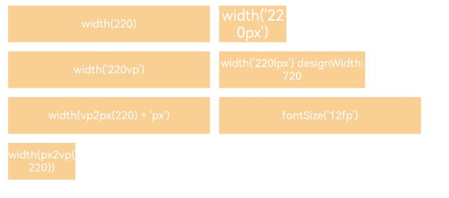

# 像素单位

为开发者提供4种像素单位，框架采用vp为基准数据单位。


| 名称   | 描述                                       |
| ---- | ---------------------------------------- |
| px   | 屏幕物理像素单位。                                |
| vp   | 屏幕密度相关像素，根据屏幕像素密度转换为屏幕物理像素，当数值不带单位时，默认单位vp。 |
| fp   | 字体像素，与vp类似适用屏幕密度变化，随系统字体大小设置变化。          |
| lpx  | 视窗逻辑像素单位，lpx单位为实际屏幕宽度与逻辑宽度（通过[designWidth](../../quick-start/package-structure.md)配置）的比值，designWidth默认值为720。当designWidth为720时，在实际宽度为1440物理像素的屏幕上，1lpx为2px大小。 |


## 像素单位转换

提供其他单位与px单位互相转换的方法。

| 接口                                       | 描述                     |
| ---------------------------------------- | ---------------------- |
| vp2px(value&nbsp;:&nbsp;number)&nbsp;:&nbsp;number | 将vp单位的数值转换为以px为单位的数值。  |
| px2vp(value&nbsp;:&nbsp;number)&nbsp;:&nbsp;number | 将px单位的数值转换为以vp为单位的数值。  |
| fp2px(value&nbsp;:&nbsp;number)&nbsp;:&nbsp;number | 将fp单位的数值转换为以px为单位的数值。  |
| px2fp(value&nbsp;:&nbsp;number)&nbsp;:&nbsp;number | 将px单位的数值转换为以fp为单位的数值。  |
| lpx2px(value&nbsp;:&nbsp;number)&nbsp;:&nbsp;number | 将lpx单位的数值转换为以px为单位的数值。 |
| px2lpx(value&nbsp;:&nbsp;number)&nbsp;:&nbsp;number | 将px单位的数值转换为以lpx为单位的数值。 |


## 示例

```ts
// xxx.ets
@Entry
@Component
struct Example {
  build() {
    Column() {
      Flex({ wrap: FlexWrap.Wrap }) {
        Column() {
          Text("width(220)")
            .width(220).height(40).backgroundColor(0xF9CF93)
            .textAlign(TextAlign.Center).fontColor(Color.White).fontSize('12vp')
        }.margin(5)
        Column() {
          Text("width('220px')")
            .width('220px').height(40).backgroundColor(0xF9CF93)
            .textAlign(TextAlign.Center).fontColor(Color.White)
        }.margin(5)
        Column() {
          Text("width('220vp')")
            .width('220vp').height(40).backgroundColor(0xF9CF93)
            .textAlign(TextAlign.Center).fontColor(Color.White).fontSize('12vp')
        }.margin(5)
        Column() {
          Text("width('220lpx') designWidth:720")
            .width('220lpx').height(40).backgroundColor(0xF9CF93)
            .textAlign(TextAlign.Center).fontColor(Color.White).fontSize('12vp')
        }.margin(5)
        Column() {
          Text("width(vp2px(220) + 'px')")
            .width(vp2px(220) + 'px').height(40).backgroundColor(0xF9CF93)
            .textAlign(TextAlign.Center).fontColor(Color.White).fontSize('12vp')
        }.margin(5)
        Column() {
          Text("fontSize('12fp')")
            .width(220).height(40).backgroundColor(0xF9CF93)
            .textAlign(TextAlign.Center).fontColor(Color.White).fontSize('12fp')
        }.margin(5)
      }.width('100%')
    }
  }
}
```


