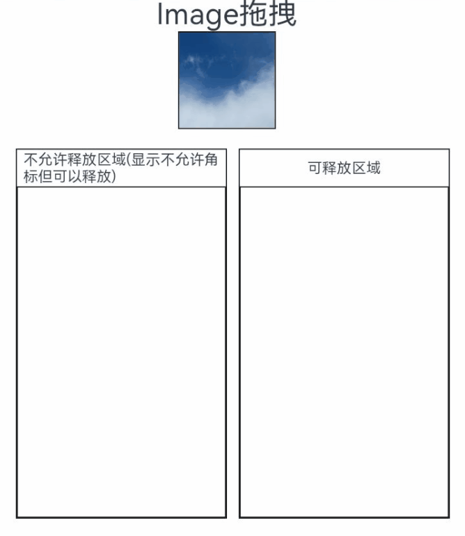

# 拖拽控制

设置组件是否可以响应拖拽事件。

> **说明：**
> 
> 从API Version 10开始支持。后续版本如有新增内容，则采用上角标单独标记该内容的起始版本。

ArkUI框架对以下组件实现了默认的拖拽能力，支持对数据的拖出或拖入响应，开发者只需要将这些组件的draggable属性设置为true，即可使用默认拖拽能力。

- 默认支持拖出能力的组件（可从组件上拖出数据）：Search、TextInput、TextArea、RichEditor、Text、Image、FormComponent、Hyperlink

- 默认支持拖入能力的组件（目标组件可响应拖入数据）：Search、TextInput、TextArea、Video

开发者也可以通过实现通用拖拽事件来自定义拖拽响应。

其他组件需要开发者将draggable属性设置为true，并在onDragStart等接口中实现数据传输相关内容，才能正确处理拖拽。


## 属性

| 名称 | 参数类型 | 描述 |
| -------- | -------- | -------- |
| allowDrop | Array\<[UniformDataType](../apis/js-apis-data-uniformTypeDescriptor.md#uniformdatatype)> | 设置该组件上允许落入的数据类型。<br/>默认值：空<br/> |
| draggable | boolean | 设置该组件是否允许进行拖拽。<br/>默认值：false<br/> |


## 示例

```ts
// xxx.ets
import UDC from '@ohos.data.unifiedDataChannel';
import UTD from '@ohos.data.uniformTypeDescriptor';

@Entry
@Component
struct ImageExample {
  @State uri: string = ""
  @State AblockArr: string[] = []
  @State BblockArr: string[] = []
  @State AVisible: Visibility = Visibility.Visible
  @State dragSuccess :Boolean = false

  build() {
    Column() {
      Text('Image拖拽')
        .fontSize('30dp')
      Flex({ direction: FlexDirection.Row, alignItems: ItemAlign.Center, justifyContent: FlexAlign.SpaceAround }) {
        Image($r('app.media.icon'))
          .width(100)
          .height(100)
          .border({ width: 1 })
          .visibility(this.AVisible)
          .draggable(true)
          .onDragEnd((event: DragEvent) => {
            let ret = event.getResult();
            if(ret == 0) {
              console.log("enter ret == 0")
              this.AVisible = Visibility.Hidden;
            } else {
              console.log("enter ret != 0")
              this.AVisible = Visibility.Visible;
            }
          })
      }
      .margin({ bottom: 20 })
      Row() {
        Column(){
          Text('不允许释放区域(显示不允许角标但可以释放)')
            .fontSize('15dp')
            .height('10%')
          List(){
            ForEach(this.AblockArr, (item:string, index) => {
              ListItem() {
                Image(item)
                  .width(100)
                  .height(100)
                  .border({width: 1})
              }
              .margin({ left: 30 , top : 30})
            }, (item:string) => item)
          }
          .height('90%')
          .width('100%')
          .allowDrop([UTD.UniformDataType.TEXT])
          .onDrop((event?: DragEvent, extraParams?: string) => {
            this.uri = JSON.parse(extraParams as string).extraInfo;
            this.AblockArr.splice(JSON.parse(extraParams as string).insertIndex, 0, this.uri);
            console.log("ondrop not udmf data");
          })
          .border({width: 1})
        }
        .height("50%")
        .width("45%")
        .border({ width: 1 })
        .margin({ left: 12 })
        Column(){
          Text('可释放区域')
            .fontSize('15dp')
            .height('10%')
          List(){
            ForEach(this.BblockArr, (item:string, index) => {
              ListItem() {
                Image(item)
                  .width(100)
                  .height(100)
                  .border({width: 1})
              }
              .margin({ left: 30 , top : 30})
            }, (item:string) => item)
          }
          .border({width: 1})
          .height('90%')
          .width('100%')
          .allowDrop([UTD.UniformDataType.IMAGE])
          .onDrop((event?: DragEvent, extraParams?: string) => {
            console.log("enter onDrop")
            let dragData:UnifiedData = (event as DragEvent).getData() as UnifiedData;
            if(dragData != undefined) {
              let arr:Array<UDC.UnifiedRecord> = dragData.getRecords();
              if(arr.length > 0) {
                let image = arr[0] as UDC.Image;
                this.uri = image.imageUri;
                this.BblockArr.splice(JSON.parse(extraParams as string).insertIndex, 0, this.uri);
              } else {
                console.log(`dragData arr is null`)
              }
            } else {
              console.log(`dragData  is undefined`)
            }
            console.log("ondrop udmf data");
            this.dragSuccess = true
          })
        }
        .height("50%")
        .width("45%")
        .border({ width: 1 })
        .margin({ left: 12 })
      }
    }.width('100%')
  }
}
```


