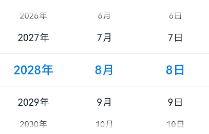

# 图像渐亮效果

设置组件的图像渐亮效果。

>  **说明：**
>
>  从API Version 10开始支持。后续版本如有新增内容，则采用上角标单独标记该内容的起始版本。此接口为系统接口。

## 属性

| 名称 | 参数类型 | 描述 |
| -------- | -------- | -------- |
| lightUpEffect | [number]&nbsp;| 设置组件图像亮起程度。<br>取值范围：[0,1]。<br>如果value等于0则图像为全黑，如果value等于1则图像为全亮效果。0到1之间数值越大，表示图像亮度越高。`value < 0` 或者 `value > 1`为异常情况，`value < 0`按0处理，`value > 1`按1处理。 |

## 示例

### 示例1
```ts
// xxx.ets
@Entry
@Component
struct LightUpExample {
  build() {
    Stack() {
      Text('This is the text content with letterSpacing 0.')
        .letterSpacing(0)
        .fontSize(12)
        .border({ width: 1 })
        .padding(10)
        .width('50%')
        .lightUpEffect(0.6)
    }.alignContent(Alignment.Center).width("100%").height("100%")
  }
}

```
效果图如下：


修改lightUpEffect参数值为0.2：


去掉lightUpEffect的设置，效果如下：


### 示例2

```ts
// xxx.ets
@Entry
@Component
struct LightUpExample {
  @State isLunar: boolean = false
  private selectedDate: Date = new Date('2028-08-08')
  build() {
    Stack() {
      DatePicker({
        start: new Date('1970-1-1'),
        end: new Date('2100-1-1'),
        selected: this.selectedDate
      })
        .lunar(this.isLunar)
        .onChange((value: DatePickerResult) => {
          this.selectedDate.setFullYear(value.year, value.month, value.day)
          console.info('select current date is: ' + JSON.stringify(value))
        })
        .lightUpEffect(0.6)

    }.alignContent(Alignment.Center).width("100%").height("100%")
  }
}
```


去掉lightUpEffect的设置，效果如下：

