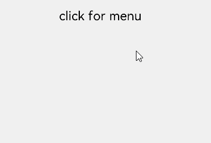

# 菜单控制

为组件绑定弹出式菜单，弹出式菜单以垂直列表形式显示菜单项，可通过长按、点击或鼠标右键触发。

>  **说明：**
>
>  - 从API Version 7开始支持。后续版本如有新增内容，则采用上角标单独标记该内容的起始版本。
>
>  - CustomBuilder里不支持再使用bindMenu、bindContextMenu弹出菜单。多级菜单可使用[Menu组件](ts-basic-components-menu.md)。


## 属性


| 名称                           | 参数类型                                     | 描述                                       |
| ---------------------------- | ---------------------------------------- | ---------------------------------------- |
| bindMenu                     | content: Array<[MenuElement](#menuelement)&gt;&nbsp;\|&nbsp;[CustomBuilder](ts-types.md#custombuilder8),<br>options?: [MenuOptions](#menuoptions10) | 给组件绑定菜单，点击后弹出菜单。弹出菜单项支持图标+文本排列和自定义两种功能。<br/>content: 配置菜单项图标和文本的数组，或者自定义组件。<br/>options: 配置弹出菜单的参数。 |
| bindContextMenu<sup>8+</sup> | content:&nbsp;[CustomBuilder](ts-types.md#custombuilder8),<br>responseType:&nbsp;[ResponseType](ts-appendix-enums.md#responsetype8)<br>options?: [ContextMenuOptions](#contextmenuoptions10) | 给组件绑定菜单，触发方式为长按或者右键点击，弹出菜单项需要自定义。<br/>responseType: 菜单弹出条件，长按或者右键点击。<br/>options: 配置弹出菜单的参数。 |

## MenuElement

| 名称                  | 类型                                   | 必填 | 描述                                                         |
| --------------------- | -------------------------------------- | ---- | ------------------------------------------------------------ |
| value                 | string                                 | 是   | 菜单项文本。                                                 |
| icon<sup>10+</sup>    | [ResourceStr](ts-types.md#resourcestr) | 否   | 菜单项图标。                                                 |
| enabled<sup>11+</sup> | boolean                                | 否   | 菜单条目是否可进行交互。<br/>默认值：true, 菜单条目可以进行交互。 |
| action                | ()&nbsp;=&gt;&nbsp;void                | 是   | 点击菜单项的事件回调。                                       |

## MenuOptions<sup>10+</sup>

| 名称        | 类型                                         | 必填 | 描述                                                         |
| ----------- | -------------------------------------------- | ---- | ------------------------------------------------------------ |
| title       | string                                       | 否   | 菜单标题。<br>**说明：** <br/>仅在content设置为Array<[MenuElement](#menuelement)&gt; 时生效。 |
| offset      | [Position](ts-types.md#position8)            | 否   | 菜单弹出位置的偏移量，不会导致菜单显示超出屏幕范围。<br/>**说明：**<br />菜单类型为相对⽗组件区域弹出时，⾃动根据菜单位置属性 (placement)将区域的宽或⾼计⼊偏移量中。<br/>当菜单相对父组件出现在上侧时（placement设置为Placement.TopLeft，Placement.Top，Placement.TopRight），x为正值，菜单相对组件向右进行偏移，y为正值，菜单相对组件向上进行偏移。<br/>当菜单相对父组件出现在下侧时（placement设置为Placement.BottomLeft，Placement.Bottom，Placement.BottomRight），x为正值，菜单相对组件向右进行偏移，y为正值，菜单相对组件向下进行偏移。<br/>当菜单相对父组件出现在左侧时（placement设置为Placement.LeftTop，Placement.Left，Placement.LeftBottom），x为正值，菜单相对组件向左进行偏移，y为正值，菜单相对组件向下进行偏移。<br/>当菜单相对父组件出现在右侧时（placement设置为Placement.RightTop，Placement.Right，Placement.RightBottom），x为正值，菜单相对组件向右进行偏移，y为正值，菜单相对组件向下进行偏移。<br/>如果菜单调整了显示位置（与placement初始值主方向不⼀致），则偏移值 (offset) 失效。 |
| placement   | [Placement](ts-appendix-enums.md#placement8) | 否   | 菜单组件优先显示的位置，当前位置显示不下时，会自动调整位置。<br/>**说明：**<br />placement值设置为undefined、null或没有设置此选项时，按默认值[BottomLeft](ts-appendix-enums.md#placement8)处理，相对父组件区域弹出。 |
| onAppear    | ()&nbsp;=&gt;&nbsp;void                      | 否   | 菜单弹出时的事件回调。                                       |
| onDisappear | ()&nbsp;=&gt;&nbsp;void                      | 否   | 菜单消失时的事件回调。                                       |

## ContextMenuOptions<sup>10+</sup>

| 名称                  | 类型                                                         | 必填 | 描述                                                         |
| --------------------- | ------------------------------------------------------------ | ---- | ------------------------------------------------------------ |
| offset                | [Position](ts-types.md#position8)                            | 否   | 菜单弹出位置的偏移量，不会导致菜单显示超出屏幕范围。<br/>**说明：**<br />菜单类型为相对⽗组件区域弹出时，⾃动根据菜单位置属性 (placement)将区域的宽或⾼计⼊偏移量中。<br/>当菜单相对父组件出现在上侧时（placement设置为Placement.TopLeft，Placement.Top，Placement.TopRight），x为正值，菜单相对组件向右进行偏移，y为正值，菜单相对组件向上进行偏移。<br/>当菜单相对父组件出现在下侧时（placement设置为Placement.BottomLeft，Placement.Bottom，Placement.BottomRight），x为正值，菜单相对组件向右进行偏移，y为正值，菜单相对组件向下进行偏移。<br/>当菜单相对父组件出现在左侧时（placement设置为Placement.LeftTop，Placement.Left，Placement.LeftBottom），x为正值，菜单相对组件向左进行偏移，y为正值，菜单相对组件向下进行偏移。<br/>当菜单相对父组件出现在右侧时（placement设置为Placement.RightTop，Placement.Right，Placement.RightBottom），x为正值，菜单相对组件向右进行偏移，y为正值，菜单相对组件向下进行偏移。<br/>如果菜单调整了显示位置（与placement初始值主方向不⼀致），则偏移值 (offset) 失效。 |
| placement             | [Placement](ts-appendix-enums.md#placement8)                 | 否   | 菜单组件优先显示的位置，当前位置显示不下时，会自动调整位置。<br/>**说明：**<br />placement值设置为undefined、null或没有设置此选项时，按未设置placement处理，菜单跟随点击位置弹出。 |
| enableArrow           | boolean                                                      | 否   | 是否显示箭头。如果菜单的大小和位置不足以放置箭头时，不会显示箭头。 <br/>默认值：false, 不显示箭头。<br/>**说明：**<br />箭头显示时，placement未设置或者值为非法值，默认在目标物上方显示，否则按照placement的位置优先显示。当前位置显示不下时，会自动调整位置。 |
| arrowOffset           | [Length](ts-types.md#length)                                 | 否   | 箭头在菜单处的偏移。箭头在菜单水平方向时，偏移量为箭头至最左侧的距离，默认居中。箭头在菜单竖直方向时，偏移量为箭头至最上侧的距离，默认居中。偏移量必须合法且转换为具体数值时大于0才会生效，另外该值生效时不会导致箭头超出菜单四周的安全距离。根据配置的placement来计算是在水平还是竖直方向上偏移。 |
| preview<sup>11+</sup> | [MenuPreviewMode](ts-appendix-enums.md#menupreviewmode11)\|&nbsp;[CustomBuilder](ts-types.md#custombuilder8) | 否   | 长按悬浮菜单的预览内容样式，可以为目标组件的截图，也可以为用户自定义的内容。<br/>默认值：MenuPreviewMode.IMAGE, 预览内容为目标组件的截图。<br/>**说明：**<br />仅支持responseType为ResponseType.LongPress时触发，如果responseType为ResponseType.RightClick，则不会显示预览内容。 |
| onAppear              | ()&nbsp;=&gt;&nbsp;void                                      | 否   | 菜单弹出时的事件回调。                                       |
| onDisappear           | ()&nbsp;=&gt;&nbsp;void                                      | 否   | 菜单消失时的事件回调。                                       |

## 示例

### 示例1

普通菜单

```ts
// xxx.ets
@Entry
@Component
struct MenuExample {
  build() {
    Column() {
      Text('click for Menu')
    }
    .width('100%')
    .margin({ top: 5 })
    .bindMenu([
      {
        value: 'Menu1',
        action: () => {
          console.info('handle Menu1 select')
        }
      },
      {
        value: 'Menu2',
        action: () => {
          console.info('handle Menu2 select')
        }
      },
    ])
  }
}
```


### 示例2

自定义内容菜单

```ts
@Entry
@Component
struct MenuExample {
  @State listData: number[] = [0, 0, 0]

  @Builder MenuBuilder() {
    Flex({ direction: FlexDirection.Column, justifyContent: FlexAlign.Center, alignItems: ItemAlign.Center }) {
      ForEach(this.listData, (item:number, index) => {
        Column() {
          Row() {
            Image($r("app.media.icon")).width(20).height(20).margin({ right: 5 })
            Text(`Menu${index as number + 1}`).fontSize(20)
          }
          .width('100%')
          .height(30)
          .justifyContent(FlexAlign.Center)
          .align(Alignment.Center)
          .onClick(() => {
            console.info(`Menu${index as number + 1} Clicked!`)
          })

          if (index != this.listData.length - 1) {
            Divider().height(10).width('80%').color('#ccc')
          }
        }.padding(5).height(40)
      })
    }.width(100)
  }

  build() {
    Column() {
      Text('click for menu')
        .fontSize(20)
        .margin({ top: 20 })
        .bindMenu(this.MenuBuilder)
    }
    .height('100%')
    .width('100%')
    .backgroundColor('#f0f0f0')
  }
}
```



### 示例3

菜单(右键触发显示)

```ts
// xxx.ets
@Entry
@Component
struct ContextMenuExample {
  @Builder MenuBuilder() {
    Flex({ direction: FlexDirection.Column, justifyContent: FlexAlign.Center, alignItems: ItemAlign.Center }) {
      Text('Test menu item 1')
        .fontSize(20)
        .width(100)
        .height(50)
        .textAlign(TextAlign.Center)
      Divider().height(10)
      Text('Test menu item 2')
        .fontSize(20)
        .width(100)
        .height(50)
        .textAlign(TextAlign.Center)
    }.width(100)
  }
  
  build() {
    Column() {
      Text('rightclick for menu')
    }
    .width('100%')
    .margin({ top: 5 })
    .bindContextMenu(this.MenuBuilder, ResponseType.RightClick)
  }
}
```

### 示例4

指向性菜单(右键触发显示)

```ts
// xxx.ets
@Entry
@Component
struct DirectiveMenuExample {
  @Builder MenuBuilder() {
    Flex({ direction: FlexDirection.Column, alignItems: ItemAlign.Center, justifyContent: FlexAlign.Center }) {
      Text('Options')
      Divider().strokeWidth(2).margin(5).color('#F0F0F0')
      Text('Hide')
      Divider().strokeWidth(2).margin(5).color('#F0F0F0')
      Text('Exit')
    }
    .width(200)
  }

  build() {
    Flex({ direction: FlexDirection.Column, alignItems: ItemAlign.Center, justifyContent: FlexAlign.Center }) {
      Column() {
        Text("DirectiveMenuExample")
          .fontSize(20)
          .width('100%')
          .height("25%")
          .backgroundColor('#F0F0F0')
          .textAlign(TextAlign.Center)
          .bindContextMenu(this.MenuBuilder, ResponseType.RightClick, {
            enableArrow: true,
            placement: Placement.Bottom
          })
      }
    }
    .width('100%')
    .height('100%')
  }
}
```


