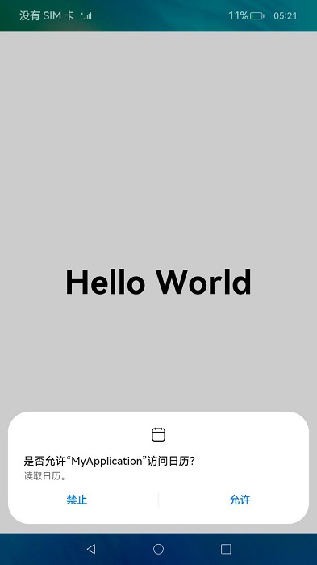

# 访问控制授权申请指导

## 场景介绍

[应用的APL（Ability Privilege Level）等级](accesstoken-overview.md#应用apl等级说明)分为`normal`、`system_basic`和`system_core`三个等级，默认情况下，应用的APL等级都为`normal`等级。[权限类型](accesstoken-overview.md#权限类型说明)分为`system_grant`和`user_grant`两种类型。应用可申请的权限项参见[应用权限列表](permission-list.md)。

本文将从如下场景分别介绍：

- [配置文件权限声明](#配置文件权限声明)
- [ACL方式声明](#acl方式声明)
- [向用户申请授权](#向用户申请授权)
- [user_grant权限预授权](#user_grant权限预授权)

## 配置文件权限声明

应用需要在项目的配置文件中逐个声明所需的权限，否则应用将无法获取授权。

> **说明**：
>
> 应用在申请`system_basic`和`system_core`等级权限时，需要提升权限等级，因为应用默认的权限等级为`normal`。如果应用需要申请高于默认等级的权限，除了在配置文件中进行声明之外，还需要通过[ACL方式](#acl方式声明)进行声明使用。

配置文件标签说明如下表所示。

| 标签      | 是否必填 | 说明                                                         |
| --------- | -------- | ------------------------------------------------------------ |
| name      | 是       | 权限名称。                                                   |
| reason    | 否       | 描述申请权限的原因，可参考[权限使用理由的文案内容规范](#权限使用理由的文案内容规范)。<br/> > **说明**：当申请的权限为user_grant权限时，此字段必填。 |
| usedScene | 否       | 描述权限使用的场景和时机。<br/> > **说明**：当申请的权限为user_grant权限时，此字段必填。 |
| abilities | 否       | 标识需要使用到该权限的Ability，标签为数组形式。<br/>**适用模型**：Stage模型 |
| ability   | 否       | 标识需要使用到该权限的Ability，标签为数组形式。<br/>**适用模型**：FA模型 |
| when      | 否       | 标识权限使用的时机，值为`inuse/always`。<br/>- inuse：表示为仅允许前台使用。<br/>- always：表示前后台都可使用。 |

### Stage模型

使用Stage模型的应用，需要在[module.json5配置文件](../quick-start/module-configuration-file.md)中声明权限。

```json
{
  "module" : {
    // ...
    "requestPermissions":[
      {
        "name" : "ohos.permission.PERMISSION1",
        "reason": "$string:reason",
        "usedScene": {
          "abilities": [
            "FormAbility"
          ],
          "when":"inuse"
        }
      },
      {
        "name" : "ohos.permission.PERMISSION2",
        "reason": "$string:reason",
        "usedScene": {
          "abilities": [
            "FormAbility"
          ],
          "when":"always"
        }
      }
    ]
  }
}
```

### FA模型

使用FA模型的应用，需要在config.json配置文件中声明权限。

```json
{
  "module" : {
    // ...
    "reqPermissions":[
      {
        "name" : "ohos.permission.PERMISSION1",
        "reason": "$string:reason",
        "usedScene": {
          "ability": [
            "FormAbility"
          ],
          "when":"inuse"
        }
      },
      {
        "name" : "ohos.permission.PERMISSION2",
        "reason": "$string:reason",
        "usedScene": {
          "ability": [
            "FormAbility"
          ],
          "when":"always"
        }
      }
    ]
  }
}
```

### 权限使用理由的文案内容规范

当申请的权限为user_grant权限时，字段reason（申请权限的原因）必填。开发者需要在应用配置文件中，配置每一个需要使用的权限。

但在实际向用户弹窗申请授权时，user_grant权限将会以[权限组](accesstoken-overview.md#权限组和子权限)向用户申请。当前支持的权限组请查看[应用权限组列表](permission-group-list.md)。

**reason字段的内容写作规范及建议如下：**

1. 保持句子简洁、不要加入多余的分割符号。

   **建议句式**：用于某事。

   **示例**：用于扫码拍照。

2. 用途描述的字串建议小于72个字符（即36个中文字符，UI界面显示大约为两行）。不能超过256个字符，以免在多语言适配后体验不好。

3. 如果不写，将展示默认的申请理由。

**权限使用理由展示方式：**

权限使用理由有两个展示途径：授权弹窗界面和“设置（Settings）”界面。“设置”的具体路径：设置-隐私-权限管理-某应用某权限详情

1. 如果是申请“电话、信息、日历、通讯录、通话记录”这五个权限组中的权限，根据工信部要求，将展示具体子权限的内容与用途。

   **句式**：包括子权限A和子权限B，用于某事。

   **样例**：用于获取通话状态和移动网络信息，用于安全运营和统计计费服务。

2. 如果是申请其他权限组中的权限。系统将使用权限组内当前被申请的第一个子权限的使用理由，作为该权限组的使用理由进行展示。组内的排序，固定按照权限管理内排列的权限组数组顺序。

   举例说明：权限组A = {权限A, 权限B, 权限C}；申请传入的是{权限C, 权限B}，界面将展示权限B中的权限使用理由。

## ACL方式声明

当应用需要申请`system_basic`和`system_core`等级的权限时，比应用默认权限等级`normal`更高。如果需要申请的权限等级高于应用默认的等级，需要使用ACL方式声明使用。

例如，如果应用需要访问用户公共目录中的音乐文件，需要申请`ohos.permission.WRITE_AUDIO`权限，该权限属于`system_basic`等级。如果应用需要截取屏幕图像，则需要申请`ohos.permission.CAPTURE_SCREEN`权限，该权限属于`system_core`等级。此时，需要将相关权限项配置到[HarmonyAppProvision配置文件](app-provision-structure.md)的`acl`字段中。

```json
{
	// ...
	"acls":{
		"allowed-acls":[
			"ohos.permission.WRITE_AUDIO",
      "ohos.permission.CAPTURE_SCREEN"
		]
	}
}
```

## 向用户申请授权

当应用需要访问用户的隐私信息或使用系统能力时，例如获取位置信息、访问日历、使用相机拍摄照片或录制视频等，应该向用户请求授权。这需要使用 `user_grant` 类型权限。在此之前，应用需要进行权限校验，以判断当前调用者是否具备所需的权限。如果权限校验结果表明当前应用尚未被授权该权限，则应使用动态弹框授权方式，为用户提供手动授权的入口。示意效果如下图所示。

图1 向用户申请授权



> **说明**：
>
> 每次访问受目标权限保护的接口之前，都需要使用 [requestPermissionsFromUser()](../reference/apis/js-apis-abilityAccessCtrl.md#requestpermissionsfromuser9) 接口请求相应的权限。用户可能在动态授予权限后通过系统设置来取消应用的权限，因此不能将之前授予的授权状态持久化。

### Stage模型

以允许应用读取日历信息为例进行说明。

1. 申请`ohos.permission.READ_CALENDAR`权限，配置方式请参见[配置文件权限声明](#配置文件权限声明)。

2. 校验当前是否已经授权。

   在进行权限申请之前，需要先检查当前应用程序是否已经被授予了权限。可以通过调用[checkAccessToken()](../reference/apis/js-apis-abilityAccessCtrl.md#checkaccesstoken9)方法来校验当前是否已经授权。如果已经授权，则可以直接访问目标操作，否则需要进行下一步操作，即向用户申请授权。

   ```ts
   import bundleManager from '@ohos.bundle.bundleManager';
   import abilityAccessCtrl, { Permissions } from '@ohos.abilityAccessCtrl';
   import { BusinessError } from '@ohos.base';
   
   async function checkAccessToken(permission: Permissions): Promise<abilityAccessCtrl.GrantStatus> {
     let atManager = abilityAccessCtrl.createAtManager();
     let grantStatus: abilityAccessCtrl.GrantStatus = abilityAccessCtrl.GrantStatus.PERMISSION_DENIED;
   
     // 获取应用程序的accessTokenID
     let tokenId: number = 0;
     try {
       let bundleInfo: bundleManager.BundleInfo = await bundleManager.getBundleInfoForSelf(bundleManager.BundleFlag.GET_BUNDLE_INFO_WITH_APPLICATION);
       let appInfo: bundleManager.ApplicationInfo = bundleInfo.appInfo;
       tokenId = appInfo.accessTokenId;
     } catch (error) {
       let err: BusinessError = error as BusinessError;
       console.error(`Failed to get bundle info for self. Code is ${err.code}, message is ${err.message}`);
     }
   
     // 校验应用是否被授予权限
     try {
       grantStatus = await atManager.checkAccessToken(tokenId, permission);
     } catch (error) {
       let err: BusinessError = error as BusinessError;
       console.error(`Failed to check access token. Code is ${err.code}, message is ${err.message}`);
     }
   
     return grantStatus;
   }
   
   async function checkPermissions(): Promise<void> {
     const permissions: Array<Permissions> = ['ohos.permission.READ_CALENDAR'];
     let grantStatus: abilityAccessCtrl.GrantStatus = await checkAccessToken(permissions[0]);
   
     if (grantStatus === abilityAccessCtrl.GrantStatus.PERMISSION_GRANTED) {
       // 已经授权，可以继续访问目标操作
     } else {
       // 申请日历权限
     }
   }
   ```

3. 动态向用户申请授权。

   动态向用户申请权限是指在应用程序运行时向用户请求授权的过程。可以通过调用[requestPermissionsFromUser()](../reference/apis/js-apis-abilityAccessCtrl.md#requestpermissionsfromuser9)方法来实现。该方法接收一个权限列表参数，例如位置、日历、相机、麦克风等。用户可以选择授予权限或者拒绝授权。

   可以在UIAbility的`onWindowStageCreate()`回调中调用[requestPermissionsFromUser()](../reference/apis/js-apis-abilityAccessCtrl.md#requestpermissionsfromuser9)方法来动态申请权限，也可以根据业务需要在UI中向用户申请授权。

   在UIAbility中向用户申请授权。

   ```typescript
   import UIAbility from '@ohos.app.ability.UIAbility';
   import window from '@ohos.window';
   import abilityAccessCtrl, { Permissions } from '@ohos.abilityAccessCtrl';
   import { BusinessError } from '@ohos.base';

   const permissions: Array<Permissions> = ['ohos.permission.READ_CALENDAR'];
   export default class EntryAbility extends UIAbility {
    // ...
    onWindowStageCreate(windowStage: window.WindowStage) {
      // Main window is created, set main page for this ability
      let context = this.context;
      let atManager = abilityAccessCtrl.createAtManager();
      // requestPermissionsFromUser会判断权限的授权状态来决定是否唤起弹窗

      atManager.requestPermissionsFromUser(context, permissions).then((data) => {
        let grantStatus: Array<number> = data.authResults;
        let length: number = grantStatus.length;
        for (let i = 0; i < length; i++) {
          if (grantStatus[i] === 0) {
            // 用户授权，可以继续访问目标操作
          } else {
            // 用户拒绝授权，提示用户必须授权才能访问当前页面的功能，并引导用户到系统设置中打开相应的权限
            return;
          }
        }
        // 授权成功
      }).catch((err: BusinessError) => {
        console.error(`Failed to request permissions from user. Code is ${err.code}, message is ${err.message}`);
      })
      // ...
    }
   }
   ```

   在UI中向用户申请授权。

   ```typescript
   import abilityAccessCtrl, { Permissions } from '@ohos.abilityAccessCtrl';
   import common from '@ohos.app.ability.common';
   import { BusinessError } from '@ohos.base';

   const permissions: Array<Permissions> = ['ohos.permission.READ_CALENDAR'];

   @Entry
   @Component
   struct Index {
    reqPermissionsFromUser(permissions: Array<Permissions>): void {
      let context = getContext(this) as common.UIAbilityContext;
      let atManager = abilityAccessCtrl.createAtManager();
      // requestPermissionsFromUser会判断权限的授权状态来决定是否唤起弹窗
      atManager.requestPermissionsFromUser(context, permissions).then((data) => {
        let grantStatus: Array<number> = data.authResults;
        let length: number = grantStatus.length;
        for (let i = 0; i < length; i++) {
          if (grantStatus[i] === 0) {
            // 用户授权，可以继续访问目标操作
          } else {
            // 用户拒绝授权，提示用户必须授权才能访问当前页面的功能，并引导用户到系统设置中打开相应的权限
            return;
          }
        }
        // 授权成功
      }).catch((err: BusinessError) => {
        console.error(`Failed to request permissions from user. Code is ${err.code}, message is ${err.message}`);
      })
    }

    // 页面展示
    build() {
      // ...
    }
   }
   ```

4. 处理授权结果。

   调用[requestPermissionsFromUser()](../reference/apis/js-apis-abilityAccessCtrl.md#requestpermissionsfromuser9)方法后，应用程序将等待用户授权的结果。如果用户授权，则可以继续访问目标操作。如果用户拒绝授权，则需要提示用户必须授权才能访问当前页面的功能，并引导用户到系统设置中打开相应的权限。

   ArkTS语法不支持直接使用globalThis，需要通过一个单例的map来做中转。开发者需要：

   a. 在EntryAbility.ets中导入构建的单例对象GlobalThis。
      ```ts
       import { GlobalThis } from '../utils/globalThis'; // 需要根据globalThis.ets的路径自行适配
      ```
   b. 在onCreate中添加:
      ```ts
       GlobalThis.getInstance().setContext('context', this.context);
      ```

   > **说明：**
   >
   > 由于在ts中引入ets文件会有告警提示，需要将EntryAbility.ts的文件后缀修改为EntryAbility.ets，并在module.json5中同步修改。

   **globalThis.ets示例代码如下：**
   ```ts
   import common from '@ohos.app.ability.common';

   // 构造单例对象
   export class GlobalThis {
     private constructor() {}
     private static instance: GlobalThis;
     private _uiContexts = new Map<string, common.UIAbilityContext>();

     public static getInstance(): GlobalThis {
       if (!GlobalThis.instance) {
         GlobalThis.instance = new GlobalThis();
       }
       return GlobalThis.instance;
     }

     getContext(key: string): common.UIAbilityContext | undefined {
       return this._uiContexts.get(key);
     }

     setContext(key: string, value: common.UIAbilityContext): void {
       this._uiContexts.set(key, value);
     }

     // 其他需要传递的内容依此扩展
   }
   ```

   ```ts
   import { BusinessError } from '@ohos.base';
   import Want from '@ohos.app.ability.Want';
   import { GlobalThis } from '../utils/globalThis';
   import common from '@ohos.app.ability.common';

   function openPermissionsInSystemSettings(): void {
     let context: common.UIAbilityContext = GlobalThis.getInstance().getContext('context');
     let wantInfo: Want = {
       action: 'action.settings.app.info',
       parameters: {
         settingsParamBundleName: 'com.example.myapplication' // 打开指定应用的详情页面
       }
     }
     context.startAbility(wantInfo).then(() => {
       // ...
     }).catch((err: BusinessError) => {
       // ...
     })
   }
   ```

### FA模型

通过调用[requestPermissionsFromUser()](../reference/apis/js-apis-inner-app-context.md#contextrequestpermissionsfromuser7)接口向用户动态申请授权。

```ts
import { BusinessError } from '@ohos.base';
import featureAbility from '@ohos.ability.featureAbility';

reqPermissions() {
    let context = featureAbility.getContext();
    let array:Array<string> = ["ohos.permission.PERMISSION2"];
    //requestPermissionsFromUser会判断权限的授权状态来决定是否唤起弹窗
    context.requestPermissionsFromUser(array, 1).then(data => {
        console.log("data:" + JSON.stringify(data));
        console.log("data permissions:" + JSON.stringify(data.permissions));
        console.log("data result:" + JSON.stringify(data.authResults));
    }, (err: BusinessError) => {
        console.error('Failed to start ability', err.code);
    });
}
```

## user_grant权限预授权

user_grant权限可以通过预授权方式请求权限。预授权方式需要预置配置文件，[预置配置文件](https://gitee.com/openharmony/vendor_hihope/blob/master/rk3568/preinstall-config/install_list_permissions.json)在设备上的路径为`/system/etc/app/install_list_permission.json`，设备开机启动时会读取该配置文件，在应用安装会对在文件中配置的`user_grant`类型权限授权。预授权配置文件字段内容包括`bundleName`、`app_signature`和`permissions`。

- `bundleName`字段配置为应用的Bundle名称。
- `app_signature`字段配置为应用的指纹信息。指纹信息的配置参见[应用特权配置指南](../../device-dev/subsystems/subsys-app-privilege-config-guide.md#install_list_capabilityjson中配置)。
- `permissions`字段中`name`配置为需要预授权的`user_grant`类型的权限名；`permissions`字段中`userCancellable`表示为用户是否能够取消该预授权，配置为true，表示支持用户取消授权，为false则表示不支持用户取消授权。

```json
[
  // ...
  {
    "bundleName": "com.example.myapplication", // Bundle名称
    "app_signature": ["****"], // 指纹信息
    "permissions":[
      {
        "name": "ohos.permission.PERMISSION_X", // user_grant类型预授权的权限名
        "userCancellable": false // 用户不可取消授权
      },
      {
        "name": "ohos.permission.PERMISSION_Y", // user_grant类型预授权的权限名
        "userCancellable": true // 用户可取消授权
      }
    ]
  }
]
```

## 相关实例

针对访问控制，有以下相关实例可供参考：

- [访问权限控制（ArkTS）（Full SDK）（API9）](https://gitee.com/openharmony/applications_app_samples/tree/OpenHarmony-4.0-Beta2/code/SystemFeature/Security/AbilityAccessCtrl)

- [为应用添加运行时权限（ArkTS）（Full SDK）（API9）](https://gitee.com/openharmony/codelabs/tree/master/Security/AccessPermission)
