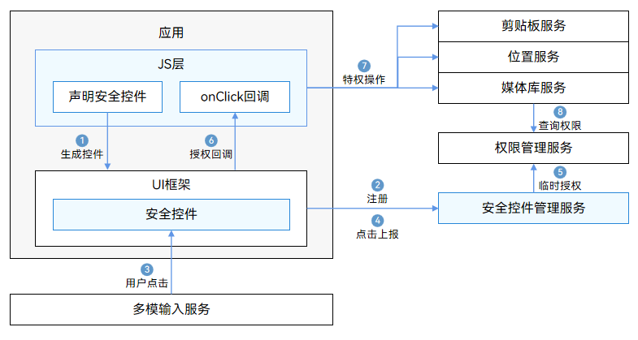

# 安全组件开发概述

安全组件是OpenHarmony提供的一组系统实现的ArkUI基础组件。当用户点击了这类组件后，应用将被授予临时授权，应用开发者仅需要像使用Button等组件那样集成到应用自己的页面即可。

当前提供了三种安全组件：

- 位置组件：获取精准定位授权。

- 粘贴组件：获取读取剪贴板授权。

- 保存组件：获取媒体库写入授权。

安全组件可以作为一种"特殊的按钮"融入应用页面，无需向用户弹窗授权，实现用户点击即许可的设计思路。精准的场景可以避免权限的滥用，保护用户隐私，同时也减少了弹窗对用户的干扰。

应用集成安全组件后，注册OnClick回调监听用户点击。当用户点击后，安全组件底层将申请权限，并将结果返回给应用。如果成功，应用可以临时使用需要特权的接口。

说明：不同类型的安全组件，对于权限的使用方式不同、授权的有效期也不同，详情请参考开发指导。

安全组件因其自动授权的特性，为了保障用户的隐私不被恶意应用获取，针对安全组件作了很多的限制，例如尺寸不能过小、颜色不能透明等等，确保安全组件是可见的且用户能够识别的，所以三方开发者需要合理的配置组件的尺寸、颜色等属性，避免视觉混淆的情况，如果发生因组件的样式不合法导致授权失败的情况，请检查设备错误日志。

## 技术框架

安全组件特性有2个主要部件构成。

- 安全组件实现：
  集成在ArkUI中，提供ETS接口负责安全组件的生成、属性配置、布局、绘制、点击回调、销毁等功能。

- 安全组件管理服务：
  独立的服务进程，负责安全组件的注册、临时授权、取消授权、取消注册等管理，以及合法性检查。

## 运作流程

1. 应用开发者在ETS文件中集成安全组件，通过JS引擎解析后，在ArkUI框架中生成具体的组件。

2. 安全组件注册组件信息到安全组件管理服务，安全组件管理服务检查组件信息的合法性。

3. 用户点击事件分发到安全组件。

4. 安全组件将点击事件上报到安全组件管理服务。

5. 安全组件管理服务根据组件种类对应不同权限，调用权限管理服务进行临时授权。

6. 授权成功后，安全组件回调OnClick通知应用层授权成功。

7. 应用调用相应的特权操作，如获取地理位置、读取剪贴板信息、媒体库中创建文件等。

8. 对应的服务会调用权限管理服务或安全组件管理服务，获取授权结果，返回鉴权结果。

## 约束与限制

应用开发者需尽量保证安全组件在应用界面上清晰可见，防止因覆盖、混淆等因素导致授权失败。
