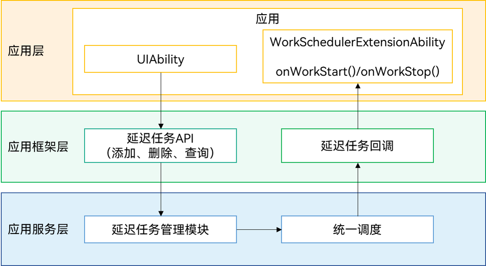

# 延迟任务

## 概述

### 功能介绍

应用退至后台后，需要执行实时性要求不高的任务，例如有网络时不定期主动获取邮件等，可以使用延迟任务。当应用满足设定条件（包括网络类型、充电类型、存储状态、电池状态、定时状态等）时，将任务添加到执行队列，系统会根据内存、功耗、设备温度、用户使用习惯等统一调度拉起应用。

### 运行原理

**图1** 延迟任务实现原理  


应用调用延迟任务接口注册、删除、查询延迟任务，延迟任务管理模块会根据任务设置的条件（通过WorkInfo参数设置，包括网络类型、充电类型、存储状态等）和系统状态（包括内存、功耗、设备温度、用户使用习惯等）统一决策调度时机。

当满足调度条件或调度结束时，系统会回调应用[WorkSchedulerExtensionAbility](../reference/apis/js-apis-WorkSchedulerExtensionAbility.md)中 onWorkStart() 或 onWorkStop() 的方法，同时会为应用单独创建一个Extension扩展进程用以承载[WorkSchedulerExtensionAbility](../reference/apis/js-apis-WorkSchedulerExtensionAbility.md)，并给[WorkSchedulerExtensionAbility](../reference/apis/js-apis-WorkSchedulerExtensionAbility.md)一定的活动周期，开发者可以在对应回调方法中实现自己的任务逻辑。


### 约束与限制

- **数量限制**：一个应用同一时刻最多申请10个延迟任务。

- **执行频率限制**：系统会根据[应用的活跃分组](../reference/apis/js-apis-resourceschedule-deviceUsageStatistics.md)，对延迟任务做分级管控，限制延迟任务调度的执行频率。通过能效资源接口申请了WORK_SCHEDULER资源的应用，会被放在能效资源豁免分组中。

  **表1** 应用活跃程度分组   
  | 应用活跃分组 | 延迟任务执行频率 |
  | -------- | -------- |
  | 活跃分组 | 最小间隔2小时 |
  | 经常使用分组 | 最小间隔4小时 |
  | 常用使用 | 最小间隔24小时 |
  | 极少使用分组 | 最小间隔48小时 |
  | 受限使用分组 | 禁止 |
  | 从未使用分组 | 禁止 |
  | 能效资源豁免分组 | 不受限制 |
  
- **超时**：WorkSchedulerExtensionAbility单次回调最长运行2分钟。如果超时不取消，系统会终止对应的Extension进程。对于系统特权应用，可以通过能效资源接口申请WORK_SCHEDULER资源，扩展单次回调运行时长，扩展后在充电状态下为20分钟，非充电状态下为10分钟。

- **调度延迟**：系统会根据内存、功耗、设备温度、用户使用习惯等统一调度，如当系统内存资源不足或温度达到一定挡位时，系统将延迟调度该任务。

- **WorkSchedulerExtensionAbility接口调用限制**：为实现对WorkSchedulerExtensionAbility能力的管控，在WorkSchedulerExtensionAbility中限制以下接口的调用：

  [@ohos.resourceschedule.backgroundTaskManager (后台任务管理)](../reference/apis/js-apis-resourceschedule-backgroundTaskManager.md)

  [@ohos.backgroundTaskManager (后台任务管理)](../reference/apis/js-apis-backgroundTaskManager.md)

  [@ohos.multimedia.camera (相机管理)](../reference/apis/js-apis-camera.md)

  [@ohos.multimedia.audio (音频管理)](../reference/apis/js-apis-audio.md)

  [@ohos.multimedia.media (媒体服务)](../reference/apis/js-apis-media.md)


## 接口说明

**表2** 延迟任务主要接口

以下是延迟任务开发使用的相关接口，更多接口及使用方式请见[延迟任务](../reference/apis/js-apis-resourceschedule-workScheduler.md)文档。
| 接口名 | 接口描述 |
| -------- | -------- |
| startWork(work: WorkInfo): void; | 申请延迟任务 |
| stopWork(work: WorkInfo, needCancel?: boolean): void; | 取消延迟任务 |
| getWorkStatus(workId: number, callback: AsyncCallback&lt;WorkInfo&gt;): void; | 获取延迟任务状态（Callback形式） |
| getWorkStatus(workId: number): Promise&lt;WorkInfo&gt;; | 获取延迟任务状态（Promise形式） |
| obtainAllWorks(callback: AsyncCallback&lt;void&gt;): Array&lt;WorkInfo&gt;; | 获取所有延迟任务（Callback形式） |
| obtainAllWorks(): Promise&lt;Array&lt;WorkInfo&gt;&gt;; | 获取所有延迟任务（Promise形式） |
| stopAndClearWorks(): void; | 停止并清除任务 |
| isLastWorkTimeOut(workId: number, callback: AsyncCallback&lt;void&gt;): boolean; | 获取上次任务是否超时（针对RepeatWork，Callback形式） |
| isLastWorkTimeOut(workId: number): Promise&lt;boolean&gt;; | 获取上次任务是否超时（针对RepeatWork，Promise形式） |

**表3** WorkInfo参数
| 参数名 | 类型 | 描述 |
| -------- | -------- | -------- |
| workId | number | 延迟任务Id（必填） |
| bundleName | string | 延迟任务包名（必填） |
| abilityName | string | 延迟任务回调通知的组件名（必填） |
| networkType | [NetworkType](/reference/apis/js-apis-resourceschedule-workScheduler.md#networktype) | 网络类型 |
| isCharging | boolean | 是否充电 |
| chargerType | [ChargingType](..//reference/apis/js-apis-resourceschedule-workScheduler.md#chargingtype) | 充电类型 |
| batteryLevel | number | 电量 |
| batteryStatus | [BatteryStatus](../reference/apis/js-apis-resourceschedule-workScheduler.md#batterystatus) | 电池状态 |
| storageRequest | [StorageRequest](../reference/apis/js-apis-resourceschedule-workScheduler.md#storagerequest) | 存储状态 |
| isRepeat | boolean | 是否循环任务 |
| repeatCycleTime | number | 循环间隔 |
| repeatCount | number | 循环次数 |
| parameters | [key: string]: number | 携带参数信息 |

WorkInfo参数用于设置应用条件，参数设置时需遵循以下规则：

- workId、bundleName、abilityName为必填项，bundleName需为本应用包名。

- 携带参数信息仅支持number、string、bool三种类型。

- 至少设置一个满足的条件，包括网络类型、充电类型、存储状态、电池状态、定时状态等。

- 对于重复任务，任务执行间隔至少20分钟。设置重复任务时间间隔时，须同时设置是否循环或循环次数中的一个。

**表4** 延迟任务回调接口

以下是延迟任务回调开发使用的相关接口，更多接口及使用方式请见[延迟任务回调](../reference/apis/js-apis-WorkSchedulerExtensionAbility.md)文档。
| 接口名 | 接口描述 |
| -------- | -------- |
| onWorkStart(work: WorkInfo): void | 延迟调度任务开始的回调 |
| onWorkStop(work: WorkInfo): void | 延迟调度任务结束的回调 |


## 开发步骤

延迟任务调度开发步骤分为两步：实现延迟任务调度扩展能力、实现延迟任务调度。

1. **延迟任务调度扩展能力**：实现WorkSchedulerExtensionAbility开始和结束的回调接口。

2. **延迟任务调度**：调用延迟任务接口，实现延迟任务申请、取消等功能。

### 实现延迟任务回调拓展能力

1. 新建工程目录。

   在工程entry Module对应的ets目录(./entry/src/main/ets)下，新建目录及ArkTS文件，例如新建一个目录并命名为extension。在extension目录下，新建一个ArkTS文件并命名为WorkSchedulerExtension.ets，用以实现延迟任务回调接口。

2. 导入模块。
   
   ```ts
   import WorkSchedulerExtensionAbility from '@ohos.WorkSchedulerExtensionAbility';
   ```

3. 实现WorkSchedulerExtension生命周期接口。
   
   ```ts
   export default class MyWorkSchedulerExtensionAbility extends WorkSchedulerExtensionAbility {
     // 延迟任务开始回调
     onWorkStart(workInfo) {
       console.info(`onWorkStart, workInfo = ${JSON.stringify(workInfo)}`);
     }
   
     // 延迟任务结束回调
     onWorkStop(workInfo) {
       console.info(`onWorkStop, workInfo is ${JSON.stringify(workInfo)}`);
     }
   }
   ```

4. 在[module.json5配置文件](../quick-start/module-configuration-file.md)中注册WorkSchedulerExtensionAbility，并设置如下标签：

   - type标签设置为“workScheduler”。

   - srcEntry标签设置为当前ExtensionAbility组件所对应的代码路径。

   ```json
   {
     "module": {
         "extensionAbilities": [
           {
             "name": "MyWorkSchedulerExtensionAbility",
             "srcEntry": "./ets/WorkSchedulerExtension/WorkSchedulerExtension.ts",
             "label": "$string:WorkSchedulerExtensionAbility_label",
             "description": "$string:WorkSchedulerExtensionAbility_desc",
             "type": "workScheduler"
           }
         ]
     }
   }
   ```


### 实现延迟任务调度

1. 导入模块。
   
   ```ts
   import workScheduler from '@ohos.resourceschedule.workScheduler';
   ```

2. 申请延迟任务。
   
   ```ts
   private workInfo = {
     workId: 1,
     networkType: workScheduler.NetworkType.NETWORK_TYPE_WIFI,
     bundleName: 'com.example.application',
     abilityName: 'MyWorkSchedulerExtensionAbility'
   }
   
   try {
     workScheduler.startWork(this.workInfo);
     console.info(`startWork success`);
   } catch (error) {
     console.error(`startWork failed. code is ${error.code} message is ${error.message}`);
   }
   ```

3. 取消延迟任务。
   
   ```ts
   private workInfo = {
     workId: 1,
     networkType: workScheduler.NetworkType.NETWORK_TYPE_WIFI,
     bundleName: 'com.example.application', 
     abilityName: 'MyWorkSchedulerExtensionAbility' 
   }
   
   try {
     workScheduler.stopWork(this.workInfo);
     console.info(`stopWork success`);
   } catch (error) {
     console.error(`stopWork failed. code is ${error.code} message is ${error.message}`);
   }
   ```

## 相关实例

针对延迟任务调度的开发，有以下相关示例可供参考：

- [WorkScheduler的创建与使用（ArkTS）（API9）](https://gitee.com/openharmony/applications_app_samples/tree/master/code/BasicFeature/TaskManagement/WorkScheduler)