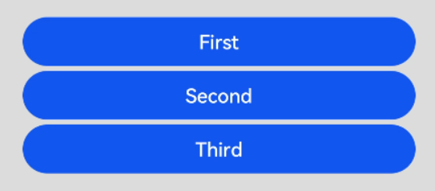
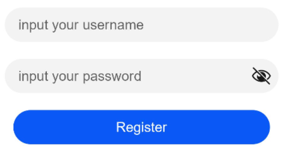

# 按钮（Button）


Button是按钮组件，通常用于响应用户的点击操作，其类型包括胶囊按钮、圆形按钮、普通按钮。Button做为容器使用时可以通过添加子组件实现包含文字、图片等元素的按钮。具体用法请参考[Button](../reference/arkui-ts/ts-basic-components-button.md)。


## 创建按钮

Button通过调用接口来创建，接口调用有以下两种形式：


- 创建不包含子组件的按钮。

  ```ts
  Button(label?: string, options?: { type?: ButtonType, stateEffect?: boolean })
  ```

  其中，label用来设置按钮文字，type用于设置Button类型，stateEffect属性设置Button是否开启点击效果。

  ```ts
  Button('Ok', { type: ButtonType.Normal, stateEffect: true }) 
    .borderRadius(8) 
    .backgroundColor(0x317aff) 
    .width(90)
    .height(40)
  ```

  


- 创建包含子组件的按钮。

  ```ts
  Button(options?: {type?: ButtonType, stateEffect?: boolean})
  ```

  只支持包含一个子组件，子组件可以是[基础组件](../reference/arkui-ts/ts-basic-components-blank.md)或者[容器组件](../reference/arkui-ts/ts-container-ability-component.md)。

  ```ts
  Button({ type: ButtonType.Normal, stateEffect: true }) {
    Row() {
      Image($r('app.media.loading')).width(20).height(40).margin({ left: 12 })
      Text('loading').fontSize(12).fontColor(0xffffff).margin({ left: 5, right: 12 })
    }.alignItems(VerticalAlign.Center)
  }.borderRadius(8).backgroundColor(0x317aff).width(90).height(40)
  ```

  


## 设置按钮类型

Button有三种可选类型，分别为胶囊类型（Capsule）、圆形按钮（Circle）和普通按钮（Normal），通过type进行设置。


- 胶囊按钮（默认类型）

  此类型按钮的圆角自动设置为高度的一半，不支持通过borderRadius属性重新设置圆角。

  ```ts
  Button('Disable', { type: ButtonType.Capsule, stateEffect: false }) 
    .backgroundColor(0x317aff) 
    .width(90)
    .height(40)
  ```

  


- 圆形按钮

  此类型按钮为圆形，不支持通过borderRadius属性重新设置圆角。

  ```ts
  Button('Circle', { type: ButtonType.Circle, stateEffect: false }) 
    .backgroundColor(0x317aff) 
    .width(90) 
    .height(90)
  ```

  

- 普通按钮

  此类型的按钮默认圆角为0，支持通过borderRadius属性重新设置圆角。

  ```ts
  Button('Ok', { type: ButtonType.Normal, stateEffect: true }) 
    .borderRadius(8) 
    .backgroundColor(0x317aff) 
    .width(90)
    .height(40)
  ```

  


## 自定义样式

- 设置边框弧度。

  使用通用属性来自定义按钮样式。例如通过borderRadius属性设置按钮的边框弧度。

  ```ts
  Button('circle border', { type: ButtonType.Normal }) 
    .borderRadius(20)
    .height(40)
  ```

  


- 设置文本样式。

  通过添加文本样式设置按钮文本的展示样式。

  ```ts
  Button('font style', { type: ButtonType.Normal }) 
    .fontSize(20) 
    .fontColor(Color.Pink) 
    .fontWeight(800)
  ```

  


- 设置背景颜色。

  添加backgroundColor属性设置按钮的背景颜色。

  ```ts
  Button('background color').backgroundColor(0xF55A42)
  ```

  


- 创建功能型按钮。

  为删除操作创建一个按钮。

  ```ts
  let MarLeft:Record<string,number> = {'left':20}
  Button({ type: ButtonType.Circle, stateEffect: true }) {
  Image($r('app.media.ic_public_delete_filled')).width(30).height(30) 
  }.width(55).height(55).margin(MarLeft).backgroundColor(0xF55A42)
  ```

  


## 添加事件

Button组件通常用于触发某些操作，可以绑定onClick事件来响应点击操作后的自定义行为。

```ts
Button('Ok', { type: ButtonType.Normal, stateEffect: true }) 
  .onClick(()=>{ 
    console.info('Button onClick') 
  })
```


## 场景示例

- 用于启动操作。

  可以用按钮启动任何用户界面元素，按钮会根据用户的操作触发相应的事件。例如，在List容器里通过点击按钮进行页面跳转。

  ```ts
  // xxx.ets
  import router from '@ohos.router';
  @Entry
  @Component
  struct ButtonCase1 {
    @State FurL:router.RouterOptions = {'url':'pages/first_page'}
    @State SurL:router.RouterOptions = {'url':'pages/second_page'}
    @State TurL:router.RouterOptions = {'url':'pages/third_page'}
    build() {
      List({ space: 4 }) {
        ListItem() {
          Button("First").onClick(() => {
            router.pushUrl(this.FurL)
          })
            .width('100%')
        }
        ListItem() {
          Button("Second").onClick(() => {
            router.pushUrl(this.SurL)
          })
            .width('100%')
        }
        ListItem() {
          Button("Third").onClick(() => {
            router.pushUrl(this.TurL)
          })
            .width('100%')
        }
      }
      .listDirection(Axis.Vertical)
      .backgroundColor(0xDCDCDC).padding(20)
    }
  }
  ```

  


- 用于提交表单。

  在用户登录/注册页面，使用按钮进行登录或注册操作。

  ```ts
  // xxx.ets
  @Entry
  @Component
  struct ButtonCase2 {
    build() {
      Column() {
        TextInput({ placeholder: 'input your username' }).margin({ top: 20 })
        TextInput({ placeholder: 'input your password' }).type(InputType.Password).margin({ top: 20 })
        Button('Register').width(300).margin({ top: 20 })
          .onClick(() => {
            // 需要执行的操作
          })
      }.padding(20)
    }
  }
  ```

  

- 悬浮按钮

  在可以滑动的界面，滑动时按钮始终保持悬浮状态。

  ```ts
  // xxx.ets
  @Entry
  @Component
  struct HoverButtonExample {
    private arr: number[] = [0, 1, 2, 3, 4, 5, 6, 7, 8, 9]
    build() {
      Stack() {
        List({ space: 20, initialIndex: 0 }) {
          ForEach(this.arr, (item:number) => {
            ListItem() {
              Text('' + item)
                .width('100%').height(100).fontSize(16)
                .textAlign(TextAlign.Center).borderRadius(10).backgroundColor(0xFFFFFF)
            }
          }, (item:number) => item.toString())
        }.width('90%')
        Button() {
          Image($r('app.media.ic_public_add'))
            .width(50)
            .height(50)
        }
        .width(60)
        .height(60)
        .position({x: '80%', y: 600})
        .shadow({radius: 10})
        .onClick(() => {
          // 需要执行的操作
        })
      }
      .width('100%')
      .height('100%')
      .backgroundColor(0xDCDCDC)
      .padding({ top: 5 })
    }
  }
  ```

  
