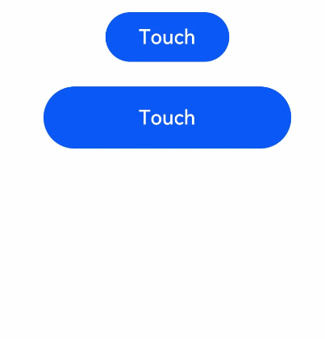

# 触屏事件


触屏事件指当手指/手写笔在组件上按下、滑动、抬起时触发的回调事件。包括[点击事件](#点击事件)、[拖拽事件](#拖拽事件)和[触摸事件](#触摸事件)。


**图1**  触摸事件原理


## 点击事件

点击事件是指通过手指或手写笔做出一次完整的按下和抬起动作。当发生点击事件时，会触发以下回调函数：


```ts
onClick(event: (event?: ClickEvent) => void)
```


event参数提供点击事件相对于窗口或组件的坐标位置，以及发生点击的事件源。


  例如通过按钮的点击事件控制图片的显示和隐藏。

```ts
@Entry
@Component
struct IfElseTransition {
  @State flag: boolean = true;
  @State btnMsg: string = 'show';

  build() {
    Column() {
      Button(this.btnMsg).width(80).height(30).margin(30)
        .onClick(() => {
          if (this.flag) {
            this.btnMsg = 'hide';
          } else {
            this.btnMsg = 'show';
          }
          // 点击Button控制Image的显示和消失
          this.flag = !this.flag;
        })
      if (this.flag) {
        Image($r('app.media.icon')).width(200).height(200)
      }
    }.height('100%').width('100%')
  }
}
```


## 拖拽事件

拖拽事件指手指/手写笔长按组件（&gt;=500ms），并拖拽到接收区域释放的事件。拖拽事件触发流程：


拖拽事件的触发通过长按、拖动平移判定，手指平移的距离达到5vp即可触发拖拽事件。ArkUI支持应用内、跨应用的拖拽事件。


拖拽事件提供以下[接口](../reference/arkui-ts/ts-universal-events-drag-drop.md)：


| 接口名称                                     | 描述                                       |
| ---------------------------------------- | ---------------------------------------- |
| onDragStart(event:&nbsp;(event?:&nbsp;DragEvent,&nbsp;extraParams?:&nbsp;string)&nbsp;=&gt;&nbsp;CustomBuilder&nbsp;\|&nbsp;DragItemInfo) | 拖拽启动接口。当前仅支持自定义pixelmap和自定义组件。           |
| onDragEnter(event:&nbsp;(event?:&nbsp;DragEvent,&nbsp;extraParams?:&nbsp;string)&nbsp;=&gt;&nbsp;void) | 拖拽进入组件接口。DragEvent定义拖拽发生位置，extraParmas表示用户自定义信息 |
| onDragLeave(event:&nbsp;(event?:&nbsp;DragEvent,&nbsp;extraParams?:&nbsp;string)&nbsp;=&gt;&nbsp;void) | 拖拽离开组件接口。DragEvent定义拖拽发生位置，extraParmas表示拖拽事件额外信息。 |
| onDragMove(event:&nbsp;(event?:&nbsp;DragEvent,&nbsp;extraParams?:&nbsp;string)&nbsp;=&gt;&nbsp;void) | 拖拽移动接口。DragEvent定义拖拽发生位置，extraParmas表示拖拽事件额外信息。 |
| onDrop(event:&nbsp;(event?:&nbsp;DragEvent,&nbsp;extraParams?:&nbsp;string)&nbsp;=&gt;&nbsp;void) | 拖拽释放组件接口。DragEvent定义拖拽发生位置，extraParmas表示拖拽事件额外信息。 |


如下是跨窗口拖拽，拖出窗口示例：


```ts
import image from '@ohos.multimedia.image';

@Entry
@Component
struct Index {
  @State visible: Visibility = Visibility.Visible
  private pixelMapReader:image.PixelMap|undefined = undefined

  aboutToAppear() {
    console.info('begin to create pixmap has info message: ')
    this.createPixelMap()
  }

  createPixelMap() {
    let color = new ArrayBuffer(4 * 96 * 96);
    let buffer = new Uint8Array(color);
    for (let i = 0; i < buffer.length; i++) {
      buffer[i] = (i + 1) % 255;
    }
    class hw{
      height:number = 96
      width:number = 96
    }
    let hwo:hw = new hw()
    let ops:image.InitializationOptions|void = {
      'alphaType': 0,
      'editable': true,
      'pixelFormat': 4,
      'scaleMode': 1,
      'size': hwo
    }
    const promise: Promise<image.PixelMap> = image.createPixelMap(color, ops);
    promise.then((data:image.PixelMap|undefined) => {
      console.info('create pixmap has info message: ' + JSON.stringify(data))
      if(data){
        this.pixelMapReader = data;
      }
    })
  }

  @Builder pixelMapBuilder() {
    Text('drag item')
      .width('100%')
      .height(100)
      .fontSize(16)
      .textAlign(TextAlign.Center)
      .borderRadius(10)
      .backgroundColor(0xFFFFFF)
  }

  build() {
    Flex({ direction: FlexDirection.Column, alignItems: ItemAlign.Center, justifyContent: FlexAlign.Center }) {
      Text('App1')
        .width('40%')
        .height(80)
        .fontSize(20)
        .margin(30)
        .textAlign(TextAlign.Center)
        .backgroundColor(Color.Pink)
        .visibility(Visibility.Visible)

      Text('Across Window Drag This')
        .width('80%')
        .height(80)
        .fontSize(16)
        .margin(30)
        .textAlign(TextAlign.Center)
        .backgroundColor(Color.Pink)
        .visibility(this.visible)
        .onDragStart((event: DragEvent|undefined, extraParams: string|undefined):CustomBuilder | DragItemInfo => {
          console.info('Text onDrag start')
          return { pixelMap: this.pixelMapReader, extraInfo: 'custom extra info.' }
        })
        .onDrop((event: DragEvent|undefined, extraParams: string|undefined) => {
          console.info('Text onDragDrop,  ')
          this.visible = Visibility.None                    //拖动结束后，使源不可见
        })
    }

    .width('100%')
    .height('100%')
  }
}
```


跨窗口拖拽，拖入示例：


```ts

@Entry
@Component
struct Index {
  @State number: string[] = ['drag here']
  @State text: string = ''
  @State bool1: boolean = false
  @State bool2: boolean = false
  @State visible: Visibility = Visibility.Visible
  @State visible2: Visibility = Visibility.None
  scroller: Scroller = new Scroller()

  build() {
    Flex({ direction: FlexDirection.Column, alignItems: ItemAlign.Center, justifyContent: FlexAlign.Center }) {
      Text('App2')
        .width('40%')
        .height(80)
        .fontSize(20)
        .margin(30)
        .textAlign(TextAlign.Center)
        .backgroundColor(Color.Pink)
        .visibility(Visibility.Visible)

      List({ space: 20, initialIndex: 0 }) {
        ForEach(this.number, (item:string) => {
          ListItem() {
            Text('' + item)
              .width('100%')
              .height(80)
              .fontSize(16)
              .borderRadius(10)
              .textAlign(TextAlign.Center)
              .backgroundColor(0xFFFFFF)
          }
        }, (item:string):string => item)

        ListItem() {
          Text('Across Window Drag This')
            .width('80%')
            .height(80)
            .fontSize(16)
            .margin(30)
            .textAlign(TextAlign.Center)
            .backgroundColor(Color.Pink)
            .visibility(this.visible2)
        }
      }
      .height('50%')
      .width('90%')
      .border({ width: 1 })
      .divider({ strokeWidth: 2, color: 0xFFFFFF, startMargin: 20, endMargin: 20 })
      .onDragEnter((event: DragEvent|undefined, extraParams: string|undefined) => {                         //拖拽进去组件
        console.info('List onDragEnter, ' + extraParams)
      })
      .onDragMove((event: DragEvent|undefined, extraParams: string|undefined) => {                          //拖拽时移动
        console.info('List onDragMove, ' + extraParams)
      })
      .onDragLeave((event: DragEvent|undefined, extraParams: string|undefined) => {                         //拖拽离开组件
        console.info('List onDragLeave, ' + extraParams)
      })
      .onDrop((event: DragEvent|undefined, extraParams: string|undefined) => {                              //释放组件
        console.info('List onDragDrop, ' + extraParams)
        this.visible2 = Visibility.Visible                                              //拖拽完成使拖入目标可见
      })
    }
    .width('100%')
    .height('100%')
  }
}
```


## 触摸事件

当手指或手写笔在组件上触碰时，会触发不同动作所对应的事件响应，包括按下（Down）、滑动（Move）、抬起（Up）事件：


```ts
onTouch(event: (event?: TouchEvent) => void)
```

- event.type为TouchType.Down：表示手指按下。

- event.type为TouchType.Up：表示手指抬起。

- event.type为TouchType.Move：表示手指按住移动。

触摸事件可以同时多指触发，通过event参数可获取触发的手指位置、手指唯一标志、当前发生变化的手指和输入的设备源等信息。


```ts
// xxx.ets
@Entry
@Component
struct TouchExample {
  @State text: string = '';
  @State eventType: string = '';

  build() {
    Column() {
      Button('Touch').height(40).width(100)
        .onTouch((event?: TouchEvent) => {
          if(event){
            if (event.type === TouchType.Down) {
              this.eventType = 'Down';
            }
            if (event.type === TouchType.Up) {
              this.eventType = 'Up';
            }
            if (event.type === TouchType.Move) {
              this.eventType = 'Move';
            }
            this.text = 'TouchType:' + this.eventType + '\nDistance between touch point and touch element:\nx: '
            + event.touches[0].x + '\n' + 'y: ' + event.touches[0].y + '\nComponent globalPos:('
            + event.target.area.globalPosition.x + ',' + event.target.area.globalPosition.y + ')\nwidth:'
            + event.target.area.width + '\nheight:' + event.target.area.height
          }
        })
      Button('Touch').height(50).width(200).margin(20)
        .onTouch((event?: TouchEvent) => {
          if(event){
            if (event.type === TouchType.Down) {
              this.eventType = 'Down';
            }
            if (event.type === TouchType.Up) {
              this.eventType = 'Up';
            }
            if (event.type === TouchType.Move) {
              this.eventType = 'Move';
            }
            this.text = 'TouchType:' + this.eventType + '\nDistance between touch point and touch element:\nx: '
            + event.touches[0].x + '\n' + 'y: ' + event.touches[0].y + '\nComponent globalPos:('
            + event.target.area.globalPosition.x + ',' + event.target.area.globalPosition.y + ')\nwidth:'
            + event.target.area.width + '\nheight:' + event.target.area.height
          }
        })
      Text(this.text)
    }.width('100%').padding(30)
  }
}
```




## 相关实例

针对触屏事件开发，有以下相关实例可供参考：

- [ArkTS组件集（ArkTS）（Full SDK）（API10）](https://gitee.com/openharmony/applications_app_samples/tree/OpenHarmony-4.0-Release/code/UI/ArkTsComponentCollection/ComponentCollection)