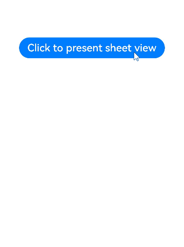

# 模态转场


模态转场是新的界面覆盖在旧的界面上，旧的界面不消失的一种转场方式。


  **表1** 模态转场接口

| 接口 | 说明 | 使用场景 |
| -------- | -------- | -------- |
| [bindContentCover](../reference/arkui-ts/ts-universal-attributes-modal-transition.md) | 弹出全屏的模态组件。 | 用于自定义全屏的模态展示界面，结合转场动画和共享元素动画可实现复杂转场动画效果，如缩略图片点击后查看大图。 |
| [bindSheet](../reference/arkui-ts/ts-universal-attributes-sheet-transition.md) | 弹出半模态组件。 | 用于半模态展示界面，如分享框。 |
| [bindMenu](../reference/arkui-ts/ts-universal-attributes-menu.md) | 弹出菜单，点击组件后弹出。 | 需要Menu菜单的场景，如一般应用的“+”号键。 |
| [bindContextMenu](../reference/arkui-ts/ts-universal-attributes-menu.md) | 弹出菜单，长按或者右键点击后弹出。 | 长按浮起效果，一般结合拖拽框架使用，如桌面图标长按浮起。 |
| [bindPopup](../reference/arkui-ts/ts-universal-attributes-popup.md) | 弹出Popup弹框。 | Popup弹框场景，如点击后对某个组件进行临时说明。 |
| if | 通过if新增或删除组件。 | 用来在某个状态下临时显示一个界面，这种方式的返回导航需要由开发者监听接口实现。 |


## 使用bindContentCover构建全屏模态转场效果

[bindContentCover](../reference/arkui-ts/ts-universal-attributes-modal-transition.md)接口用于为组件绑定全屏模态页面，在组件插入和删除时可通过设置转场参数ModalTransition显示过渡动效。

1. 定义全屏模态转场效果[bindContentCover](../reference/arkui-ts/ts-universal-attributes-modal-transition.md)。

2. 定义模态展示界面。
  
   ```ts
   // 通过@Builder构建模态展示界面
   @Builder MyBuilder() {
     Column() {
       Text('my model view')
     }
     // 通过转场动画实现出现消失转场动画效果，transition需要加在builder下的第一个组件 
     .transition(TransitionEffect.translate(y:300).animation({ curve: curves.springMotion(0.6, 0.8) }))
   }
   ```

3. 通过模态接口调起模态展示界面，通过转场动画或者共享元素动画去实现对应的动画效果。
  
   ```ts
   class PresentTmp{
     isPresent: boolean = false;
     set(){
       this.isPresent = !this.isPresent;
     }
   }
   // 模态转场控制变量
   @State isPresent: boolean = false;
   
   Button('Click to present model view')
     // 通过选定的模态接口，绑定模态展示界面，ModalTransition是内置的ContentCover转场动画类型，这里选择None代表系统不加默认动画
     .bindContentCover($$this.isPresent, this.MyBuilder, ModalTransition.None)
     .onClick(() => {
       // 改变状态变量，让模态界面显示
       let setPre:PresentTmp = new PresentTmp()
       setPre.set()
     })
   ```


完整示例代码和效果如下。


```ts
import curves from '@ohos.curves';

@Entry
@Component
struct BindContentCoverDemo {
  // 第一步：定义全屏模态转场效果bindContentCover
  // 模态转场控制变量
  @State isPresent: boolean = false;

  // 第二步：定义模态展示界面
  // 通过@Builder构建模态展示界面
  @Builder MyBuilder() {
    Column() {
      Column() {
        Column() {
          Text('back')
            .fontSize(24)
            .fontColor(Color.White)
        }
        .justifyContent(FlexAlign.Center)
        .width(100)
        .height(100)
        .borderRadius(5)
        .backgroundColor(0xf56c6c)
        .onClick(() => {
          this.isPresent = false;
        })
      }
      .height('100%')
      .width('100%')
      .backgroundColor(0x909399)
      .justifyContent(FlexAlign.Center)
      .border({
        radius: {
          topLeft: 15,
          topRight: 15,
        }
      })
    }
    .height('100%')
    .justifyContent(FlexAlign.End)
    // 通过转场动画实现出现消失转场动画效果
    .transition(TransitionEffect.translate({ y: 1000 }).animation({ curve: curves.springMotion(0.6, 0.8) }))
  }

  build() {
    Column() {
      Column() {
        Text('Click Me')
          .fontSize(24)
          .fontColor(Color.White)
      }
      // 第三步：通过模态接口调起模态展示界面，通过转场动画或者共享元素动画去实现对应的动画效果
      .onClick(() => {
        // 改变状态变量，让模态界面显示
        this.isPresent = !this.isPresent;
      })
      // 通过选定的模态接口，绑定模态展示界面，ModalTransition是内置的ContentCover转场动画类型，这里选择None代表系统不加默认动画
      .bindContentCover($$this.isPresent, this.MyBuilder(), ModalTransition.DEFAULT)
      .justifyContent(FlexAlign.Center)
      .backgroundColor(0XF56C6C)
      .width(100)
      .height(100)
      .borderRadius(5)
    }
    .justifyContent(FlexAlign.Center)
    .width('100%')
    .height('100%')
  }
}
```


## 使用bindSheet构建半模态转场效果

[bindSheet](../reference/arkui-ts/ts-universal-attributes-sheet-transition.md)属性可为组件绑定半模态页面，在组件插入时可通过设置自定义或默认的内置高度确定半模态大小。构建半模态转场动效的步骤基本与使用bindContentCover构建全屏模态转场动效相同。

完整示例和效果如下。


```ts
@Entry
@Component
struct BindSheetDemo {

  // 半模态转场高度控制变量
  @State sheetHeight: number|SheetSize|null|undefined = 300;
  // 半模态转场控制条控制变量
  @State showDragBar: boolean = true;

  // 通过@Builder构建半模态展示界面
  @Builder myBuilder() {
    Column() {
      Button("change height")
        .margin(10)
        .fontSize(20)
        .onClick(() => {
          this.sheetHeight = 500;
        })

      Button("Set Illegal height")
        .margin(10)
        .fontSize(20)
        .onClick(() => {
          this.sheetHeight = null;
        })

      Button("close dragbar")
        .margin(10)
        .fontSize(20)
        .onClick(() => {
          this.showDragBar = !this.showDragBar;
        })
      Button("close modal 1")
        .margin(10)
        .fontSize(20)
        .onClick(() => {
          this.isPresent = false;
        })
    }
    .width('100%')
    .height('100%')
  }

  // 半模态转场控制变量
  @State isPresent: boolean = false;

  build() {
    Column() {
      if(this.sheetHeight){
        Button("Click to present sheet view")
        .onClick(() => {
          // 改变状态变量，让模态界面显示
          this.isPresent = !this.isPresent;
        })
        .fontSize(20)
        .margin(10)
          // 通过选定的半模态接口，绑定模态展示界面，style中包含两个参数，一个是设置半模态的高度，不设置时默认高度是Large,一个是是否显示控制条DragBar,默认是true显示控制条
        .bindSheet($$this.isPresent, this.myBuilder(), { height: this.sheetHeight, dragBar: this.showDragBar })
      }
    }
    .justifyContent(FlexAlign.Center)
    .width('100%')
    .height('100%')
  }
}
```




## 使用bindMenu实现菜单弹出效果

[bindMenu](../reference/arkui-ts/ts-universal-attributes-menu.md)为组件绑定弹出式菜单，通过点击触发。完整示例和效果如下。


```ts
class BMD{
  value:string = ''
  action:Function|undefined = undefined
}
@Entry
@Component
struct BindMenuDemo {

  // 第一步: 定义一组数据用来表示菜单按钮项
  private items = [
    {
      value: '菜单项1',
      action: () => {
        console.info('handle Menu1 select')
      }
    } as BMD,
    {
      value: '菜单项2',
      action: () => {
        console.info('handle Menu2 select')
      }
    } as BMD,
  ]

  build() {
    Column() {
      Button('click')
        .backgroundColor(0x409eff)
        .borderRadius(5)
          // 第二步: 通过bindMenu接口将菜单数据绑定给元素
        .bindMenu(this.items)
    }
    .justifyContent(FlexAlign.Center)
    .width('100%')
    .height(437)
  }
}
```


## 使用bindContextMenu实现菜单弹出效果

[bindContextMenu](../reference/arkui-ts/ts-universal-attributes-menu.md)为组件绑定弹出式菜单，通过长按或右键点击触发。完整示例和效果如下。

完整示例和效果如下。


```ts
@Entry
@Component
struct BindContextMenuDemo {
  private num: number[] = [1, 2, 3, 4];
  private colors: Color[] = [0x67C23A, 0xE6A23C, 0xf56c6c, 0x909399];
  // 通过@Builder构建自定义菜单项
  @Builder MyMenu() {
    Row() {
      Column() {
        ForEach(this.num, (item: number, index?: number|undefined) => {
          if(index){
            Row() {
              Text(item.toString())
                .fontSize(20)
                .fontColor(Color.White)
            }
            .backgroundColor(this.colors[index])
            .width('100%')
            .aspectRatio(2)
            .justifyContent(FlexAlign.Center)
          }
        })
      }
      .width('100%')
    }
    .width(150)
    .justifyContent(FlexAlign.Center)
    .padding(5)
  }

  build() {
    Column() {
      Column() {
        Text('longPress')
          .fontSize(20)
          .fontColor(Color.White)
      }
      .justifyContent(FlexAlign.Center)
      .width(170)
      .height(50)
      .bindContextMenu(this.MyMenu, ResponseType.LongPress)
      .backgroundColor(0xf56c6c)
      .borderRadius(5)
    }
    .justifyContent(FlexAlign.Center)
    .width('100%')
    .height(437)
  }
}
```


## 使用bindPopUp实现气泡弹窗效果

[bindpopup](../reference/arkui-ts/ts-universal-attributes-popup.md)属性可为组件绑定弹窗，并设置弹窗内容，交互逻辑和显示状态。

完整示例和代码如下。


```ts
@Entry
@Component
struct BindPopupDemo {

  // 第一步：定义变量控制弹窗显示
  @State customPopup: boolean = false;

  // 第二步：popup构造器定义弹框内容
  @Builder popupBuilder() {
    Column({ space: 2 }) {
      Row().width(64)
        .height(64)
        .backgroundColor(0x409eff)
      Text('Popup')
        .fontSize(10)
        .fontColor(Color.White)
    }
    .justifyContent(FlexAlign.SpaceAround)
    .width(100)
    .height(100)
    .padding(5)
  }

  build() {
    Column() {

      Button('click')
        // 第四步：创建点击事件，控制弹窗显隐
        .onClick(() => {
          this.customPopup = !this.customPopup;
        })
        .backgroundColor(0xf56c6c)
          // 第三步：使用bindPopup接口将弹窗内容绑定给元素
        .bindPopup(this.customPopup, {
          builder: this.popupBuilder,
          placement: Placement.Top,
          maskColor: 0x33000000,
          popupColor: 0xf56c6c,
          enableArrow: true,
          onStateChange: (e) => {
            if (!e.isVisible) {
              this.customPopup = false;
            }
          }
        })
    }
    .justifyContent(FlexAlign.Center)
    .width('100%')
    .height(437)
  }
}
```


## 使用if实现模态转场

上述模态转场接口需要绑定到其他组件上，通过监听状态变量改变调起模态界面。实际上，也可以通过if范式，通过新增/删除组件，实现模态转场效果。

完整示例和代码如下。


```ts
@Entry
@Component
struct ModalTransition1 {

  // 第一步：定义状态变量控制页面显示
  @State isShow: boolean = false;

  build() {
    // 第二步：定义Stack布局显示当前页面和模态页面
    Stack() {
      Column() {
        Text('Page1')
          .fontSize(40)
          .fontColor(Color.White)
          .fontWeight(FontWeight.Bolder)

        Text('Click to transition')
          .fontSize(15)
          .fontColor(Color.White)
      }
      .justifyContent(FlexAlign.Center)
      .width('100%')
      .height('100%')
      .linearGradient({
        colors: [
          [0xf56c6c, 0.0],
          [0xffffff, 1.0]
        ]
      })
      // 第五步：改变状态变量，显示模态页面
      .onClick(() => {
        animateTo({ duration: 500 }, () => {
          this.isShow = !this.isShow;
        })
      })

      // 第三步：在if中定义模态页面，显示在最上层，通过if控制模态页面出现消失
      if (this.isShow) {
        Column() {
          Text('Page2')
            .fontSize(40)
            .fontColor(Color.Gray)
            .fontWeight(FontWeight.Bolder)

          Text('Click to transition')
            .fontSize(15)
            .fontColor(Color.Gray)
        }
        .justifyContent(FlexAlign.Start)
        .width('100%')
        .height('100%')
        .linearGradient({
          colors: [
            [0xffffff, 0.0],
            [0x409eff, 1.0]
          ]
        })
        // 第四步：定义模态页面出现消失转场方式
        .transition(TransitionEffect.OPACITY.combine(TransitionEffect.rotate({ angle: 90, y: 1 })))
        .onClick(() => {
          animateTo({ duration: 500 }, () => {
            this.isShow = !this.isShow;
          })
        })
      }

    }
    .width('100%')
    .height('100%')
  }
}
```


