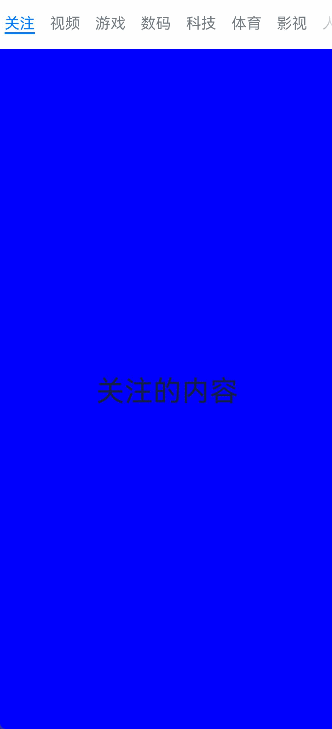

# Tabs


当页面信息较多时，为了让用户能够聚焦于当前显示的内容，需要对页面内容进行分类，提高页面空间利用率。[Tabs](../reference/arkui-ts/ts-container-tabs.md)组件可以在一个页面内快速实现视图内容的切换，一方面提升查找信息的效率，另一方面精简用户单次获取到的信息量。


## 基本布局

  Tabs组件的页面组成包含两个部分，分别是TabContent和TabBar。TabContent是内容页，TabBar是导航页签栏，页面结构如下图所示，根据不同的导航类型，布局会有区别，可以分为底部导航、顶部导航、侧边导航，其导航栏分别位于底部、顶部和侧边。
  **图1** Tabs组件布局示意图  


>**说明：**
>
> - TabContent组件不支持设置通用宽度属性，其宽度默认撑满Tabs父组件。
>
> - TabContent组件不支持设置通用高度属性，其高度由Tabs父组件高度与TabBar组件高度决定。


Tabs使用花括号包裹TabContent，如图2，其中TabContent显示相应的内容页。


  **图2** Tabs与TabContent使用  


每一个TabContent对应的内容需要有一个页签，可以通过TabContent的tabBar属性进行配置。在如下TabContent组件上设置属性tabBar，可以设置其对应页签中的内容，tabBar作为内容的页签。


```ts
 TabContent() {
   Text('首页的内容').fontSize(30)
 }
.tabBar('首页')
```


设置多个内容时，需在Tabs内按照顺序放置。


```ts
Tabs() {
  TabContent() {
    Text('首页的内容').fontSize(30)
  }
  .tabBar('首页')

  TabContent() {
    Text('推荐的内容').fontSize(30)
  }
  .tabBar('推荐')

  TabContent() {
    Text('发现的内容').fontSize(30)
  }
  .tabBar('发现')
  
  TabContent() {
    Text('我的内容').fontSize(30)
  }
  .tabBar("我的")
}
```


## 底部导航

底部导航是应用中最常见的一种导航方式。底部导航位于应用一级页面的底部，用户打开应用，能够分清整个应用的功能分类，以及页签对应的内容，并且其位于底部更加方便用户单手操作。底部导航一般作为应用的主导航形式存在，其作用是将用户关心的内容按照功能进行分类，迎合用户使用习惯，方便在不同模块间的内容切换。


  **图3** 底部导航栏  


导航栏位置使用Tabs的参数barPosition进行设置，默认情况下，导航栏位于顶部，参数默认值为Start。设置为底部导航需要在Tabs传递参数，设置barPosition为End。


```ts
Tabs({ barPosition: BarPosition.End }) {
  // TabContent的内容：首页、发现、推荐、我的
  ...
}
```


## 顶部导航

当内容分类较多，用户对不同内容的浏览概率相差不大，需要经常快速切换时，一般采用顶部导航模式进行设计，作为对底部导航内容的进一步划分，常见一些资讯类应用对内容的分类为关注、视频、数码，或者主题应用中对主题进行进一步划分为图片、视频、字体等。

  **图4** 顶部导航栏  


Tabs组件默认的barPosition参数为Start，即顶部导航模式。


```ts
Tabs({ barPosition: BarPosition.Start }) {
  // TabContent的内容:关注、视频、游戏、数码、科技、体育、影视
  ...
}
```


## 侧边导航

侧边导航是应用较为少见的一种导航模式，更多适用于横屏界面，用于对应用进行导航操作，由于用户的视觉习惯是从左到右，侧边导航栏默认为左侧侧边栏。


  **图5** 侧边导航栏  


实现侧边导航栏需要设置Tabs的属性vertical为true。在底部导航和顶部导航实现中，其默认值为false，表明内容页和导航栏垂直方向排列。


```ts
Tabs({ barPosition: BarPosition.Start }) {
  // TabContent的内容:首页、发现、推荐、我的
  ...
}
.vertical(true)
.barWidth(100)
.barHeight(200)
```


>**说明：**
>
> - vertical为true时，tabbar宽度会默认撑满屏幕的宽度，需要设置barWidth为合适值。
>
> - vertical为true时，tabbar的高度会默认实际内容高度，需要设置barHeight为合适值。


## 限制导航栏的滑动切换

  默认情况下，导航栏都支持滑动切换，在一些内容信息量需要进行多级分类的页面，如支持底部导航+顶部导航组合的情况下，底部导航栏的滑动效果与顶部导航出现冲突，此时需要限制底部导航的滑动，避免引起不好的用户体验。
  **图6** 限制底部导航栏滑动  


控制滑动切换的属性为scrollable，默认值为true，表示可以滑动，若要限制滑动切换页签则需要设置为false。


```ts
Tabs({ barPosition: BarPosition.End }) {
  TabContent(){
    Column(){
      Tabs(){
        // 顶部导航栏内容
        ...
      }
    }
    .backgroundColor('#ff08a8f1')
    .width('100%')
  }
  .tabBar('首页')

  // 其他TabContent内容：发现、推荐、我的
  ...
}
.scrollable(false)
```


## 固定导航栏

当内容分类较为固定且不具有拓展性时，例如底部导航内容分类一般固定，分类数量一般在3-5个，此时使用固定导航栏。固定导航栏不可滚动，无法被拖拽滚动，内容均分tabBar的宽度。


  **图7** 固定导航栏 


Tabs的属性barMode是控制导航栏是否可以滚动，默认值为Fixed。


```ts
Tabs({ barPosition: BarPosition.End }) {
  // TabContent的内容：首页、发现、推荐、我的
  ...
}
.barMode(BarMode.Fixed)
```


## 滚动导航栏

滚动导航栏可以用于顶部导航栏或者侧边导航栏的设置，内容分类较多，屏幕宽度无法容纳所有分类页签的情况下，需要使用可滚动的导航栏，支持用户点击和滑动来加载隐藏的页签内容。


  **图8** 可滚动导航栏  




滚动导航栏需要设置Tabs组件的barMode属性，默认情况下其值为Fixed，表示为固定导航栏，设置为Scrollable即可设置为可滚动导航栏。


```ts
Tabs({ barPosition: BarPosition.Start }) {
  // TabContent的内容：关注、视频、游戏、数码、科技、体育、影视、人文、艺术、自然、军事
  ...
}
.barMode(BarMode.Scrollable)
```


## 自定义导航栏

对于底部导航栏，一般作为应用主页面功能区分，为了更好的用户体验，会组合文字以及对应语义图标表示页签内容，这种情况下，需要自定义导航页签的样式。


  **图9** 自定义导航栏图  


系统默认情况下采用了下划线标志当前活跃的页签，而自定义导航栏需要自行实现相应的样式，用于区分当前活跃页签和未活跃页签。


设置自定义导航栏需要使用tabBar的参数，以其支持的CustomBuilder的方式传入自定义的函数组件样式。例如这里声明TabBuilder的自定义函数组件，传入参数包括页签文字title，对应位置index，以及选中状态和未选中状态的图片资源。通过当前活跃的currentIndex和页签对应的targetIndex匹配与否，决定UI显示的样式。


```ts
@Builder TabBuilder(title: string, targetIndex: number, selectedImg: Resource, normalImg: Resource) {
  Column() {
    Image(this.currentIndex === targetIndex ? selectedImg : normalImg)
      .size({ width: 25, height: 25 })
    Text(title)
      .fontColor(this.currentIndex === targetIndex ? '#1698CE' : '#6B6B6B')
  }
  .width('100%')
  .height(50)
  .justifyContent(FlexAlign.Center)
}
```


在TabContent对应tabBar属性中传入自定义函数组件，并传递相应的参数。


```ts
TabContent() {
  Column(){
    Text('我的内容')  
  }
  .width('100%')
  .height('100%')
  .backgroundColor('#007DFF')
}
.tabBar(this.TabBuilder('我的', 0, $r('app.media.mine_selected'), $r('app.media.mine_normal')))
```


## 切换至指定页签

在不使用自定义导航栏时，系统默认的Tabs会实现切换逻辑。在使用了自定义导航栏后，切换页签的逻辑需要手动实现。即用户点击对应页签时，屏幕需要显示相应的内容页。


  **图10** 使用自定义导航栏实现切换指定页签  


切换指定页签需要使用TabsController，TabsController是Tabs组件的控制器，用于控制Tabs组件进行页签切换。通过TabsController的changeIndex方法来实现跳转至指定索引值对应的TabContent内容。


```ts
private tabsController : TabsController = new TabsController()
@State currentIndex:number = 0;

@Builder TabBuilder(title: string, targetIndex: number) {
  Column() {
    Text(title)
      .fontColor(this.currentIndex === targetIndex ? '#1698CE' : '#6B6B6B')
  }
  ...
  .onClick(() => {
    this.currentIndex = targetIndex;
    this.tabsController.changeIndex(this.currentIndex);
  })
}
```


使用自定义导航栏时，在tabBar属性中传入对应的\@Builder，并传入相应的参数。


```ts
Tabs({ barPosition: BarPosition.End, controller: this.tabsController }) {
  TabContent(){
    ...
  }.tabBar(this.TabBuilder('首页',0))

  TabContent(){
    ...
  }.tabBar(this.TabBuilder('发现',1))

  TabContent(){
    ...
  }.tabBar(this.TabBuilder('推荐',2))

  TabContent(){
    ...
  }
  .tabBar(this.TabBuilder('我的',3))
}
```


## 滑动切换导航栏

在不使用自定义导航栏的情况下，Tabs默认会实现tabBar与TabContent的切换联动。但在使用了自定义导航栏后，使用TabsController可以实现点击页签与页面内容的联动，但不能实现滑动页面时，页面内容对应页签的联动。即用户在使用滑动屏幕切换页面内容时，页签栏需要同步切换至内容对应的页签。


  **图11** 滑动切换时页签内容不联动  


此时需要使用Tabs提供的onChange事件方法，监听索引index的变化，并将其当前活跃的index值传递给currentIndex，实现页签内容的切换。


```ts
Tabs({ barPosition: BarPosition.End, controller: this.tabsController }) {
  TabContent() {
    ...
  }.tabBar(this.TabBuilder('首页', 0))

  TabContent() {
    ...
  }.tabBar(this.TabBuilder('发现', 1))

  TabContent() {
    ...
  }.tabBar(this.TabBuilder('推荐', 2))

  TabContent() {
    ...
  }
  .tabBar(this.TabBuilder('我的', 3))
}.onChange((index) => {
  this.currentIndex = index
})
```


  **图12** 内容与页签联动 


## 相关实例

如需详细了解Tabs的更多实现，请参考以下示例：

- [健康生活](https://gitee.com/openharmony/codelabs/tree/master/ETSUI/Healthy_life)

- [常用组件与布局](https://gitee.com/openharmony/codelabs/tree/master/ETSUI/ArkTSComponents)
