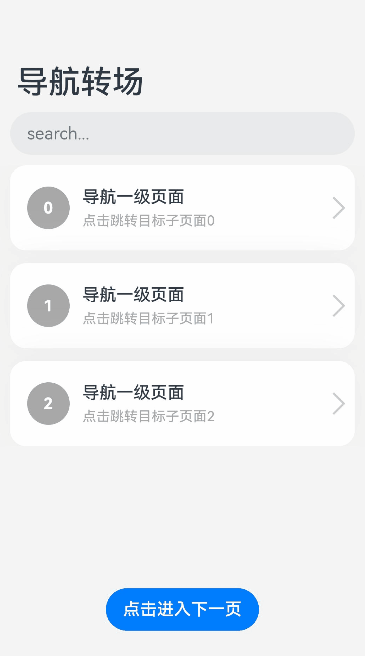

# 导航转场


导航转场是页面的路由转场方式，也就是一个界面消失，另外一个界面出现的动画效果。导航转场的动画效果是系统定义的，开发者不能修改。


导航转场推荐使用[Navigation](../reference/arkui-ts/ts-basic-components-navigation.md)组件实现，可搭配[NavRouter](../reference/arkui-ts/ts-basic-components-navrouter.md)组件和[NavDestination](../reference/arkui-ts/ts-basic-components-navdestination.md)组件实现导航功能。


完整的代码示例和效果如下。


```ts
@Entry
@Component
struct NavigationDemo {
  private listArray: Array<number> = [0, 1, 2, 3, 4, 5, 6, 7, 8, 9];

  // 设置标题栏菜单组件，如果不需要标题栏组件，可以不设置
  @Builder NavigationMenus() {
    Column() {
      Text('menu')
        .fontColor('#182431')
        .fontSize(14)
        .lineHeight(19)
        .opacity(0.4)
        .margin({ top: 30 })
    }
    .alignItems(HorizontalAlign.Start)
  }

  build() {
    Stack() {
      Column() {
        // 定义Navigation组件，设置显示模式，设置标题
        Navigation() {
          // 这里定义了一个输入法框组件
          TextInput({ placeholder: 'search...' })
            .width('90%')
            .height(40)
            .backgroundColor('#ededed')
            .margin({ bottom: 10 })

          // 通过List定义导航的一级界面
          List({ space: 12, initialIndex: 0 }) {
            ForEach(this.listArray, (item:number) => {
              ListItem() {
                // 通过NavRouter定义导航转场，通过NavDestination定义导航目标界面，界面之间通过组件间的状态变量或者普通变量传递参数
                // NavRouter必须包含两个子组件，第一个组件是导航一级界面，第二个子组件必须为NavDestination为导航目标界面
                NavRouter() {
                  // 第一个组件：导航的一级界面显示的组件
                  Row() {
                    Row()
                      .width(40)
                      .height(40)
                      .backgroundColor('#a8a8a8')
                      .margin({ right: 12 })
                      .borderRadius(20)

                    Column() {
                      Text('导航一级页面')
                        .fontSize(16)
                        .lineHeight(21)
                        .fontWeight(FontWeight.Medium)
                      Text('点击跳转目标子页面')
                        .fontSize(13)
                        .lineHeight(21)
                        .fontColor('#a8a8a8')
                    }
                    .alignItems(HorizontalAlign.Start)

                    Blank()

                    Row()
                      .width(15)
                      .height(15)
                      .margin({ right: 12 })
                      .border({
                        width: { top: 2, right: 2 },
                        color: 0xcccccc
                      })
                      .rotate({ angle: 45 })
                  }
                  .borderRadius(15)
                  .shadow({ radius: 100, color: '#ededed' })
                  .width('90%')
                  .alignItems(VerticalAlign.Center)
                  .padding({ left: 16, top: 12, bottom: 12 })
                  .height(80)

                  // 第二个组件：导航的目的界面
                  NavDestination() {
                    // 目的界面的内容，这里一般为自定义的Component
                    Column() {
                      Text("导航目标页面" + item + "内容")
                        .fontSize(20)
                        .fontColor(Color.Black)
                        .textAlign(TextAlign.Center)
                        .width('100%')
                        .height('100%')
                    }
                    .width('100%')
                    .height('100%')
                    .backgroundColor(0xf5f5f5)
                  }
                  .title('导航目标页面') // 这里定义二级界面的标题
                }
              }
              .width('100%')
            }, (item:string):string => item)
          }
          .listDirection(Axis.Vertical)
          .edgeEffect(EdgeEffect.Spring)
          .sticky(StickyStyle.Header)
          .chainAnimation(false)
          .borderRadius(15)
          .width('100%')
          .height('100%')
        }
        .width('100%')
        .mode(NavigationMode.Auto) // 设置显示模式为Auto
        .title('导航转场') // 设置标题文字
        .titleMode(NavigationTitleMode.Full) // 设置标题栏模式
        .menus(this.NavigationMenus) // 设置标题栏菜单
      }
      .width('100%')
    }
  }
}
```




