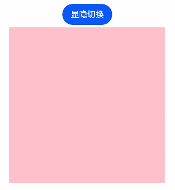

# 性能提升的推荐方法

开发者若使用低性能的代码实现功能场景可能不会影响应用的正常运行，但却会对应用的性能造成负面影响。本章节列举出了一些可提升性能的场景供开发者参考，以避免应用实现上带来的性能劣化。

## 推荐使用数据懒加载

开发者在使用长列表时，如果直接采用循环渲染方式，如下所示，会一次性加载所有的列表元素，一方面会导致页面启动时间过长，影响用户体验，另一方面也会增加服务器的压力和流量，加重系统负担。

```ts
@Entry
@Component
struct MyComponent {
  @State arr: number[] = Array.from(Array(100), (v,k) =>k);  //构造0-99的数组
  build() {
    List() {
      ForEach(this.arr, (item: number) => {
        ListItem() {
          Text(`item value: ${item}`)
        }
      }, (item: number) => item.toString())
    }
  }
}
```

上述代码会在页面加载时将100个列表元素全部加载，这并非我们需要的，我们希望从数据源中按需迭代加载数据并创建相应组件，因此需要使用数据懒加载，如下所示：

```ts
class BasicDataSource implements IDataSource {
  private listeners: DataChangeListener[] = []

  public totalCount(): number {
    return 0
  }

  public getData(index: number): any {
    return undefined
  }

  registerDataChangeListener(listener: DataChangeListener): void {
    if (this.listeners.indexOf(listener) < 0) {
      console.info('add listener')
      this.listeners.push(listener)
    }
  }

  unregisterDataChangeListener(listener: DataChangeListener): void {
    const pos = this.listeners.indexOf(listener);
    if (pos >= 0) {
      console.info('remove listener')
      this.listeners.splice(pos, 1)
    }
  }

  notifyDataReload(): void {
    this.listeners.forEach(listener => {
      listener.onDataReloaded()
    })
  }

  notifyDataAdd(index: number): void {
    this.listeners.forEach(listener => {
      listener.onDataAdd(index)
    })
  }

  notifyDataChange(index: number): void {
    this.listeners.forEach(listener => {
      listener.onDataChange(index)
    })
  }

  notifyDataDelete(index: number): void {
    this.listeners.forEach(listener => {
      listener.onDataDelete(index)
    })
  }

  notifyDataMove(from: number, to: number): void {
    this.listeners.forEach(listener => {
      listener.onDataMove(from, to)
    })
  }
}

class MyDataSource extends BasicDataSource {
  private dataArray: string[] = ['item value: 0', 'item value: 1', 'item value: 2']

  public totalCount(): number {
    return this.dataArray.length
  }

  public getData(index: number): any {
    return this.dataArray[index]
  }

  public addData(index: number, data: string): void {
    this.dataArray.splice(index, 0, data)
    this.notifyDataAdd(index)
  }

  public pushData(data: string): void {
    this.dataArray.push(data)
    this.notifyDataAdd(this.dataArray.length - 1)
  }
}

@Entry
@Component
struct MyComponent {
  private data: MyDataSource = new MyDataSource()

  build() {
    List() {
      LazyForEach(this.data, (item: string) => {
        ListItem() {
          Row() {
            Text(item).fontSize(20).margin({ left: 10 })
          }
        }
        .onClick(() => {
          this.data.pushData('item value: ' + this.data.totalCount())
        })
      }, item => item)
    }
  }
}
```


上述代码在页面加载时仅初始化加载三个列表元素，之后每点击一次列表元素，将增加一个列表元素。

## 使用条件渲染替代显隐控制

如下所示，开发者在使用visibility通用属性控制组件的显隐状态时，仍存在组件的重新创建过程，造成性能上的损耗。

```ts
@Entry
@Component
struct MyComponent {
  @State isVisible: Visibility = Visibility.Visible;

  build() {
    Column() {
      Button("显隐切换")
        .onClick(() => {
          if (this.isVisible == Visibility.Visible) {
            this.isVisible = Visibility.None
          } else {
            this.isVisible = Visibility.Visible
          }
        })
      Row().visibility(this.isVisible)
        .width(300).height(300).backgroundColor(Color.Pink)
    }.width('100%')
  }
}
```

要避免这一问题，可使用if条件渲染代替visibility属性变换，如下所示：

```ts
@Entry
@Component
struct MyComponent {
  @State isVisible: boolean = true;

  build() {
    Column() {
      Button("显隐切换")
        .onClick(() => {
          this.isVisible = !this.isVisible
        })
      if (this.isVisible) {
        Row()
          .width(300).height(300).backgroundColor(Color.Pink)
      }
    }.width('100%')
  }
}
```



## 使用Column/Row替代Flex

由于Flex容器组件默认情况下存在shrink导致二次布局，这会在一定程度上造成页面渲染上的性能劣化。

```ts
@Entry
@Component
struct MyComponent {
  build() {
    Flex({ direction: FlexDirection.Column }) {
      Flex().width(300).height(200).backgroundColor(Color.Pink)
      Flex().width(300).height(200).backgroundColor(Color.Yellow)
      Flex().width(300).height(200).backgroundColor(Color.Grey)
    }
  }
}
```

上述代码可将Flex替换为Column、Row，在保证实现的页面布局效果相同的前提下避免Flex二次布局带来的负面影响。

```ts
@Entry
@Component
struct MyComponent {
  build() {
    Column() {
      Row().width(300).height(200).backgroundColor(Color.Pink)
      Row().width(300).height(200).backgroundColor(Color.Yellow)
      Row().width(300).height(200).backgroundColor(Color.Grey)
    }
  }
}
```


## 减少应用滑动白块

应用通过增大List/Grid控件的cachedCount参数，调整UI的加载范围。cachedCount表示屏幕外List/Grid预加载item的个数。  
如果需要请求网络图片，可以在item滑动到屏幕显示之前，提前下载好内容，从而减少滑动白块。  
如下是使用cachedCount参数的例子：

```ts
@Entry
@Component
struct MyComponent {
  private source: MyDataSource = new MyDataSource();

  build() {
    List() {
      LazyForEach(this.source, item => {
        ListItem() {
          Text("Hello" + item)
            .fontSize(50)
            .onAppear(() => {
              console.log("appear:" + item)
            })
        }
      })
    }.cachedCount(3) // 扩大数值appear日志范围会变大
  }
}

class MyDataSource implements IDataSource {
  data: number[] = [1, 2, 3, 4, 5, 6, 7, 8, 9, 10, 11, 12, 13, 14, 15];

  public totalCount(): number {
    return this.data.length
  }

  public getData(index: number): any {
    return this.data[index]
  }

  registerDataChangeListener(listener: DataChangeListener): void {
  }

  unregisterDataChangeListener(listener: DataChangeListener): void {
  }
}
```


**使用说明：**
cachedCount的增加会增大UI的cpu、内存开销。使用时需要根据实际情况，综合性能和用户体验进行调整。