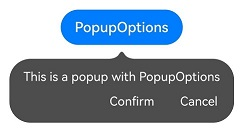

# 气泡提示


Popup属性可绑定在组件上显示气泡弹窗提示，设置弹窗内容、交互逻辑和显示状态。主要用于屏幕录制、信息弹出提醒等显示状态。


气泡分为两种类型，一种是系统提供的气泡[PopupOptions](../reference/arkui-ts/ts-universal-attributes-popup.md#popupoptions类型说明)，一种是开发者可以自定义的气泡[CustomPopupOptions](../reference/arkui-ts/ts-universal-attributes-popup.md#custompopupoptions8类型说明)。其中PopupOptions为系统提供的气泡，通过配置primaryButton、secondaryButton来设置带按钮的气泡。CustomPopupOptions通过配置[builder](../quick-start/arkts-builder.md)参数来设置自定义的气泡。


## 文本提示气泡

文本提示气泡常用于只展示带有文本的信息提示，不带有任何交互的场景。Popup属性需绑定组件，当bindPopup属性中参数show为true的时候会弹出气泡提示。

在Button组件上绑定Popup属性，每次点击Button按钮，handlePopup会切换布尔值，当其为true时，触发bindPopup弹出气泡。


```ts
@Entry
@Component
struct PopupExample {
  @State handlePopup: boolean = false
 
  build() {
    Column() {
      Button('PopupOptions')
        .onClick(() => {
          this.handlePopup = !this.handlePopup
        })
        .bindPopup(this.handlePopup, {
          message: 'This is a popup with PopupOptions',
        })
    }.width('100%').padding({ top: 5 })
  }
}
```


## 带按钮的提示气泡

通过primaryButton、secondaryButton属性为气泡最多设置两个Button按钮，通过此按钮进行简单的交互；开发者可以通过配置action参数来设置想要触发的操作。


```ts
@Entry
@Component
struct PopupExample22 {
  @State handlePopup: boolean = false
  build() {
    Column() {
      Button('PopupOptions').margin({top:200})
        .onClick(() => {
          this.handlePopup = !this.handlePopup
        })
        .bindPopup(this.handlePopup, {
          message: 'This is a popup with PopupOptions',
          primaryButton:{
            value:'Confirm',
            action: () => {
              this.handlePopup = !this.handlePopup
              console.info('confirm Button click')
            }
          },
          secondaryButton: {
            value: 'Cancel',
            action: () => {
              this.handlePopup = !this.handlePopup
            }
          },
        })
    }.width('100%').padding({ top: 5 })
  }
}
```





## 自定义气泡

开发者可以使用构建器CustomPopupOptions创建自定义气泡，\@Builder中可以放自定义的内容。除此之外，还可以通过popupColor等参数控制气泡样式。


```ts
@Entry
@Component
struct Index {
  @State customPopup: boolean = false
  // popup构造器定义弹框内容
  @Builder popupBuilder() {
    Row({ space: 2 }) {
      Image($r("app.media.icon")).width(24).height(24).margin({ left: 5 })
      Text('This is Custom Popup').fontSize(15)
    }.width(200).height(50).padding(5)
  }
  build() {
    Column() {
      Button('CustomPopupOptions')
        .position({x:100,y:200})
        .onClick(() => {
          this.customPopup = !this.customPopup
        })
        .bindPopup(this.customPopup, {
          builder: this.popupBuilder, // 气泡的内容
          placement:Placement.Bottom, // 气泡的弹出位置
          popupColor:Color.Pink // 气泡的背景色
        })
    }
    .height('100%')
  }
}
```


使用者通过配置placement参数将弹出的气泡放到需要提示的位置。弹窗构造器会触发弹出提示信息，来引导使用者完成操作，也让使用者有更好的UI体验。


```ts
@Entry
@Component
struct Index {
  @State customPopup: boolean = false
  // popup构造器定义弹框内容
  @Builder popupBuilder() {
    Row({ space: 2 }) {
      Image('/images/shengWhite.png').width(30).objectFit(ImageFit.Contain)
      Column(){
        Text('控制人生').fontSize(14).fontWeight(900).fontColor(Color.White).width('100%')
        Text('想要跟唱时，数千万歌曲任你选择，人声随心调整。').fontSize(12).fontColor('#ffeeeeee').width('100%')
      }
    }.width(230).height(80).padding(5)
  }
  build() {
    Row() {
      Text('我要K歌')
      Image('/images/sheng.png').width(35).objectFit(ImageFit.Contain)
        .onClick(() => {
          this.customPopup = !this.customPopup
        })
        .bindPopup(this.customPopup, {
          builder: this.popupBuilder,
        })
    }
    .margin(20)
    .height('100%')
  }
}
```
