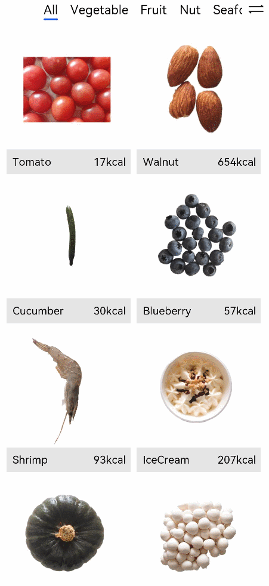

# 添加动画效果

动画主要包含了组件动画和页面间动画，并提供了[插值计算](../reference/apis/js-apis-curve.md)和[矩阵变换](../reference/apis/js-apis-matrix4.md)的动画能力接口，让开发者极大程度的自主设计动画效果。

在本节主要完成两个动画效果：

1. 启动页的闪屏动画，即Logo图标的渐出和放大效果；
2. 食物列表页和食物详情页的共享元素转场动画效果。

## animateTo实现闪屏动画

组件动画包括属性动画和animateTo显式动画：

1. 属性动画：设置组件通用属性变化的动画效果。
2. 显式动画：设置组件从状态A到状态B的变化动画效果，包括样式、位置信息和节点的增加删除等，开发者无需关注变化过程，只需指定起点和终点的状态。animateTo还提供播放状态的回调接口，是对属性动画的增强与封装。

闪屏页面的动画效果是Logo图标的渐出和放大，动画结束后跳转到食物分类列表页面。接下来，我们就使用animateTo来实现启动页动画的闪屏效果。

1. 动画效果自动播放。闪屏动画的预期效果是，进入Logo页面后，animateTo动画效果自动开始播放，可以借助于组件显隐事件的回调接口来实现。调用Shape的onAppear方法，设置其显式动画。

   ```ts
   Shape() {
     ...
   }
   .onAppear(() => {
      animateTo()
   })
   ```

2. 创建opacity和scale数值的成员变量，用装饰器@State修饰。表示其为有状态的数据，即改变会触发页面的刷新。

   ```ts
   @Entry
   @Component
   struct Logo {
     @State private opacityValue: number = 0
     @State private scaleValue: number = 0
     build() {
       Shape() {
         ...
       }
      .scale({ x: this.scaleValue, y: this.scaleValue })
      .opacity(this.opacityValue)
      .onAppear(() => {
        animateTo()
       })
     }
   }
   ```

3. 设置animateTo的动画曲线curve。Logo的加速曲线为先慢后快，使用贝塞尔曲线cubicBezier，cubicBezier(0.4, 0, 1, 1)。

   需要使用动画能力接口中的插值计算，首先要导入curves模块。

   ```ts
   import Curves from '@ohos.curves'
   ```

   @ohos.curves模块提供了线性Curve. Linear、阶梯step、三阶贝塞尔（cubicBezier）和弹簧（spring）插值曲线的初始化函数，可以根据入参创建一个插值曲线对象。

   ```ts
   @Entry
   @Component
   struct Logo {
     @State private opacityValue: number = 0
     @State private scaleValue: number = 0
     private curve1 = Curves.cubicBezier(0.4, 0, 1, 1)
   
     build() {
       Shape() {
         ...
       }
      .scale({ x: this.scaleValue, y: this.scaleValue })
      .opacity(this.opacityValue)
      .onAppear(() => {
        animateTo({
           curve: this.curve1
        })
       })
     }
   }
   ```

4. 设置动画时长为1s，延时0.1s开始播放，设置显示动效event的闭包函数，即起点状态到终点状态为透明度opacityValue和大小scaleValue从0到1，实现Logo的渐出和放大效果。

   ```ts
   @Entry
   @Component
   struct Logo {
     @State private opacityValue: number = 0
     @State private scaleValue: number = 0
     private curve1 = Curves.cubicBezier(0.4, 0, 1, 1)
   
     build() {
       Shape() {
         ...
       }
      .scale({ x: this.scaleValue, y: this.scaleValue })
      .opacity(this.opacityValue)
      .onAppear(() => {
        animateTo({
         duration: 1000, 
         curve: this.curve1, 
         delay: 100, 
        }, () => {
          this.opacityValue = 1
          this.scaleValue = 1
         })
       })
     }
   }
   ```

5. 闪屏动画播放结束后定格1s，进入FoodCategoryList页面。设置animateTo的onFinish回调接口，调用定时器Timer的setTimeout接口延时1s后，调用router.replace，显示FoodCategoryList页面。

   ```ts
   import router from '@ohos.router'
   
   @Entry
   @Component
   struct Logo {
     @State private opacityValue: number = 0
     @State private scaleValue: number = 0
     private curve1 = Curves.cubicBezier(0.4, 0, 1, 1)
   
     build() {
       Shape() {
         ...
       }
      .scale({ x: this.scaleValue, y: this.scaleValue })
      .opacity(this.opacityValue)
      .onAppear(() => {
   
        animateTo({
         duration: 1000,
          curve: this.curve1, 
          delay: 100, 
          onFinish: () => {
            setTimeout(() => {
              router.replaceUrl({ url: "pages/FoodCategoryList" })
            }, 1000);
          }
        }, () => {
          this.opacityValue = 1
          this.scaleValue = 1
         })
       })
     }
   }
   ```

   整体代码如下。

   ```ts
   import Curves from '@ohos.curves'
   import router from '@ohos.router'
   
   @Entry
   @Component
   struct Logo {
     @State private opacityValue: number = 0
     @State private scaleValue: number = 0
     private curve1 = Curves.cubicBezier(0.4, 0, 1, 1)
     private pathCommands1: string = 'M319.5 128.1 c103.5 0 187.5 84 187.5 187.5 v15 a172.5 172.5 0 0 3 -172.5 172.5 H198 a36 36 0 0 3 -13.8 -1 207 207 0 0 0 87 -372 h48.3 z'
     private pathCommands2: string = 'M270.6 128.1 h48.6 c51.6 0 98.4 21 132.3 54.6 a411 411 0 0 3 -45.6 123 c-25.2 45.6 -56.4 84 -87.6 110.4 a206.1 206.1 0 0 0 -47.7 -288 z'
   
     build() {
       Flex({ direction: FlexDirection.Column, alignItems: ItemAlign.Center, justifyContent: FlexAlign.Center }) {
         Shape() {
           Path()
             .commands('M162 128.7 a222 222 0 0 1 100.8 374.4 H198 a36 36 0 0 3 -36 -36')
             .fill(Color.White)
           Path()
             .commands(this.pathCommands1)
             .fill('none')
             .linearGradient(
             {
               angle: 30,
               colors: [["#C4FFA0", 0], ["#ffffff", 1]]
             })
             .clip(new Path().commands(this.pathCommands1))
   
           Path()
             .commands(this.pathCommands2)
             .fill('none')
             .linearGradient(
             {
               angle: 50,
               colors: [['#8CC36A', 0.1], ["#B3EB90", 0.4], ["#ffffff", 0.7]]
             })
             .clip(new Path().commands(this.pathCommands2))
         }
         .height('630px')
         .width('630px')
         .scale({ x: this.scaleValue, y: this.scaleValue })
         .opacity(this.opacityValue)
         .onAppear(() => {
           animateTo({
             duration: 1000,
             curve: this.curve1,
             delay: 100,
             onFinish: () => {
               setTimeout(() => {
                 router.replaceUrl({ url: "pages/FoodCategoryList" })
               }, 1000);
             }
           }, () => {
             this.opacityValue = 1
             this.scaleValue = 1
           })
         })
   
         Text('Healthy Diet')
           .fontSize(26)
           .fontColor(Color.White)
           .margin({ top: 300 })
   
         Text('Healthy life comes from a balanced diet')
           .fontSize(17)
           .fontColor(Color.White)
           .margin({ top: 4 })
       }
       .width('100%')
       .height('100%')
       .linearGradient(
         {
           angle: 180,
           colors: [['#BDE895', 0.1], ["#95DE7F", 0.6], ["#7AB967", 1]]
         })
     }
   }
   ```

   

## 页面转场动画

食物分类列表页和食物详情页之间的共享元素转场，即点击FoodListItem/FoodGridItem后，食物缩略图会放大，随着页面跳转，到食物详情页的大图。

1. 设置FoodListItem和FoodGridItem的Image组件的共享元素转场方法（sharedTransition）。转场id为foodItem.id，转场动画时长为1s，延时0.1s播放，变化曲线为贝塞尔曲线Curves.cubicBezier(0.2, 0.2, 0.1, 1.0) ，需引入curves模块。

   共享转场时会携带当前元素的被设置的属性，所以创建Row组件，使其作为Image的父组件，设置背景颜色在Row上。

   在FoodListItem的Image组件上设置autoResize为false，因为image组件默认会根据最终展示的区域，去调整图源的大小，以优化图片渲染性能。在转场动画中，图片在放大的过程中会被重新加载，所以为了转场动画的流畅，autoResize设置为false。

   ```ts
   // FoodList.ets
   import Curves from '@ohos.curves'
   
   @Component
   struct FoodListItem {
     private foodItem: FoodData
     build() {
       Navigator({ target: 'pages/FoodDetail' }) {
         Flex({ justifyContent: FlexAlign.Start, alignItems: ItemAlign.Center }) {
           Row() {
             Image(this.foodItem.image)
               .objectFit(ImageFit.Contain)
               .autoResize(false)
               .height(40)
               .width(40)
               .sharedTransition(this.foodItem.id, { duration: 1000, curve: Curves.cubicBezier(0.2, 0.2, 0.1, 1.0), delay: 100 })
           }
           
           .margin({ right: 16 })
           Text(this.foodItem.name)
             .fontSize(14)
             .flexGrow(1)
           Text(this.foodItem.calories + ' kcal')
             .fontSize(14)
         }
         .height(64)
       }
       .params({ foodData: this.foodItem })
       .margin({ right: 24, left:32 })
     }
   }
   
   @Component
   struct FoodGridItem {
     private foodItem: FoodData
     build() {
       Column() {
         Row() {
           Image(this.foodItem.image)
             .objectFit(ImageFit.Contain)
             .autoResize(false)
             .height(152)
             .width('100%')
             .sharedTransition(this.foodItem.id, { duration: 1000, curve: Curves.cubicBezier(0.2, 0.2, 0.1, 1.0), delay: 100 })
         }
         Flex({ justifyContent: FlexAlign.Start, alignItems: ItemAlign.Center }) {
           Text(this.foodItem.name)
             .fontSize(14)
             .flexGrow(1)
             .padding({ left: 8 })
           Text(this.foodItem.calories + 'kcal')
             .fontSize(14)
             .margin({ right: 6 })
         }
         .height(32)
         .width('100%')
         .backgroundColor('#FFe5e5e5')
       }
       .height(184)
       .width('100%')
       .onClick(() => {
         router.pushUrl({ url: 'pages/FoodDetail', params: { foodData: this.foodItem } })
       })
     }
   }
   
   
   ```

2. 设置FoodDetail页面的FoodImageDisplay的Image组件的共享元素转场方法（sharedTransition）。设置方法同上。

   ```ts
   import Curves from '@ohos.curves'
   
   @Component
   struct FoodImageDisplay {
     private foodItem: FoodData
     build() {
       Stack({ alignContent: Alignment.BottomStart }) {
         Image(this.foodItem.image)
           .objectFit(ImageFit.Contain)
           .sharedTransition(this.foodItem.id, { duration: 1000, curve: Curves.cubicBezier(0.2, 0.2, 0.1, 1.0), delay: 100 })
         Text(this.foodItem.name)
           .fontSize(26)
           .fontWeight(500)
           .margin({ left: 26, bottom: 17.4 })
       }
       .height(357)  
     }
   }
   ```

   

   通过对绘制组件和动画的学习，我们已完成了启动Logo的绘制、启动页动画和页面间的转场动画，声明式UI框架提供了丰富的动效接口，合理地应用和组合可以让应用更具有设计感。


