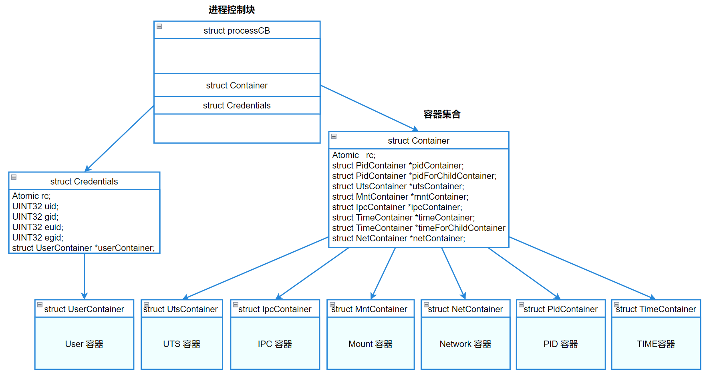
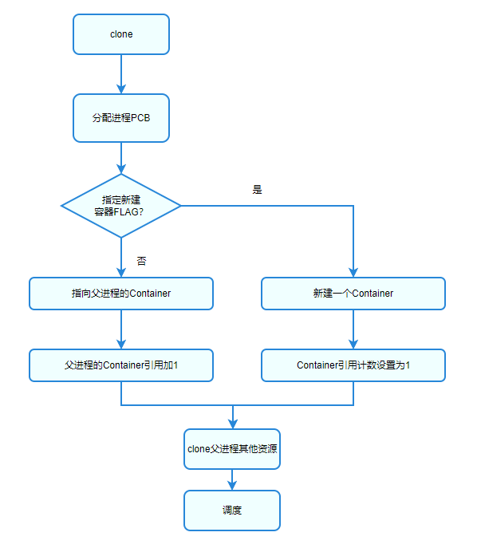

#   容器隔离

## 概述

容器（Container）提供了一种资源隔离的解决方案。系统中许多资源是全局管理的。例如进程PID、主机信息、用户信息等，容器机制是对这种全局资源的隔离，使得处于不同容器的进程拥有独立的全局系统资源，改变一个容器中的系统资源只会影响当前容器里的进程，对其他容器中的进程没有影响。

LiteOS-A内核容器隔离功能包含7个容器：UTS容器、PID容器、Mount容器、Network容器、TIME容器、IPC容器、User容器。通过所在进程ProcessCB的Container和Credentials保存。

隔离的容器如下表。

|    编号   |       名称     |    宏定义/flag       |          隔离资源        |    数据结构定义位置      |
| :-------- | :------------- | :------------------- | :----------------------- | :----------------------- |
| 1         | UTS            | CLONE_NEWUTS         | 主机名，域名，版本信息 |struct Container          |
| 2         | PID            | CLONE_NEWPID         | 进程ID                |struct Container          |
| 3         | Mount          | CLONE_NEWNS          | 文件系统挂载点           |struct Container          |
| 4         | Network        | CLONE_NEWNET         | 网络系统资源     |struct Container          |
| 5         | TIME           | CLONE_NEWTIME        | 时钟资源                 |struct Container          |
| 6         | IPC            | CLONE_NEWIPC         | 进程间通信资源           |struct Container          |
| 7         | User           | CLONE_NEWUSER        | 用户和用户组             |struct Credentials             |

容器之间的资源隔离，细分为两种：

 - 全局隔离：属于平行关系（无继承关系）的容器，所有容器之间的容器类资源彼此不可见。

 - 非全局隔离：属于有父子继承关系的容器，同一层的各容器之间资源不可见，但上层容器仍然可以访问下层容器资源。

PID容器通过 unshare/setns 切换时，切换子进程的容器，而本进程容器不变。

通过在子进程ProcessCB中添加对应容器集合Container和用户容器，完成对容器功能的支持，并通过编译开关控制特性的开启和关闭。

 - 每个进程ProcessCB包含一个Container指针，该指针指向真正分配的Container结构。通过这种方式，进程可单独拥有一个Container结构，也可共享同一个Container结构。 进一步分解，在Container结构中，包含各容器指针，分别指向UTS容器、PID容器、Network容器、Mount容器、TIME容器、IPC容器。

 - 每个进程ProcessCB对应一个Credentials结构，单独管理User容器，便于模块化、单独处理User容器的特有逻辑。




### 各容器简介

#### **UTS容器**

UTS 容器用于对主机名和域名进行隔离。

每一个进程对应有一个自己的UTS  Container，用来隔离容器的内核名称、版本等信息，不同容器查看到的都是属于自己的信息，相互间不能查看。

#### **Mount容器**

用于隔离文件挂载点。在一个容器里挂载、卸载的动作不会影响到其他容器。

通过文件挂载容器，实现各进程间相互独立的使用文件挂载系统，子进程在独立的文件挂载容器里面进行挂载操作，可以建立自身的文件挂载结构：

- 文件挂载容器的基础实现，创建进程时根据clone传入的参数flag在各自进程创建文件挂载容器，将挂载信息从全局更改为与文件挂载容器相关联。

- 创建容器后，修改获取当前挂载信息的实现，将从全局或者更改为当前文件挂载容器中获取，使进程挂载、卸载或者访问挂载文件操作不会对其他进程挂载信息产生影响或者访问到其他进程的文件挂载信息。

#### **PID容器**

用于隔离进程号，不同容器的进程可以使用相同的虚拟进程号。

  进程容器主要用于进程的隔离，特点如下:

- 容器间的进程ID相互独立。
- 父容器可以看到子容器中的进程，且同一个进程在父容器中的进程ID和子容器中的进程ID相互独立。
- 子容器无法看到父容器中的进程。
- 在根容器下可以看到系统的所有进程。

#### **Network容器**

用于隔离系统网络设备和网络栈。

Network容器对TCP/IP协议栈和网络设备资源进行隔离，以达到隔离目的。

 - 传输层隔离：对端口号进行隔离，Network容器内的可用端口号范围是0~65535，进程绑定的是自己所属容器的端口号，所以不同Network容器的进程可以对同一个TCP/UDP端口号进行绑定，且互相之间没有影响。
 - IP层隔离：对IP资源进行隔离，每个容器都有属于自己的IP资源，在一个Network容器内修改IP对其他Network容器没有影响。
 - 网络设备隔离：对网卡进行隔离，每个容器都有属于自己的网卡，不同Network容器内的网卡设备之间相互隔离无法通信，用户可以通过配置veth-pair解决不同容器间的通信问题。

#### **User容器**

用于隔离用户和用户组。

User Container是用来隔离和分割管理权限的，管理权限实质分为两部分uid/gid和Capability。

- UID/GID

  User Container是对资源的一种隔离，主要隔离uid/gid，处于不同的User Container具有不同的uid/gid，每个User container拥有独立的从0开始的uid/gid。这样容器中的进程可以拥有root权限，但是它的root权限会被限制在一小块范围之内。改变一个User Container中的值只会影响当前User Container，对其他User Container中的进程无影响。

- Capability

  User Container通过设置Capability来实现能力隔离。

  每个进程在进程初始化的时候调用OsInitCapability对权限进行初始化，对用户提供修改和获取(SysCapSet/SysCapGet)权限的系统调用，用于修改进程的权限。

Capabilities的类型如下表： 

| 名称                  | 描述                                           |
| --------------------- | ---------------------------------------------- |
| CAP_CHOWN             | 修改文件所有者的权限                           |
| CAP_DAC_EXECUTE       | 忽略文件执行的 DAC 访问限制                    |
| CAP_DAC_WRITE         | 忽略文件写的 DAC 访问限制                      |
| CAP_DAC_READ_SEARCH   | 忽略文件读及目录搜索的 DAC 访问限制            |
| CAP_FOWNER            | 忽略文件属主 ID 必须和进程用户 ID 相匹配的限制 |
| CAP_KILL              | 允许对不属于自己的进程发送信号                 |
| CAP_SETGID            | 允许改变进程的GID                              |
| CAP_SETUID            | 允许改变进程的UID                              |
| CAP_NET_BIND_SERVICE  | 允许绑定到小于 1024 的端口                     |
| CAP_NET_BROADCAST     | 允许网络广播和多播访问                         |
| CAP_NET_ADMIN         | 允许执行网络管理任务                           |
| CAP_NET_RAW           | 允许使用原始套接字                             |
| CAP_FS_MOUNT          | 允许使用 chroot() 系统调用                     |
| CAP_FS_FORMAT         | 允许使用文件格式                               |
| CAP_SCHED_SETPRIORITY | 允许设置优先级                                 |
| CAP_SET_TIMEOFDAY     | 允许设置系统时间                               |
| CAP_CLOCK_SETTIME     | 允许改变系统时钟                               |
| CAP_CAPSET            | 允许设置任意的 capabilities                    |
| CAP_REBOOT            | 允许重新启动系统                               |
| CAP_SHELL_EXEC        | 允许执行shell                                  |

#### **TIME容器**

用于隔离系统的时间维护信息。

每一个进程对应有一个自己的TIME Container，用来隔离`CLOCK_MONOTONIC`和`CLOCK_MONOTONIC_RAW`对应的时钟，不同容器中的进程在对`CLOCK_MONOTONIC`和`CLOCK_MONOTONIC_RAW`时钟进行对应的时间操作调用时，彼此之间时钟的数值相对独立，实现安全容器间系统时钟的隔离。

容器（当前进程的time_for_children容器）中时钟的偏移量记录在`/proc/PID/timens_offsets`文件中，通过修改该文件，可以对应修改TIME容器的偏移信息。这些偏移是相对于初始时间容器中的时钟值表示的。

当前，创建TIME Container的唯一方法是通过使用`CLONE_NEWTIME`标志调用`unshare`。该调用将创建一个新的TIME Container，但不会将调用过程放在新的容器中。而是调用进程的随后创建的子级将放置在新的容器中。

这允许时钟偏移，用于新的容器的第一进程被放置在容器之前进行设置`/proc/PID/timens_offsets`文件。

#### **IPC容器**  

用于隔离进程间通信对象（IPC对象），包括消息队列和共享内存。

每一个进程对应有一个自己的IPC Container，用来隔离如下全局资源：消息队列、共享内存。 

不同容器中的进程在对消息队列、共享内存进行对应的时间操作调用时，彼此之间是独立的。

- 消息队列隔离：把用于消息队列的全局变量结构LosQueueCB修改为IPC Container中的局部变量保存，从而实现在各自进程中的容器内可见，达到相互隔离的效果。

- 共享内存隔离：把用于共享内存的全局变量shmInfo，sysvShmMux，shmSegs，shmUsedPageCount修改为IPC Container中的局部变量保存，从而实现在各自进程中的容器内可见，达到相互隔离的效果。

### 运作机制

#### 新建容器流程

在系统初始化时，需要为初始进程（0号、1号、2号进程）创建同一个根容器，根容器类型包括所有7种类型：UTS容器、PID容器、User容器、Network容器、Mount容器、TIME容器、IPC容器。

后续可通过clone等接口为子进程新建容器（指定容器FLAG），未指定容器FLAG的情况下clone的子进程复用父进程容器。




#### 切换容器流程

通过 unshare接口，将当前进程脱离当前所属容器，并转移到一个新建的容器。以IPC容器为例。


## 开发指导

应用层可基于容器隔离功能，进行如下场景的使用，新建容器、切换容器、销毁容器。

### 新建容器

创建子进程时可以完成新建容器。接口如下：

**clone接口**

通过clone()创建新进程的同时创建容器，是新建容器的一种常见做法，函数原型: 

```
int clone(int (*fn)(void *), void *stack, int flags, void *arg, ... 
             /* pid_t *parent_tid, void *tls, pid_t *child_tid */ );
```

 - clone时可以指定新建的子进程通过容器隔离资源，使得资源（如UTS信息）获取和修改只限于容器范围内，不影响其他容器。

 - 若调用clone接口不指定容器相关FLAG，则会将子进程也放到父进程所在容器中，即复用/共享父进程的容器。

### 切换容器

 转移/切换容器是调整已有进程的容器。包括2种情况：

- **unshare 接口**

  通过 unshare接口，将当前进程脱离当前所属容器，并转移到一个新建的容器。函数原型：
  ```
  int unshare(int flags);
  ```

  参考其他内核的实现，PID容器特殊处理，PID容器通过 unshare/setns 切换时， 是切换子进程的容器，而本进程容器仍然保持不变。

  方法是，本进程将新建的容器记录下来，创建子进程时再根据记录信息进行容器归属。

  这一点上，与其他容器（如Network容器）有区别，其他容器的setns、unshare操作是直接对已有进程生效。

  可以一句话总结为： PID容器的setns和unshare操作，是针对后代进程的PID容器。

- **setns接口**

  通过 setns接口，将当前进程脱离当前所属容器，并转移到一个已有的容器。便于灵活切换进程容器。

  PID容器通过 setns 转移时， 是切换子进程的容器，而本进程容器仍然保持不变。同上文。函数原型：

  ```
  int setns(int fd, int nstype);
  ```

### 销毁容器

进程终止时会退出所属容器，并对引用计数进行递减。引用计数减为0的对象，需要进行销毁。

通过kill接口，可向指定进程发送指定信号，通知进程执行关闭/退出动作。函数原型: 

```
int kill(pid_t pid, int sig);
```

### 查询容器信息

容器隔离之后，系统用户可使用 ls 命令访问 /proc/[pid]/container/ 目录进行查看和确认。

```
ls -l /proc/[pid]/container
```

| 属性       | 所属用户 | 所属用户组 | 文件名                                   | 说明                   |
| :--------- | :------- | :--------- | :--------------------------------------- | :--------------------- |
| lr--r--r-- | u:0      | g:0        | net -> 'net:[4026531847]'                | 链接对象为容器唯一编号 |
| lr--r--r-- | u:0      | g:0        | user -> 'user:[4026531841]'              | 同上                   |
| lr--r--r-- | u:0      | u:0        | time_for_children -> 'time:[4026531846]' | 同上                   |
| lr--r--r-- | u:0      | g:0        | time -> 'time:[4026531846]'              | 同上                   |
| lr--r--r-- | u:0      | g:0        | ipc -> 'ipc:[4026531845]'                | 同上                   |
| lr--r--r-- | u:0      | g:0        | mnt -> 'mnt:[4026531844]'                | 同上                   |
| lr--r--r-- | u:0      | g:0        | uts -> 'uts:[4026531843]'                | 同上                   |
| lr--r--r-- | u:0      | g:0        | pid_for_children -> 'pid:[4026531842]'   | 同上                   |
| lr--r--r-- | u:0      | g:0        | pid -> 'pid:[4026531842]'                | 同上                   |

### 容器配额

容器配额（plimits）的主要功能是限制进程组可以使用的资源，/proc/plimits 目录作为容器配额根目录。

- plimits文件系统为伪文件系统，需要实现文件与plimits控制变量的映射；通过文件操作，达到修改内核变量的目的。例如：memory限制器中，通过用户修改memory.limit文件内容，即可修改相应的内核变量值，进而限制内存分配。
- plimits文件系统中，文件能够被读写，目录能够被增删。
- plimits的目录，映射的是plimits的分组，所以需要在创建目录的时候，自动创建目录下的文件（这些文件映射为限制器的控制变量）。
- 创建限制器的文件是以组为单位创建的，例如：创建memory限制器，在增加一个memory限制器的时候，会全量创建所需的文件，而不是单独创建单个文件。

采用编译宏“LOSCFG_PROCESS_LIMITS”进行开关控制，y打开，n关闭，默认关闭

打开编译开关，查看 /proc/plimits目录， 主要包含下列文件：

| 权限       | 用户 | 用户组 | 文件名           | 描述                              | 备注                                                         |
| ---------- | ---- | ------ | ---------------- | --------------------------------- | ------------------------------------------------------------ |
| -r--r--r-- | u:0  | g:0    | sched.stat       | 调度统计信息                      | 输出格式：[PID   runTime]                                    |
| -r--r--r-- | u:0  | g:0    | sched.period     | 调度周期配置                      | 单位：us                                                     |
| -r--r--r-- | u:0  | g:0    | sched.quota      | 调度配额配置                      | 单位：us                                                     |
| -r--r--r-- | u:0  | g:0    | devices.list     | 报告plimits中的进程访问的设备     | 输出格式：[type name access]                                 |
| -r--r--r-- | u:0  | g:0    | devices.deny     | 指定plimits中的进程可以访问的设备 | 写入格式：["type name access" >> device.deny]                |
| -r--r--r-- | u:0  | g:0    | devices.allow    | 报告plimits中的进程不能访问的设备 | 写入格式：["type name access" >> device.allow]               |
| -r--r--r-- | u:0  | g:0    | ipc.stat         | ipc对象申请统计信息               | 输出格式：[mq count:  mq failed count:  <br/> shm size:  shm failed count: ] |
| -r--r--r-- | u:0  | g:0    | ipc.shm_limit    | 共享内存大小上限                  | 单位：byte                                                   |
| -r--r--r-- | u:0  | g:0    | ipc.mq_limit     | 消息个数上限                      | 0~最大64位正整数                                             |
| -r--r--r-- | u:0  | g:0    | memory.stat      | 内存统计信息                      | 单位：byte                                                   |
| -r--r--r-- | u:0  | g:0    | memory.limit     | 组内进程占用内存总量配额          | 单位：byte                                                   |
| -r--r--r-- | u:0  | g:0    | pids.max         | 组内包括的最大进程个数            | /                                                            |
| -r--r--r-- | u:0  | g:0    | pids.priority    | 组内包括的最高进程优先级          | /                                                            |
| -r--r--r-- | u:0  | g:0    | plimits.procs    | 组内包含的所有进程的pid           | /                                                            |
| -r--r--r-- | u:0  | g:0    | plimits.limiters | plimits组内包含的限制器           | /                                                            |

其中devices参数说明：

| type （设备类型）                            | name （设备名字） | access （相应的权限）              |
| -------------------------------------------- | ----------------- | ---------------------------------- |
| a - 所有设备，可以是字符设备，也可以是块设备 | /                 | r - 允许进程读取指定设备           |
| b- 块设备                                    | /                 | w - 允许进程写入指定设备           |
| c - 字符设备                                 | /                 | m - 允许进程生成还不存在的设备文件 |

## 参考

### 规格说明

#### 参数设定

内核支持每一种容器最大数默认为LOSCFG_KERNEL_CONTAINER_DEFAULT_LIMIT。

内核初始化proc/sys/user目录，生成文件max_net_container，max_ipc_container，max_time_container，max_uts_container，max_user_container，max_pid_container，max_mnt_container并且将伪文件与内核参数绑定。用户配置伪文件即会修改对应的内核参数。当前容器数量如果小于上限，则可创建新的容器，否则返回NULL表示失败。

#### 容器唯一编号

各容器的全局唯一编号，统一基于一个固定值进行编号。

```
#define CONTAINER_IDEX_BASE (0xF0000000)
inum = CONTAINER_IDEX_BASE + (unsigned int)i;  
```

#### 规则设定

- PID容器和User容器，具有分层关系，最大支持3层；其他的UTS、Mount、Network容器无分层关系。

- 通过上述接口clone创建容器、setns切换容器、unshare切换容器时，需传入符合POSIX标准的FLAG，如下：

| FLAG          | clone                        | setns                            | unshare                          |
| ------------- | ---------------------------- | -------------------------------- | -------------------------------- |
| CLONE_NEWNS   | 为子进程新建文件系统容器     | 将当前进程转移到指定文件系统容器 | 为本进程新建文件系统容器         |
| CLONE_NEWPID  | 为子进程新建PID容器          | 将当前进程转移到指定PID容器      | 为本进程新建的子进程新建PID容器  |
| CLONE_NEWIPC  | 为子进程新建IPC容器          | 将当前进程转移到指定IPC容器      | 为本进程新建IPC容器              |
| CLONE_NEWTIME | 为进程所属父进程新建TIME容器 | 暂不支持                         | 为本进程新建的子进程新建TIME容器 |
| CLONE_NEWUSER | 为子进程新建User容器         | 将当前进程转移到指定User容器     | 为本进程新建User容器             |
| CLONE_NEWUTS  | 为子进程新建UTSNAME容器      | 将当前进程转移到指定UTSNAME容器  | 为本进程新建UTSNAME容器          |
| CLONE_NEWNET  | 为子进程新建Network容器  | 将当前进程转移到指定Network容器 | 为本进程新建Network容器      |

- 容器功能采用编译宏、编译脚本中参数结合，完成特性的开关控制。

  - 容器编译宏定义:

  ```
  // 容器功能总编译宏
  LOSCFG_CONTAINER
  // 各容器编译宏
  LOSCFG_UTS_CONTAINER
  LOSCFG_MNT_CONTAINER
  LOSCFG_PID_CONTAINER
  LOSCFG_NET_CONTAINER
  LOSCFG_USER_CONTAINER
  LOSCFG_TIME_CONTAINER
  LOSCFG_IPC_CONTAINER
  ```

  - 测试用例编译宏定义: enable打开，disable关闭，默认关闭。
  ```
  LOSCFG_USER_TEST_MNT_CONTAINER
  LOSCFG_USER_TEST_PID_CONTAINER
  LOSCFG_USER_TEST_NET_CONTAINER
  LOSCFG_USER_TEST_USER_CONTAINER
  LOSCFG_USER_TEST_TIME_CONTAINER
  LOSCFG_USER_TEST_IPC_CONTAINER
  ```

### 开发实例

当前LiteOS-A冒烟用例中已包含对应接口的使用示例，请开发者自行编译验证，推荐用例路径如下：

[创建UTS容器](https://gitee.com/openharmony/kernel_liteos_a/blob/master/testsuites/unittest/container/smoke/It_uts_container_001.cpp)

[Unshare 切换当前进程的UTS容器至一个新容器](https://gitee.com/openharmony/kernel_liteos_a/blob/master/testsuites/unittest/container/smoke/It_uts_container_004.cpp)

[setns切换，将当前进程的UTS容器切换至子进程的UTS容器](https://gitee.com/openharmony/kernel_liteos_a/blob/master/testsuites/unittest/container/smoke/It_uts_container_005.cpp)

[创建Network容器](https://gitee.com/openharmony/kernel_liteos_a/blob/master/testsuites/unittest/container/smoke/It_net_container_001.cpp)

[创建User容器](https://gitee.com/openharmony/kernel_liteos_a/blob/master/testsuites/unittest/container/smoke/It_user_container_001.cpp)

[创建PID容器](https://gitee.com/openharmony/kernel_liteos_a/blob/master/testsuites/unittest/container/smoke/It_pid_container_023.cpp)

[创建Mount容器](https://gitee.com/openharmony/kernel_liteos_a/blob/master/testsuites/unittest/container/smoke/It_mnt_container_001.cpp)

[创建IPC容器](https://gitee.com/openharmony/kernel_liteos_a/blob/master/testsuites/unittest/container/smoke/It_ipc_container_001.cpp)

[创建TIME容器](https://gitee.com/openharmony/kernel_liteos_a/blob/master/testsuites/unittest/container/smoke/It_time_container_001.cpp)

