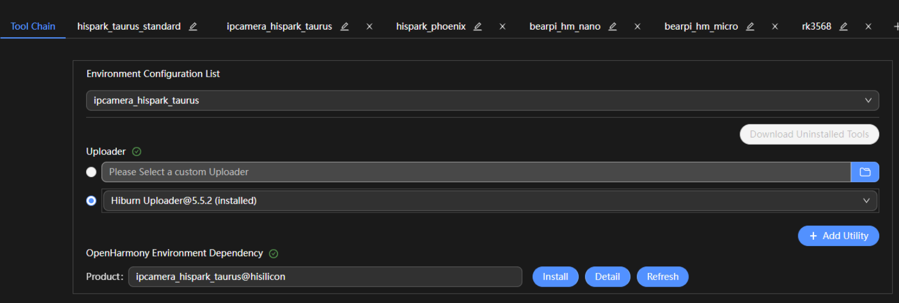
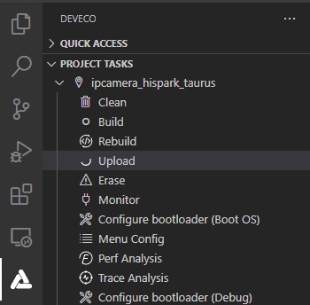
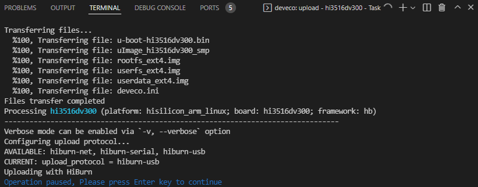

# 烧录

烧录是指将编译后的程序文件下载到芯片开发板上的动作，为后续的程序调试提供基础。DevEco Device Tool提供一键烧录功能，操作简单，能快捷、高效的完成程序烧录，提升烧录的效率。

Hi3516DV300的镜像烧录通过Windows环境进行烧录，开发者启动烧录操作后，DevEco Device Tool通过Remote远程模式，将Ubuntu环境下编译生成的待烧录程序文件拷贝至Windows目录下，然后通过Windows的烧录工具将程序文件烧录至开发板中。

Hi3516DV300开发板小型系统的烧录方式包括USB烧录、网口烧录两种方式，本文采用USB方式进行烧录。

## 前提条件

- 代码已[编译](quickstart-ide-3516-build.md)完成。

- 请安装Hi3516DV300开发板串口驱动程序，请参考[Hi3516DV300开发板串口驱动安装指导](https://device.harmonyos.com/cn/docs/documentation/guide/hi3516_hi3518-drivers-0000001050743695)。

- 请安装Hi3516DV300开发板USB驱动程序，请参考[Hi3516DV300开发板USB驱动安装](https://device.harmonyos.com/cn/docs/documentation/guide/usb_driver-0000001058690393)。

## 操作步骤

1. 请连接好电脑和待烧录开发板，需要连接USB口和串口，具体可参考[Hi3516DV300开发板介绍](quickstart-appendix-hi3516.md)。

2. 在DevEco Device Tool中，选择**REMOTE DEVELOPMENT &gt; Local PC**，查看远程计算机（Ubuntu开发环境）与本地计算机（Windows开发环境）的连接状态。
   - 如果Local PC右边连接按钮为，则远程计算机与本地计算机为已连接状态，不需要执行其他操作。
   - 如果Local PC右边连接按钮为，则点击绿色按钮进行连接。连接时DevEco Device Tool会重启服务，因此请不要在下载源码或源码编译过程中进行连接，否则会中断任务。

   

3. 在菜单栏中点击**Project Settings**按钮，进入Hi3516DV300工程配置界面。

   

4. 在“Tool Chain”页签，检查Uploader烧录器工具是否已安装。

   - 如工具为“uninstalled”状态（），可单击**Download Uninstalled Tools**，自动安装所需工具，或单击工具后方的**Download**安装指定工具。
   - 如工具无法通过**Download**方式安装，表示该工具未被DevEco Device Tool收录，需要开发者自行下载到本地后单击**Import**导入。

   

5. 在“ipcamea_hispark_taurus”页签，设置烧录选项，包括upload_partitions、upload_port和upload_protocol。配置完成后工程将自动保存。
   - upload_partitions：选择待烧录的文件，默认情况下会同时烧录fastboot、kernel、rootfs和userfs。DevEco Device Tool已预置默认的烧录文件信息，包括起始地址、分区大小、待烧录文件地址等，开发者可根据实际情况进行调整，点击每个待烧录文件后的按钮进行修改。
      >  **说明：**
      > 在设置烧录分区起始地址和分区长度时，应根据实际待烧录文件的大小进行设置，要求设置的烧录分区大小，要大于待烧录文件的大小；同时，各烧录文件的分区地址设置不能出现重叠。

      
      
   - upload_protocol：选择烧录协议，固定选择“hiburn-usb”。
   - upload_port：选择已查询到的串口号。

      

6. 点击ipcamera_hispark_taurus下的**Upload**按钮。

   

   此时待烧录文件会从Ubuntu系统传输到Windows下，传输完成后界面显示“Operation paused, Please press Enter key to continue”时，请点击**Enter**键启动烧录。

   

7. 在终端窗口显示如下提示信息时，请在15秒内，按住Update键，插拔USB线，最后松开Update键启动烧录。

   

   启动烧录后，界面提示**SUCCESS**信息时，表示烧录成功。

   

8. 烧录成功后，请根据运行章节进行操作，启动系统。
