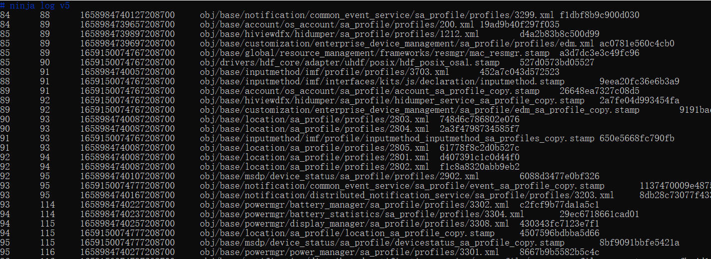

# 参考信息

## 关于deps、external_deps的使用

在添加一个模块的时候，需要在BUILD.gn中声明它的依赖，为了便于后续处理部件间依赖关系，我们将依赖分为两种——部件内依赖deps和部件间依赖external_deps。

**依赖分类**


如上图所示，主要分为部件内依赖（图左）和部件间依赖（图右）。

- 部件内依赖： 现有模块module1属于部件part1，要添加一个属于部件part1的模块module2，module2依赖于module1，这种情况就属于部件内依赖。

- 部件间依赖： 现有模块module1属于部件part1，要添加一个模块module2，module2依赖于module1，module2属于部件part2。模块module2与模块module1分属于两个不同的部件，这种情况就属于部件间依赖。

- 部件内依赖示例：

  ```shell
  import("//build/ohos.gni")
  ohos_shared_library("module1") {
    ……
    part_name = "part1"   # 必选，所属部件名称
    ……
  }
  ```

  ```shell
  import("//build/ohos.gni")
  ohos_shared_library("module2") {
    ……
    deps = [
      "module1的gn target",
    ……
   ]                        # 部件内模块依赖
  part_name = "part1"       # 必选，所属部件名称
  }
  ```

- 部件间依赖示例：

  ```shell
  import("//build/ohos.gni")
  ohos_shared_library("module1") {
    ……
    part_name = "part1"   # 必选，所属部件名称
    ……
  }
  ```

  ```shell
  import("//build/ohos.gni")
  ohos_shared_library("module2") {
    ……
    external_deps = [
      "part1:module1",
    ……
    ]                      # 部件间模块依赖，这里依赖的模块必须是依赖的部件声明在inner_kits中的模块
    part_name = "part2"    # 必选，所属部件名称
  }
  ```

  **注意**：部件间依赖要写在external_deps里面，格式为”部件名:模块名"的形式，并且依赖的模块必须是依赖的部件声明在inner_kits中的模块。

## Sanitizer使用说明

在添加模块时，可选地对该模块开启编译器提供的Sanitizer功能，包括整数溢出排错、控制流完整性检查等。配置的每一项都是可选的，如不指定默认为false或者空。Sanitizer配置示例如下所示：
``` shell
  ohos_shared_library("example") {
    sanitize = {
      cfi = true                             # 开启控制流完整性检测
      integer_overflow = true                # 开启整数溢出检测
      boundary_sanitize = true               # 开启边界检测
      ubsan = true                           # 开启部分ubsan选项
      all_ubsan = true                       # 开启全量ubsan选项
      debug = true                           # 可选，调测模式，默认是不开启
      blocklist = "./blocklist.txt"          # 可选，屏蔽名单路径
    }
    ...
  }
```

**支持的Sanitizer类型**

目前支持开启的Sanitizer：

- 整数溢出排错：unsigned_integer_overflow/signed_integer_overflow/integer_overflow(同时包括无符号和有符号整数溢出两种检查)
- 控制流完整性：cfi
- 边界检测：boundary_sanitize
- 部分未定义行为检测：ubsan(bool,integer-divide-by-zero,return,returns-nonnull-attribute,shift-exponent,unreachable,vla-bound等编译选项)
- 全量未定义行为检测：all_ubsan(全量undefined behavior sanitizer编译选项)

**发布、调测模式**

通过`debug`选项控制使用发布模式还是调测模式，默认为发布模式，使用`debug = true`显式声明开启调测模式。`debug`选项仅对Sanitizer生效，且与模块是否编译为调试版本无关，但在模块发布版本的编译配置中不应带此选项，或显式地将`debug`设置为`false`，使得Sanitizer处于发布模式。

- 调测模式：用于开发时排查问题。该模式下会输出产生错误相关的丰富信息来辅助定位错误，并且在发生错误后并不会直接中断程序运行，而是会恢复程序运行进一步识别后续的错误。

- 发布模式：保护程序不发生错误或被恶意攻击，在产生错误后直接中断程序不会继续执行。


**屏蔽名单**

指定该模块中不受Sanitizer选项影响的函数或源程序文件名单，用于避免良性行为被识别为错误、热点函数产生了不合理、不可接受的开销；该名单需谨慎使用。名单示例如下所示：
```
[cfi]
fun:*([Tt]est|TEST)*
fun: main

[integer]
src:example/*.cpp
```


## 开源软件Notice收集策略说明

开源软件Notice是与项目开源相关的文件，收集这些文件的目的是为了符合开源的规范。

**收集目标**

只收集打包到镜像里面的模块对应的License；不打包的都不收集，比如构建过程使用的工具（如clang、python、ninja等）都是不收集的。

静态库本身是不会被打包的，一般是作为动态库或者可执行程序的一部分被打包到系统中的，为了确保完备，静态库的都会收集。

最终合并的NOTICE.txt要体现出镜像中每个文件都是用了哪些License，模块和License要有对应关系。

最终合并的NOTICE.txt文件在/system/etc/ 目录下。

**收集规则**

按照优先级收集License，以下由1到4，优先级依次降低。

1. 模块在BUILD.gn中直接声明自己使用的License文件，优先级最高。如下示例：

   ```shell
   ohos_shared_library("example") {
       ...
       license_file = "path-to-license-file"
       ...
   }
   ```

2. 如果模块没有显式声明，那么编译脚本会在BUILD.gn所在的当前目录中查找Readme.OpenSource文件，解析该文件，找出该文件中声明的license，将其作为模块的License。 如果Readme.OpenSource文件中配置的license文件不存在，直接报错。

3. 如果Readme.OpenSource文件不存在，编译脚本会从当前目录开始，向上层目录寻找（一直找到源码的根目录），默认查找License、Copyright、Notice三个文件，如果找到，则将其作为模块的License。

4. 如果上面三种方式都未找到license，则使用默认的license作为该模块的license；默认license是Apache2.0 License。

需要注意及检查的问题

- 三方的开源软件，比如openssl，icu等，这部分软件基本上在源码目录下都要求配置Readme.OpenSource，要检查Readme.OpenSource文件是否和BUILD.gn文件在同一个目录，以及Readme.OpenSource文件中配置的License文件是否存在以及真实有效。
- 代码目录下，如果代码使用的不是Apache2.0 License，需要在目录下提供对应的License文件，或者直接在模块中指定license_file。
- 如果BUILD.gn中添加的源码文件不是当前目录的，需要检查下源码文件所在仓下的license是否和BUILD.gn文件所在仓的一致。

## 加快本地编译的一些参数

编译时，适当选择添加以下的编译参数可以加快编译的过程。

- **添加--ccache参数**:
  - 原理：ccache会缓存c/c++编译的编译输出，下一次在编译输入不变的情况下，直接复用缓存的产物。
  - 安装：
    - 快速安装：执行sudo apt-get install ccache命令。
    - [官网下载](https://ccache.dev/download.html)，下载二进制文件，把ccache所在路径配置到环境变量。
  - 使用：执行./build.sh --product-name 产品名 --ccache命令。
- **添加--fast-rebuild参数**
  - 原理：编译流程主要分为：preloader->loader->gn->ninja这四个过程，在本地没有修改gn和产品配置相关文件的前提下，添加--fast-rebuild会让你直接从ninja编译开始。
  - 使用：执行./build.sh --product-name 产品名 --fast-rebuild命令。
- **添加enable_notice_collection=false参数**
  - 原理：省略掉收集开源软件模块的license的过程。
  - 使用：执行./build.sh --product-name 产品名 --gn-args --enable_notice_collection=false --ccache命令。
- **添加--build-target参数**
  - 该参数用于指定编译模块，如何找模块的名字：
    - 相关仓下BUILD.gn中关注group、ohos_shared_library、ohos_executable等关键字。
    - ./build.sh --product-name 产品名 --build-target 模块名 --build-only-gn生成build.ninja，然后去该文件中查找相关模块名。
  - 使用：执行./build.sh --product-name 产品名 --build-target ark_js_host_linux_tools_packages命令。

## 查看NinjaTrace

out/rk3568/.ninja_log文件记录了每个模块编译的开始和结束时间(ms)，结束时间和开始时间间隔越短表示模块的编译时间越短，编译性能越高。

从左到右分别表示：start time|end time|mtime|command hash。



图形化显示编译时间。

- 本地打开ninja trace：
  解压out/rk3568/build.trace.gz，将build.trace拖到chrome的trace链接chrome://tracing/打开即可。
- 在CI网站ci.openharmony.cn/events上打开ninja trace：
  CI上每个编译的输出里面有build.trace.html可直接打开，具体方法是：
  1. 点击静态检查下的“成功”；

  2. 点击输出列的“输出”即可在左侧的build_trace列看到build.trace.html文件，单击该文件即可打开。
