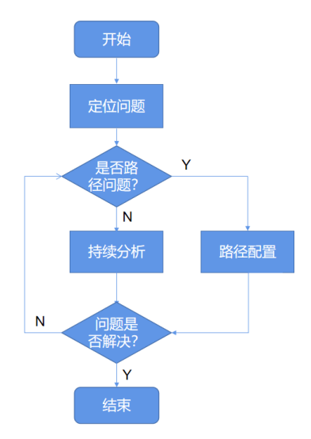
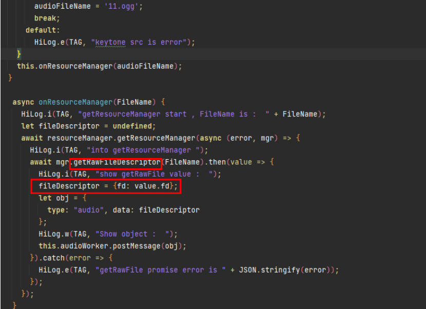
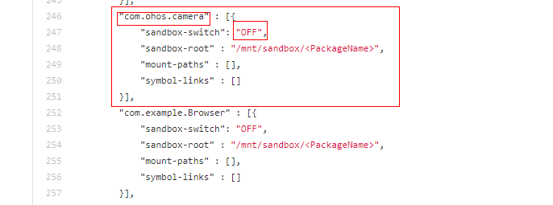

# OpenHarmony启用应用沙箱机制-适配指导

## 验证流程

1. 取发布版本自验证功能，如果功能正常，则适配流程结束。
2. 取版本验证发现自身应用功能异常，则进行问题定位，通过分析代码识别到问题点，通过[适配流程](#适配流程)中的方法来进行文件访问模型的适配。
3. 适配完毕之后，重新验证功能，功能正常则适配流程结束。功能依旧存在问题则重新回到第二步继续定位，直到问题解决为止。

## 适配流程

1. 定位出app异常的问题点之后，识别该问题是否是app源代码访问路径出错导致的，是否是访问有效文件可以通过下一章节的[沙箱文件访问规格清单](#沙箱文件访问规格清单)自查。
2. 如果是app源码访问无效路径，则可以通过调整访问路径的策略，将原来访问/data目录从绝对路径访问方式调整为使用context接口进行访问，具体请见context接口使用说明：
   https://gitee.com/openharmony/docs/blob/master/zh-cn/application-dev/ability/context-userguide.md
   https://gitee.com/openharmony/docs/blob/master/zh-cn/application-dev/reference/apis/js-apis-ability-context.md
   https://gitee.com/OpenHarmony/docs/blob/master/zh-cn/application-dev/reference/apis/js-apis-Context.md
3. 如果是app调用三方模块，异常调用栈出现在三方模块中，而app源码没有使用绝对路径去访问文件，则适配过程如下：
   - 通知三方模块，让其访问文件路径通过context接口进行访问而非使用绝对路径的方式。
   - 如果三方模块是个公共模块，除了给appspawn孵化的进程使用之外还给native进程使用，则可以将三方模块抽象成一个服务，应用通过ipc的方式去访问服务。

## 沙箱文件访问规格清单

**应用根目录访问路径清单**

| 路径名                | 备注                                       |
| --------------------- | ------------------------------------------ |
| bin                   | 存放着各种二进制文件                       |
| config                | 配置目录                                   |
| data                  | 应用数据目录                               |
| dev                   | 设备节点                                   |
| etc                   | /system/etc的软连接                        |
| init                  | /system/bin/init的软连接                   |
| lib                   | /system/lib的软连接                        |
| mnt                   | 挂载目录                                   |
| proc                  | proc文件系统目录                           |
| sys                   | sys文件系统目录                            |
| sys_prod              | 此目录不同设备上存在差异，部分设备无此目录 |
| system/app            | 系统目录资源                               |
| system/fonts          | 系统文字资源                               |
| system/lib            | 系统库                                     |
| system/data           | 系统目录资源                               |
| system/usr            | 系统目录资源                               |
| system/profile        | 系统目录资源                               |
| system/bin            | 系统程序                                   |
| system/etc            | 系统配置                                   |
| vendor/lib/chipsetsdk | 芯片组件目录，目前仅挂载chipsetsdk         |

**应用数据目录访问路径清单**

| 路径名                             | 备注                                                         |
| ---------------------------------- | ------------------------------------------------------------ |
| /data                              | 应用数据目录                                                 |
| /data/storage                      | 应用数据                                                     |
| /data/bundles                      | 所有应用安装目录，仅应用apl权限为BASIC及以上权限的应用可访问 |
| /data/storage/el1                  | 应用el1加密级别数据目录                                      |
| /data/storage/el2                  | 应用el2加密级别数据目录                                      |
| /data/storage/el1/base             | 应用el1加密级别数据目录                                      |
| /data/storage/el1/bundles          | 应用el1加密级别应用安装包目录                                |
| /data/storage/el1/database         | 应用el1加密级别数据库存储目录                                |
| /data/storage/el2/base             | 应用el2加密级别数据目录                                      |
| /data/storage/el2/database         | 应用el2加密级别数据库存储目录                                |
| /data/storage/el2/auth_groups      | 应用el2加密级别无账号分布式数据融合目录                      |
| /data/storage/el2/distributedfiles | 应用el2加密级别有账号分布式数据融合目录                      |

启用应用沙箱之后，应用命名空间内无法再访问物理路径下数据目录的访问方式，而是只能通过context接口来访问应用的数据目录，具体访问应用数据目录的方式可以通过context接口进行访问，参考[适配流程](#适配流程)中的context接口访问链接了解更多细节。
应用的物理数据目录跟沙箱数据目录存储的是同一份应用的数据，通过bind mount技术进行关联，改动任意一处会影响另一处的数据。应用在命名空间下访问数据，只能通过沙箱路径来访问，下面列出应用的数据目录在物理路径跟沙箱路径下的对应关系。

**应用的数据目录在物理路径跟沙箱路径下的对应关系**

| 物理路径                                                     | 沙箱路径                           | 备注                                    |
| ------------------------------------------------------------ | ---------------------------------- | --------------------------------------- |
| /data/app/el1/bundle/public/\<PackageName>\                  | /data/storage/el1/bundle           | 应用安装包目录                          |
| /data/app/el1/\<USERID\>/base/\<PACKAGENAME\>                | /data/storage/el1/base             | 应用el1级别加密数据目录                 |
| /data/app/el2/\<USERID\>/base/\<PACKAGENAME\>                | /data/storage/el2/base             | 应用el2级别加密数据目录                 |
| /data/app/el1/\<USERID\>/database/\<PACKAGENAME\>            | /data/storage/el1/database         | 应用el1级别加密数据库目录               |
| /data/app/el2/\<USERID\>/database/\<PACKAGENAME\>            | /data/storage/el2/database         | 应用el2级别加密数据库目录               |
| /mnt/hmdfs/\<USERID\>/account/merge_view/data/\<PACKAGENAME\> | /data/storage/el2/distributedfiles | 应用el2加密级别有账号分布式数据融合目录 |
| /mnt/hmdfs/\<USERID\>/non_account/merge_view/data/           | /data/storage/el2/auth_groups      | 应用el2加密级别无账号分布式数据融合目录 |
| /mnt/hmdfs/                                                  | /mnt/hmdfs/                        | 分布式文件系统目录                      |

> **说明：** \<USERID\>代表当前的用户ID
> \<PACKAGENAME\>代表当前的应用包名

更多物理路径沙箱路径的对应关系，请访问：
https://gitee.com/OpenHarmony/startup_appspawn/blob/master/appdata-sandbox64.json

## 案例：Contacts.hap拨号场景无法触发音频问题

联系人应用沙箱整改前访问资源文件的方式如下，可以看到访问的路径是绝对路径硬编码，为/data/app/el1此类目录，而此类目录在应用沙箱中是访问受限的，所以会造成访问异常。

此代码的核心是想通过fileIO接口open固定路径得到fdNumber，使用fdNumber去做接下来的文件访问。FileIO是通过路径得到fdNumber的，而现在路径访问已经被限制了，因此考虑用其他的接口去获取fdNumber即可，
查阅OpenHarmony相关开发手册得知，使用resourceManager可以获取fdNumber。
更改后的代码如下：

## 规避方案

如果发现应用异常且定位没有结论，可以使用关闭进程沙箱的方式来规避问题，规避方式如下：

1. 打开OpenHarmony startup_appspawn仓的源码，找到应用沙箱配置文件，根据自己编译类型修改对应的配置代码文件。
   32位修改:https://gitee.com/OpenHarmony/startup_appspawn/blob/master/appdata-sandbox.json
   64位修改:https://gitee.com/OpenHarmony/startup_appspawn/blob/master/appdata-sandbox.json

2. 在json中文件找到camera的配置，在下方参照camera的配置新建一条自身应用的配置，将包名改为自身应用报名，其他项保持跟camera一致即可，OFF字段代表关闭进程沙箱。

   