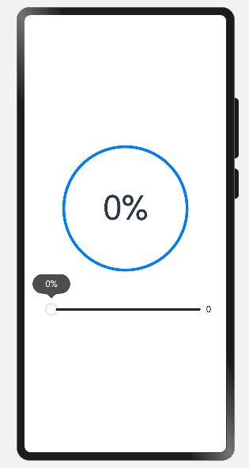
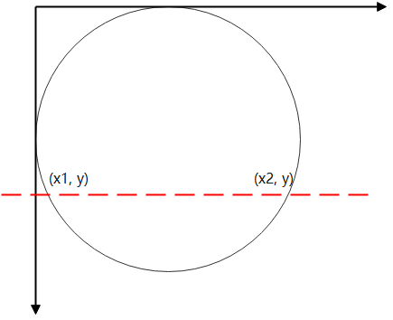

# 如何实现圆形进度条
## 场景说明
应用开发过程中经常用到圆形进度条，常见的如充电进度、下载进度、上传进度等，本例即为大家介绍如何实现上述场景。
## 效果呈现
本示例最终效果如下：



## 运行环境
本例基于以下环境开发，开发者也可以基于其他适配的版本进行开发：
- IDE: DevEco Studio 3.1 Beta2
- SDK: Ohos_sdk_public 3.2.11.9(API Version 9 Release)

## 实现思路
本示例涉及4个主要特性及其实现方案如下：
- 外部圆框展示：使用Circle组件绘制外层圆环,实现外层框架
- 圆框内部数值变化：利用Timer模块让进度组件按照函数完成进度
- 圆框内部填充：通过Path路径绘制组件的命令（M、Q、T）去绘制路径生成封闭的自定义形状并对中间进行填充
- 底部进度条展示：使用Slider组件绘制进度条

## 开发步骤
针对上述所提到的内容，具体实现步骤如下:
1. 先使用Cricle组件绘制外层的圆环
    具体代码块如下：
    ```ts
    ...
    // 外框圆环
    Circle({ width: BIG_DIAMETER, height: BIG_DIAMETER })
      .fill(COLOR_TRANSPARENT)  // 填充：透明
      .stroke('#007DFF')  //圆环颜色
      .strokeWidth(5)  //圆环环宽
    ...
    ```
2. 通过Timer模块，通过自增让outSetValue值一直增加到100，使进度在规定时间内完成，最后通过clearInterval结束定时。
    具体代码块如下：
    ```ts
    ...
    aboutToAppear() {
      this.test()
    }
    test() {
      let timer = setInterval(() => {  //开始定时
        if (this.outSetValue < 100) {
          //进度值每次+1
          this.outSetValue += 1  
          //进度显示
          if (this.outSetValue == 100) {  
            this.backGroundColor = COLOR_BACKGROUND_FILL
            this.pathCommands = '';  
          } else {
            this.backGroundColor = COLOR_TRANSPARENT
            this.pathCommands = this.calPathCommands(this.outSetValue);
          }
        } else {
        clearInterval(timer)  //取消定时
        }
      }, 100)
    }
    ...
    ```

3. 通过方程表达进度百分比和y的关系，通过Path路径绘制组件的命令（M、Q、T）去绘制路径生成封闭的自定义形状并对中间进行填充
    中间的填充有两个状态：1.在进度100%时时填充颜色的圆形；2.在进度不是100%时，使用Path组件绘制闭合曲线实现
    说明一下在使用Path绘制组件时的计算过程和相关函数的使用，在Path组件坐标原点在左上角。

    

    - 进度百分比和y的关系：y = （1-k）* 2r。
    - 圆心点的坐标是（r, r）,使用圆方程就可以计算出圆弧的起点和终点。
    -  使用 A(rx ry x-axis-rotation large-arc-flag sweep-flag x y) 绘制圆弧，注意点就是在过圆心之后，需要反转下绘制角度。 
    - 使用 Q(x1 y1 x y) 和 T(x, y) 绘制对应的波浪，最后闭合路径然后填充颜色。
    具体代码块如下:
    ```ts
    ...
    onPageShow() {
      //校准的路径指令与进度值
      this.pathCommands = this.calPathCommands(this.outSetValue); 
    }

    calXSquare(y: number) {
      return RADIUS_IN_PX * RADIUS_IN_PX - (y - RADIUS_IN_PX) * (y - RADIUS_IN_PX);
    }

    calY(k: number) {
      return (1 - k) * RADIUS_IN_PX * 2;//返回值为百分比
    }
    formatPathCommands(x1: number, x2: number, y: number, radius: number) {
      //填充区域波浪线
      return `M${x1} ${y} A${radius} ${radius} 0 ${y > RADIUS_IN_PX ? 0 : 1} 0  ${x2} ${y} `
    + `Q${(x1 + 3 * x2) / 4} ${y + 12.5 * (x2 - x1) / radius}, ${(x1 + x2) / 2} ${y} T${x1} ${y}`
    }   
    calPathCommands(value: number) {
      let y = this.calY(value / 100.0) 
      let squareX = this.calXSquare(y)
      if (squareX >= 0) {
        let x = Math.sqrt(squareX);
        let x1 = RADIUS_IN_PX - x;
        let x2 = RADIUS_IN_PX + x;
        return this.formatPathCommands(x1, x2, y, RADIUS_IN_PX);
      }
      return "";
    }
    ...
    ```
4. 绘制下方滑动条组件
    具体代码块如下：
    ```ts
    ...
    Row() {
      Slider({
        value: this.outSetValue,
        min: 0,
        max: 100,
        step: 1,
        style: SliderStyle.OutSet
      })
        .blockColor('#FFFFFF')
        .trackColor('#182431')
        .selectedColor('#007DFF')
        .showSteps(true)
        .showTips(true)
        .onChange((value: number, mode: SliderChangeMode) => {
          if(this.outSetValue == 0) {
            this.test()
          }
          this.outSetValue = value //初始状态
          if (this.outSetValue == 100) {
            this.backGroundColor = COLOR_BACKGROUND_FILL //进度为100时，滑动条拉满，背景全满
            this.pathCommands = '';
          } else {
            this.backGroundColor = COLOR_TRANSPARENT 、
            this.pathCommands = this.calPathCommands(this.outSetValue);
          }
          console.log(`value = ${value} ->` + this.pathCommands);
          //进度显示
        })
      Text(this.outSetValue.toFixed(0)).fontSize(16)
    }
    ...
    ```

## 完整代码
具体代码如下：
```ts
const COLOR_TRANSPARENT = '#00000000'
const COLOR_BACKGROUND_FILL = '#7ebede'

const DIAMETER = 200;
const RADIUS_IN_PX = vp2px(DIAMETER / 2.0);
const BIG_DIAMETER = 220;


@Entry
@Component
struct Page3 {
  @State outSetValue: number = 0
  @State pathCommands: string = ''
  @State backGroundColor: string = '#00000000'

  onPageShow() {
    this.pathCommands = this.calPathCommands(this.outSetValue);
  }

  calXSquare(y: number) {
    return RADIUS_IN_PX * RADIUS_IN_PX - (y - RADIUS_IN_PX) * (y - RADIUS_IN_PX);
  }

  calY(k: number) {
    return (1 - k) * RADIUS_IN_PX * 2;
  }

  formatPathCommands(x1: number, x2: number, y: number, radius: number) {
    return `M${x1} ${y} A${radius} ${radius} 0 ${y > RADIUS_IN_PX ? 0 : 1} 0  ${x2} ${y} `
    + `Q${(x1 + 3 * x2) / 4} ${y + 12.5 * (x2 - x1) / radius}, ${(x1 + x2) / 2} ${y} T${x1} ${y}`
  }

  calPathCommands(value: number) {
    let y = this.calY(value / 100.0)
    let squareX = this.calXSquare(y)
    if (squareX >= 0) {
      let x = Math.sqrt(squareX);
      let x1 = RADIUS_IN_PX - x;
      let x2 = RADIUS_IN_PX + x;
      return this.formatPathCommands(x1, x2, y, RADIUS_IN_PX);
    }
    return "";
  }

  aboutToAppear() {
    this.test()
  }
  test() {
    let timer = setInterval(() => {
      if (this.outSetValue < 100) {
        this.outSetValue += 1
        if (this.outSetValue == 100) {
          this.backGroundColor = COLOR_BACKGROUND_FILL
          this.pathCommands = '';
        } else {
          this.backGroundColor = COLOR_TRANSPARENT
          this.pathCommands = this.calPathCommands(this.outSetValue);
        }
      } else {
        clearInterval(timer)
      }
    }, 100)
  }
  build() {

    Column() {
      Column() {
        Stack() {
          // 外框圆环
          Circle({ width: BIG_DIAMETER, height: BIG_DIAMETER })
            .fill(COLOR_TRANSPARENT)
            .stroke('#007DFF')
            .strokeWidth(5)
          // 进度显示

          Circle({ width: DIAMETER, height: DIAMETER })
            .fill(this.backGroundColor)
          Path()
            .width(DIAMETER)
            .height(DIAMETER)
            .commands(this.pathCommands)
            .fill(COLOR_BACKGROUND_FILL)

          // 进度
          Text(this.outSetValue.toFixed(0) + "%")
            .fontSize(60)


        }.width(BIG_DIAMETER)
        .height(BIG_DIAMETER)


        Row() {
          Slider({
            value: this.outSetValue,
            min: 0,
            max: 100,
            step: 1,
            style: SliderStyle.OutSet
          })
            .blockColor('#FFFFFF')
            .trackColor('#182431')
            .selectedColor('#007DFF')
            .showSteps(true)
            .showTips(true)
            .onChange((value: number, mode: SliderChangeMode) => {
              if(this.outSetValue == 0) {
                this.test()
              }
              this.outSetValue = value
              if (this.outSetValue == 100) {
                this.backGroundColor = COLOR_BACKGROUND_FILL
                this.pathCommands = '';
              } else {
                this.backGroundColor = COLOR_TRANSPARENT
                this.pathCommands = this.calPathCommands(this.outSetValue);
              }
              console.log(`value = ${value} ->` + this.pathCommands);
            })
          Text(this.outSetValue.toFixed(0)).fontSize(16)
        }
        .padding({ top: 50 })
        .width('80%')

      }.width('100%')
    }
    .height('100%')
    .justifyContent(FlexAlign.Center)
  }
}
```
## 参考
[Circle](../application-dev/reference/arkui-ts/ts-drawing-components-circle.md)

[Path](../application-dev/reference/arkui-ts/ts-drawing-components-path.md)

[Slider](../application-dev/reference/arkui-ts/ts-basic-components-slider.md)

[Timer](../application-dev/reference/apis/js-apis-timer.md)
