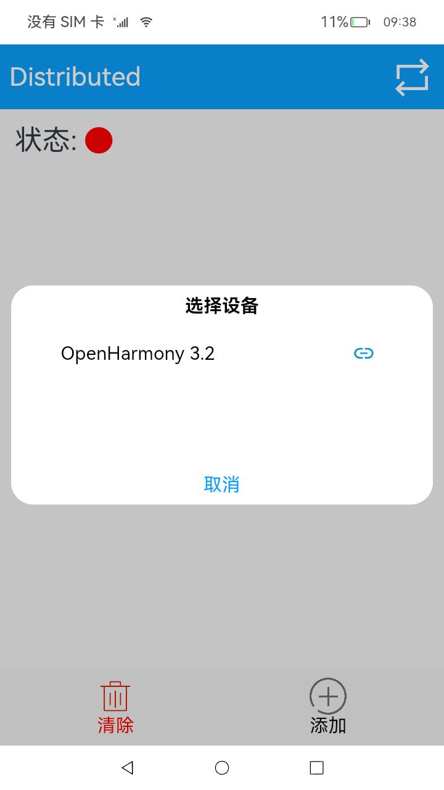
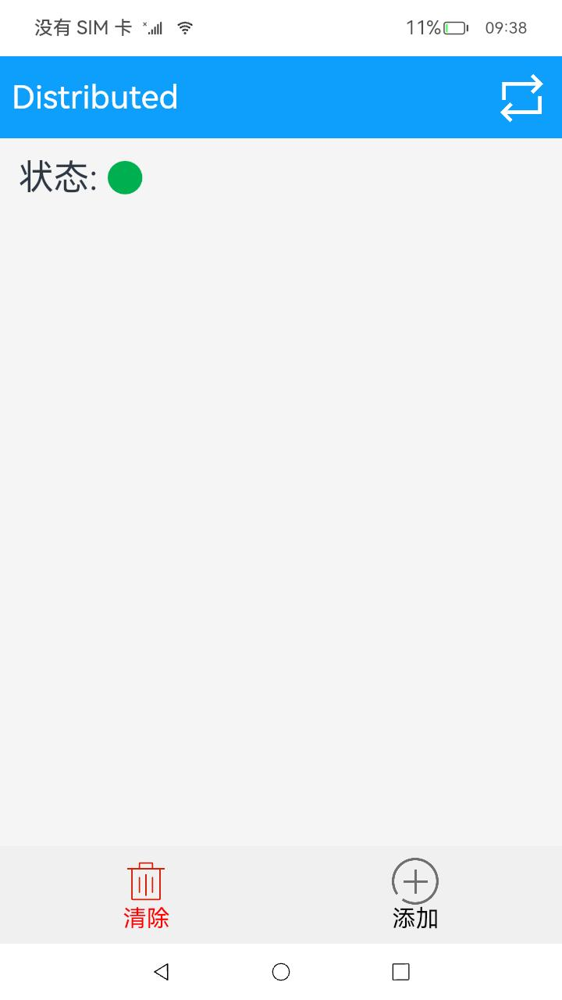

# 分布式文件场景

## 场景说明

两台设备组网的分布式场景是工作中常常需要的。常见的如代码的同步编辑、文档的同步修改等。这样的分布式场景有助于加快工作效率，减少工作中的冗余，本例将为大家介绍如何实现上述功能。

## 效果呈现

本例效果如下：

| 设置分布式权限                         | 进行分布式连接                           | 连接后状态显示                          |
| -------------------------------------- | ---------------------------------------- | --------------------------------------- |
|  |  |  |

| 点击添加进入编辑界面                  | 保存后本机显示                         | 另外一台机器分布式应用显示             |
| ------------------------------------- | -------------------------------------- | -------------------------------------- |
|  |  |  |

## 运行环境

本例基于以下环境开发，开发者也可以基于其他适配的版本进行开发。

- IDE：DevEco Studio 4.0.0.201 Beta1
- SDK：Ohos_sdk_public 4.0.7.5 (API Version 10 Beta1)

## 实现思路

在分布式文件场景中，分布式设备管理包含了分布式设备搜索、分布式设备列表弹窗、远端设备拉起三部分。
首先在分布式组网内搜索设备，然后把设备展示到分布式设备列表弹窗中，最后根据用户的选择拉起远端设备。

- 分布式设备搜索：通过SUBSCRIBE_ID搜索分布式组网内的设备。

- 分布式设备列表弹窗：使用@CustomDialog装饰器来装饰分布式设备列表弹窗。

- 远端设备拉起：通过startAbility(deviceId)方法拉起远端设备的包。

- 分布式数据管理：(1)管理分布式数据库：创建一个distributedObject分布式数据对象实例，用于管理分布式数据对象。

  ​							   (2)订阅分布式数据变化：通过this.distributedObject.on('status', this.statusCallback)监听分布式数据对象的变更。

## 开发步骤

1. 申请所需权限

   在model.json5中添加以下配置：

   ```json
   "requestPermissions": [
         {
           "name": "ohos.permission.DISTRIBUTED_DATASYNC"//允许不同设备间的数据交换
         },
         {
           "name": "ohos.permission.ACCESS_SERVICE_DM"//允许系统应用获取分布式设备的认证组网能力
         }
       ]
   ```

2. 构建UI框架

   index页面：

   TitleBar组件呈现标题栏。使用List组件呈现文件列表，ListItem由一个呈现文件类型标志的Image组件，一个呈现文件标题的Text组件，一个呈现文件内容的Text组件组成。

   ```typescript
   build() {
       Column() {
         TitleBar({ rightBtn: $r('app.media.trans'), onRightBtnClicked: this.showDialog })
   	//自/common/TitleBar.ets中引入标题栏相关。点击标题栏中的右侧按钮会调用showDialog()函数连接组网设备
         Row() {
           Text($r('app.string.state'))
             .fontSize(30)
           Image(this.isOnline ? $r('app.media.green') : $r('app.media.red'))//两台设备组网成功后状态显示为绿色、否则为红色
             .size({ width: 30, height: 30 })
             .objectFit(ImageFit.Contain)
         }
         .width('100%')
         .padding(16)
   		//通过数据懒加载的方式从数据源中每次迭代一个文件进行展示，可用列表被放置在滚动容器中，被划出可视区域外的资源会被回收
         List({ space: 10 }) {
           LazyForEach(this.noteDataSource, (item: Note, index) => {
             ListItem() {
               NoteItem({ note: item, index: index })//NoteItem引入自common/NoteItem.ets,负责主页文件信息的呈现
                 .id(`${item.title}`)
             }
           }, item => JSON.stringify(item))
         }
         .width('95%')
         .margin(10)
         .layoutWeight(1)
   
         Row() {
           Column() {
             Image($r('app.media.clear'))//清除按钮
               .size({ width: 40, height: 40 })
             Text($r('app.string.clear'))
               .fontColor(Color.Red)
               .fontSize(20)
           }.layoutWeight(1)
           .id('clearNote')
           .onClick(() => {
               //点击清除按钮清除所有文件
             Logger.info(TAG, 'clear notes')
             this.noteDataSource['dataArray'] = []
             this.noteDataSource.notifyDataReload()
             this.globalObject.clear()
             AppStorage.SetOrCreate('sessionId', this.sessionId)
           })
   
           Column() {
             Image($r('app.media.add'))//添加按钮
               .size({ width: 40, height: 40 })
             Text($r('app.string.add'))
               .fontColor(Color.Black)
               .fontSize(20)
           }.layoutWeight(1)
           .id('addNote')
           .onClick(() => {
               //点击添加按钮跳转到编辑页面
             router.push({
               url: 'pages/Edit',
               params: {
                 note: new Note('', '', -1),
                 isAdd: true
               }
             })
           })
         }
         .width('100%')
         .padding(10)
         .backgroundColor('#F0F0F0')
       }
       .width('100%')
       .height('100%')
       .backgroundColor('#F5F5F5')
     }
   }
   ...
   //common/NoteItem.ets
   import router from '@ohos.router'
   import { MARKS } from '../model/Const'
   import Note from '../model/Note'
   
   @Component
   export default struct NoteItem {
     @State note: Note | undefined = undefined
     private index: number = 0
   
     build() {
       Row() {
         Image(this.note.mark >= 0 ? MARKS[this.note.mark] : $r('app.media.note'))//文件标志图片
           .size({ width: 30, height: 30 })
           .objectFit(ImageFit.Contain)
         Column() {
           Text(this.note.title)//文件标题
             .fontColor(Color.Black)
             .fontSize(30)
             .maxLines(1)
             .textOverflow({ overflow: TextOverflow.Ellipsis })
           Text(this.note.content)//文件内容
             .fontColor(Color.Gray)
             .margin({ top: 10 })
             .fontSize(25)
             .maxLines(1)//在列表中最多展示一行
             .textOverflow({ overflow: TextOverflow.Ellipsis })
         }
         .alignItems(HorizontalAlign.Start)
         .margin({ left: 20 })
       }
       .padding(16)
       .width('100%')
       .borderRadius(16)
       .backgroundColor(Color.White)
       .onClick(() => {
           //点击文件进入此文件编辑页面
         router.push({
           url: 'pages/Edit',
           params: {
             index: this.index,
             note: this.note,
             isAdd: false
           }
         })
       })
     }
   }
   ```

   Edit页面：

   使用TextInput组件呈现文件标题输入框，使用TextArea组件呈现文件内容的输入区域，使用Button组件呈现保存按钮并绑定点击事件以新建或更新文件内容。

   ```typescript
   build() {
       Column() {
         TitleBar({ title: this.note.title === '' ? $r('app.string.add_note') : this.note.title })
         Column() {
           Row() {
             Image(this.note.mark >= 0 ? MARKS[this.note.mark] : $r('app.media.mark'))
               .width(30)
               .aspectRatio(1)
               .margin({ left: 16, top: 16 })
               .objectFit(ImageFit.Contain)
               .alignSelf(ItemAlign.Start)
             Select([{ value: '   ', icon: MARKS[0] },
                     { value: '   ', icon: MARKS[1] },
                     { value: '   ', icon: MARKS[2] },
                     { value: '   ', icon: MARKS[3] },
                     { value: '   ', icon: MARKS[4] }])
               .selected(this.note.mark)
               .margin({ top: 5 })
               .onSelect((index: number) => {
                 this.note.mark = index
               })
           }
           .width('100%')
   
           TextInput({ placeholder: 'input the title', text: this.note.title })//文件标题输入框
             .id('titleInput')
             .placeholderColor(Color.Gray)
             .fontSize(30)
             .margin({ left: 15, right: 15, top: 15 })
             .height(60)
             .backgroundColor(Color.White)
             .onChange((value: string) => {
               this.note.title = value
             })
           TextArea({ placeholder: 'input the content', text: this.note.content })//文件内容输入区域
             .id('contentInput')
             .placeholderColor(Color.Gray)
             .backgroundColor(Color.White)
             .fontSize(30)
             .height('35%')
             .margin({ left: 16, right: 16, top: 16 })
             .textAlign(TextAlign.Start)
             .onChange((value: string) => {
               this.note.content = value
             })
   
           Button() {
               //保存按钮
             Text($r('app.string.save'))
               .fontColor(Color.White)
               .fontSize(17)
           }
           .id('saveNote')
           .backgroundColor('#0D9FFB')
           .height(50)
           .width(200)
           .margin({ top: 20 })
           .onClick(() => {
               //点击按钮时调用model/DistributedObjectModel.ts定义的类globalObject中的方法
             if (!this.isAdd) {
               let index = router.getParams()['index']
               this.globalObject.update(index, this.note.title, this.note.content, this.note.mark)//编辑时更新内容
             } else {
               this.globalObject.add(this.note.title, this.note.content, this.note.mark)//新建时添加内容
             }
             router.back()//返回主页
           })
         }
       }
       .width('100%')
       .height('100%')
       .backgroundColor('#F5F5F5')
     }
   }
   ```

3. 将两台设备组网

   使用自RemoteDeviceModel.ts中引入的类RemoteDeviceModel以扫描获得附近可以连接的设备。

   ```typescript
   showDialog = () => {
       //RemoteDeviceModel引入自model/RemoteDeviceModel.ts
       RemoteDeviceModel.registerDeviceListCallback(() => {
           //得到附近可信的设备列表
         Logger.info(TAG, 'registerDeviceListCallback, callback entered')
         this.devices = []
         this.devices = RemoteDeviceModel.discoverDevices.length > 0 ? RemoteDeviceModel.discoverDevices : RemoteDeviceModel.devices
         if (this.dialogController) {
           this.dialogController.close()
           this.dialogController = undefined
         }
         this.dialogController = new CustomDialogController({
           builder: DeviceDialog({
             devices: this.devices,
             onSelectedIndexChange: this.onSelectedDevice
           }),
           autoCancel: true
         })
         this.dialogController.open()
       })
     }
   ...
   //model/RemoteDeviceModel.ts
   import deviceManager from '@ohos.distributedHardware.deviceManager'
   registerDeviceListCallback(stateChangeCallback: () => void) {
       if (typeof (this.deviceManager) !== 'undefined') {
         this.registerDeviceListCallbackImplement(stateChangeCallback)
         return
       }
       Logger.info(TAG, 'deviceManager.createDeviceManager begin')
       try {
         deviceManager.createDeviceManager(BUNDLE, (error, value) => {
           if (error) {
             Logger.error(TAG, 'createDeviceManager failed.')
             return
           }
           this.deviceManager = value
           this.registerDeviceListCallbackImplement(stateChangeCallback)
           Logger.info(TAG, `createDeviceManager callback returned,value=${value}`)
         })
       } catch (error) {
         Logger.error(TAG, `createDeviceManager throw error, code=${error.code} message=${error.message}`)
       }
   
       Logger.info(TAG, 'deviceManager.createDeviceManager end')
     }
   registerDeviceListCallbackImplement(stateChangeCallback: () => void) {
       Logger.info(TAG, 'registerDeviceListCallback')
       this.stateChangeCallback = stateChangeCallback
       if (this.deviceManager === undefined) {
         Logger.error(TAG, 'deviceManager has not initialized')
         this.stateChangeCallback()
         return
       }
       Logger.info(TAG, 'getTrustedDeviceListSync begin')
       try {
         let list = this.deviceManager.getTrustedDeviceListSync()//同步获取所有可信设备列表
         Logger.info(TAG, `getTrustedDeviceListSync end, devices=${JSON.stringify(list)}`)
         if (typeof (list) !== 'undefined' && typeof (list.length) !== 'undefined') {
           this.devices = list
         }
       } catch (error) {
         Logger.error(TAG, `getLocalDeviceInfoSync throw error, code=${error.code} message=${error.message}`)
       }
       this.stateChangeCallback()
       Logger.info(TAG, 'callback finished')
       try {
         this.deviceManager.on('deviceStateChange', (data) => {
           if (data === null) {
             return
           }
           Logger.info(TAG, `deviceStateChange data = ${JSON.stringify(data)}`)
           switch (data.action) {
             case deviceManager.DeviceStateChangeAction.READY://即设备处于可用状态，表示设备间信息已在分布式数据中同步完成, 可以运行分布式业务
               this.discoverDevices = []
               this.devices.push(data.device)
               this.stateChangeCallback()
               try {
                 let list = this.deviceManager.getTrustedDeviceListSync()
                 if (typeof (list) !== 'undefined' && typeof (list.length) !== 'undefined') {
                   this.devices = list
                 }
               } catch (error) {
                 Logger.error(TAG, `getTrustedDeviceListSync throw error, code=${error.code} message=${error.message}`)
               }
               this.stateChangeCallback()
               break
             default:
               break
           }
         })
         this.deviceManager.on('deviceFound', (data) => {
           if (data === null) {
             return
           }
           Logger.info(TAG, `deviceFound data=${JSON.stringify(data)}`)
           this.onDeviceFound(data)
         })
         this.deviceManager.on('discoverFail', (data) => {
           Logger.info(TAG, `discoverFail data=${JSON.stringify(data)}`)
         })
         this.deviceManager.on('serviceDie', () => {
           Logger.info(TAG, 'serviceDie')
         })
       } catch (error) {
         Logger.error(TAG, `on throw error, code=${error.code} message=${error.message}`)
       }
       this.startDeviceDiscovery()
     }
   startDeviceDiscovery() {
       SUBSCRIBE_ID = Math.floor(65536 * Math.random())
       var info = {
         subscribeId: SUBSCRIBE_ID,
         mode: 0xAA,
         medium: 2,
         freq: 2,//高频率
         isSameAccount: false,
         isWakeRemote: true,
         capability: 0
       }
       Logger.info(TAG, `startDeviceDiscovery${SUBSCRIBE_ID}`)
       try {
         this.deviceManager.startDeviceDiscovery(info)//开始发现周边设备
       } catch (error) {
         Logger.error(TAG, `startDeviceDiscovery throw error, code=${error.code} message=${error.message}`)
       }
   
     }
   ```

4. 实现同步编辑

   通过AppStorage设置持久性数据，然后实现IDataSource接口，通过注册数据监听接口监听数据的变化。

   ```typescript
   class BasicDataSource implements IDataSource {
     private listeners: DataChangeListener[] = []
   
     public totalCount(): number {
       return 0
     }
   
     public getData(index: number): any {
       return undefined
     }
   
     registerDataChangeListener(listener: DataChangeListener): void {
       if (this.listeners.indexOf(listener) < 0) {
         console.info('add listener')
         this.listeners.push(listener)
       }
     }
   
     unregisterDataChangeListener(listener: DataChangeListener): void {
       const pos = this.listeners.indexOf(listener);
       if (pos >= 0) {
         console.info('remove listener')
         this.listeners.splice(pos, 1)
       }
     }
     //数据准备好了
     notifyDataReload(): void {
       this.listeners.forEach(listener => {
         listener.onDataReloaded()
       })
     }
     ...
   }
   
   onPageShow() {
       //每当完成编辑或者新建文件，就会回到主页，此时就会执行onPageShow()
       //noteDataSource获取globalObject保存的分布式的持久性数据，并进行Reload操作传递。
       this.noteDataSource['dataArray'] = this.globalObject.distributedObject.documents
       this.noteDataSource.notifyDataReload()
       Logger.info(TAG, `this.sessionId = ${this.sessionId}`)
       Logger.info(TAG, `globalSessionId = ${this.globalSessionId}`)
       if (this.sessionId !== this.globalSessionId) {
         this.sessionId = this.globalSessionId
         this.share()
       }
     }
   share() {
       //多个设备间的对象如果设置为同一个sessionId的笔记数据自动同步
       Logger.info(TAG, `sessionId = ${this.sessionId}`)
       this.globalObject.setChangeCallback(() => {
         this.noteDataSource['dataArray'] = this.globalObject.distributedObject.documents
         this.noteDataSource.notifyDataReload()
       })
       this.globalObject.setStatusCallback((session, networkId, status) => {
         Logger.info(TAG, `StatusCallback,${status}`)
         if (status === 'online') {
           this.isOnline = true
         } else {
           this.isOnline = false
         }
       })
       this.globalObject.distributedObject.setSessionId(this.sessionId)
       AppStorage.SetOrCreate('objectModel', this.globalObject)
     }
   ```

## 全部代码

本例完整代码sample示例链接：[分布式对象](https://gitee.com/openharmony/applications_app_samples/tree/monthly_20230815/code/SuperFeature/DistributedAppDev/DistributedNote)

## 参考

- [权限列表](../application-dev/security/permission-list.md#ohospermissiondistributed_datasync)
- [分布式数据对象](../application-dev/reference/apis/js-apis-data-distributedobject.md)
