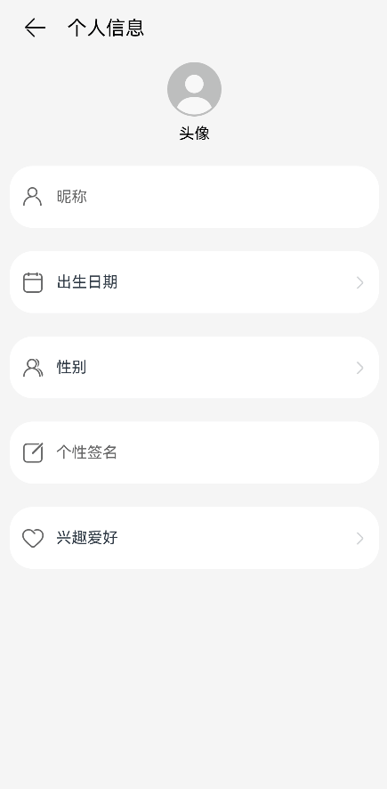

# 弹框的使用

## 场景说明
应用中经常用到弹窗，比如警告弹窗、日期选择弹窗、文本选择弹窗以及其他自定义弹窗等等。本例将为大家介绍如何使用不同的弹窗。

## 效果呈现
本例最终效果如下：



示例中共涉及四类对话框：
- 告警弹框：提示信息尚未保存。
- 日期选择弹框：选择出生日期。
- 文本选择弹框：选择性别。
- 自定义弹框：填写兴趣爱好。

## 运行环境
本例基于以下环境开发，开发者也可以基于其他适配的版本进行开发：

- IDE: DevEco Studio 3.1 Release
- SDK: Ohos_sdk_public 3.2.12.5(API Version 9 Release)


## 实现思路
本例中涉及的4类弹框及实现方案如下：
- 告警弹框：使用AlertDialog实现。
- 日期选择弹框：使用DatePickerDialog实现。
- 文本选择弹框：使用TextPickerDialog实现。
- 自定义弹框：使用CustomDialogController实现。

## 开发步骤
由于本例重点讲解对话框的使用，所以开发步骤会着重讲解相关实现，不相关的内容不做介绍，全量代码可参考完整代码章节。
1. 首先，使用AlertDialog实现告警弹框。
通过‘message’参数设置告警信息，‘alignment’设置弹框在界面中垂直方向的对齐方式；通过'primaryButton'和'secondaryButton'添加按钮。
具体代码如下：
    ```ts
    alertDialog(context: Context.UIAbilityContext) {
      AlertDialog.show({
        // 通过message设置告警信息
        message: '当前数据未保存，是否确认离开？',
        // 通过alignment设置弹框在界面垂直方向的对齐方式，此处设置为底部对齐
        alignment: DialogAlignment.Bottom,
        // 通过offset设置基于对齐位置的便宜量
        offset: {
          dx: 0,
          dy: -20
        },
        // 弹框中左起第一个按钮
        primaryButton: {
          value: '取消',
          action: () => {
            console.info('Callback cancel button is clicked');
          }
        },
        // 弹框中左起第二个按钮
        secondaryButton: {
          value: '确定',
          action: () => {
            // Exiting the app.
            context.terminateSelf();
            console.info('Callback definite button is clicked');
          }
        }
      });
    }
    ```
2. 使用DatePickerDialog实现日期选择弹框。
通过start和end分别设置日期区间的起始时间和末尾时间；通过lunar设置使用农历还是阳历；使用onAccept监听选择的日期，本例中通过变量selectedDate将选中的日期设置给参数selected，这样弹框弹出时的日期就默认为上次选中的日期。
具体代码如下：
    ```ts
    datePickerDialog(dateCallback) {
      DatePickerDialog.show({
        start: new Date('1900-1-1'),
        end: new Date('2100-1-1'),
        // 通过变量selectedDate将选中的日期设置给参数selected
        selected: this.selectedDate,
        lunar: false,
        // 使用onAccept监听选择的日期
        onAccept: (value: DatePickerResult) => {
          let year = value.year;
          let month = value.month + 1;
          let day = value.day;
          let birthdate: string = this.getBirthDateValue(year, month, day);
          // 通过setFullYear将选中的日期传递给变量selectedDate
          this.selectedDate.setFullYear(value.year, value.month, value.day)
          // 返回选中的日期
          dateCallback(birthdate);
        }
      });
    }
    ```
3. 使用TextPickerDialog实现文本选择弹框。
通过range设置文本选择项，使用onAccept监听选择的文本项，本例中通过变量selectedGender将选中的性别的索引设置给参数selected，这样弹框弹出时的性别就默认为上次选中的性别。
具体代码如下：
    ```ts
    textPickerDialog(sexArray: Resource, sexCallback) {
      // 判断文本项的列表是否为空
      if (this.isEmptyArr(sexArray)) {
        console.error('sex is null');
        return;
      }
      TextPickerDialog.show({
        // 通过range设置文本选择项
        range: sexArray,
        // 通过变量selectedGender将选中的性别的索引设置给参数selected
        selected: this.selectedGender,
        // 使用onAccept监听选择的文本项
        onAccept: (result: TextPickerResult) => {
          sexCallback(result.value);
          // 获取选中项的索引
          this.selectedGender = result.index
        },
        onCancel: () => {
          console.info('TextPickerDialog onCancel');
        }
      });
    }
    ```
4. 使用CustomDialogController实现自定义弹框。
当现有弹框不能满足业务诉求时，开发者可以自行设计弹框的样式。在实现自定义弹框时，需要将弹框的UI放在被@CustomDialog修饰的自定义组件中，然后使用CustomDialogController的实例来控制弹框的弹出和关闭。
具体代码如下：
    ```ts
    // 使用@CustomDialog修饰自定义弹框
    @CustomDialog
    struct CustomDialogFrame{
      ...
      // 定义CustomDialogController
      controller: CustomDialogController

      build(){
        Column() {
          Text('兴趣爱好').fontSize(20).margin({ top: 10, bottom: 10 })
          TextInput({ placeholder: '', text: this.textValue }).height(60).width('90%')
            .onChange((value: string) => {
              this.textValue = value
            })
          Flex({ justifyContent: FlexAlign.SpaceAround }) {
            Button('取消')
              .onClick(() => {
                // 点击‘取消’，弹框关闭
                this.controller.close()
              })
              .backgroundColor('')
              .fontColor('#007DFF')
            Button('保存')
              .onClick(() => {
                this.inputValue = this.textValue
                // 点击‘保存’，弹框关闭
                this.controller.close()
              })
              .backgroundColor(0xffffff)
              .fontColor('#007DFF')
          }.margin({ bottom: 10 })
        }.justifyContent(FlexAlign.Start)
      }
    }
    ...
      // 实例化自定义弹框
      customDialogController: CustomDialogController = new CustomDialogController({
        // 使用上文创建的自定义弹框进行实例化
        builder: CustomDialogFrame({
          textValue: $textValue,
          inputValue: $inputValue
        }),
        alignment: DialogAlignment.Bottom,
        offset: {
          dx: 0,
          dy: -20
        }
      });
    ...
    ```
## 完整代码
本例完整代码如下：
```ts
import Context from '@ohos.app.ability.common';
import hilog from '@ohos.hilog';

@Component
struct TextFrame{
  @Link content: string;
  private textImage:Resource;
  private text:string;
  onTextClick:()=>void;

  build(){
    Row(){
      Image(this.textImage)
        .width(24)
        .height(24)
        .margin({left:12})
      Text(this.text)
        .fontSize(16)
        .margin({ left:12 })
        .height(24)
      Text(this.content)
        .fontSize(16)
        .textAlign(TextAlign.End)
        .textOverflow({ overflow: TextOverflow.Ellipsis })
        .maxLines(1)
        .margin({
          left: 16,
          right: 7
        })
        .layoutWeight(1)
        .width('100%')
      Image($r('app.media.ic_arrow'))
        .width(12)
        .height(24)
        .margin({ right: 14 })
    }
    .margin({ top: 24 })
    .borderRadius(24)
    .backgroundColor(Color.White)
    .width('93.3%')
    .height(64)
    .onClick(this.onTextClick)
  }
}

@Component
struct InputFrame{
  private inputImage: Resource;
  private hintText: string;

  build(){
    Row() {
      Image(this.inputImage)
        .width(24)
        .height(24)
        .margin({ left: 12 })
      TextInput({ placeholder: this.hintText })
        .fontSize(16)
        .padding({ left: 12 })
        .placeholderColor('#99000000')
        .backgroundColor(Color.White)
        .fontWeight(FontWeight.Normal)
        .fontStyle(FontStyle.Normal)
        .fontColor(Color.Black)
        .margin({ right: 32 })
        .layoutWeight(1)
        .height(48)
    }
    .margin({ top: 24 })
    .borderRadius(24)
    .backgroundColor(Color.White)
    .width('93.3%')
    .height(64)
  }
}

@CustomDialog
struct CustomDialogFrame{
  @Link textValue: string
  @Link inputValue: string
  controller: CustomDialogController

  build(){
    Column() {
      Text('兴趣爱好').fontSize(20).margin({ top: 10, bottom: 10 })
      TextInput({ placeholder: '', text: this.textValue }).height(60).width('90%')
        .onChange((value: string) => {
          this.textValue = value
        })
      Flex({ justifyContent: FlexAlign.SpaceAround }) {
        Button('取消')
          .onClick(() => {
            this.controller.close()
          }).backgroundColor('').fontColor('#007DFF')
        Button('保存')
          .onClick(() => {
            this.inputValue = this.textValue
            this.controller.close()
          }).backgroundColor(0xffffff).fontColor('#007DFF')
      }.margin({ bottom: 10 })
    }.justifyContent(FlexAlign.Start)
  }
}

@Entry
@Component
struct Index {
  @State birthdate: string = '';
  @State sex: string = '';
  @State textValue: string = '';
  @State inputValue: string = '';
  selectedDate: Date = new Date("2010-1-1")
  selectedGender:number = 0
  private sexArray: Resource = $r('app.strarray.sex_array');
  customDialogController: CustomDialogController = new CustomDialogController({
    builder: CustomDialogFrame({
      textValue: $textValue,
      inputValue: $inputValue
    }),
    alignment: DialogAlignment.Bottom,
    offset: {
      dx: 0,
      dy: -20
    }
  });

  alertDialog(context: Context.UIAbilityContext) {
    AlertDialog.show({
      message: '当前数据未保存，是否确认离开？',
      alignment: DialogAlignment.Bottom,
      offset: {
        dx: 0,
        dy: -20
      },
      primaryButton: {
        value: '取消',
        action: () => {
          console.info('Callback cancel button is clicked');
        }
      },
      secondaryButton: {
        value: '确定',
        action: () => {
          // Exiting the app.
          context.terminateSelf();
          console.info('Callback definite button is clicked');
        }
      }
    });
  }

  datePickerDialog(dateCallback) {
    DatePickerDialog.show({
      start: new Date('1900-1-1'),
      end: new Date('2100-1-1'),
      selected: this.selectedDate,
      lunar: false,
      onAccept: (value: DatePickerResult) => {
        let year = value.year;
        let month = value.month + 1;
        let day = value.day;
        let birthdate: string = this.getBirthDateValue(year, month, day);
        this.selectedDate.setFullYear(value.year, value.month, value.day)
        dateCallback(birthdate);
      }
    });
  }

  textPickerDialog(sexArray: Resource, sexCallback) {
    if (this.isEmptyArr(sexArray)) {
      console.error('sex is null');
      return;
    }
    TextPickerDialog.show({
      range: sexArray,
      selected: this.selectedGender,
      onAccept: (result: TextPickerResult) => {
        sexCallback(result.value);
        this.selectedGender = result.index
      },
      onCancel: () => {
        console.info('TextPickerDialog onCancel');
      }
    });
  }

  getBirthDateValue(year: number, month: number, day: number): string {
    let birthdate: string = `${year}${'年'}${month}` +
    `${'月'}${day}${'日'}`;
    return birthdate;
  }

  isEmpty(obj): boolean {
    return obj === undefined || obj === null || obj === '';
  }

  isEmptyArr(array): boolean {
    return this.isEmpty(array) || array.length === 0;
  }

  build() {
    Row() {
      Column() {
        Row(){
          Image($r('app.media.ic_back'))
            .width(26)
            .height(26)
            .alignSelf(ItemAlign.Start)
            .margin({
              left: '7.2%',
              top: 19
            })
            .onClick(() => {
              let context = getContext(this) as Context.UIAbilityContext;
              this.alertDialog(context);
            })
          Text('个人信息')
            .fontColor(Color.Black)
            .fontSize(20)
            .margin({ top: 20,left:20 })
            .alignSelf(ItemAlign.Center)
        }.width('100%')
        Image($r('app.media.ic_avatar'))
          .width(56)
          .height(56)
          .alignSelf(ItemAlign.Center)
          .margin({ top: '5.5%' })
        Text('头像')
          .fontColor(Color.Black)
          .fontSize(16)
          .margin({ top: '2.1%' })
          .alignSelf(ItemAlign.Center)
        InputFrame({
          inputImage: $r('app.media.ic_nickname'),
          hintText: '昵称'
        })
        TextFrame({
          textImage: $r('app.media.ic_birthdate'),
          text: '出生日期',
          content: $birthdate,
          onTextClick: () => {
            this.datePickerDialog((birthValue: string) => {
              this.birthdate = birthValue;
            });
          }
        })
        TextFrame({
          textImage: $r('app.media.ic_sex'),
          text: '性别',
          content: $sex,
          onTextClick: () => {
            this.textPickerDialog(this.sexArray, (sexValue: string) => {
              this.sex = sexValue;
            });
          }
        })
        InputFrame({
          inputImage: $r('app.media.ic_signature'),
          hintText: '个性签名'
        })
        TextFrame({
          textImage: $r('app.media.ic_hobbies'),
          text: '兴趣爱好',
          content: $textValue,
          onTextClick: () => {
            this.customDialogController.open();
          }
        })
      }
      .backgroundColor('#F5F5F5')
      .height('100%')
      .width('100%')
    }
    .height('100%')
  }
}
```
## 参考