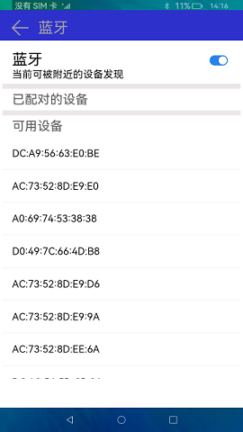
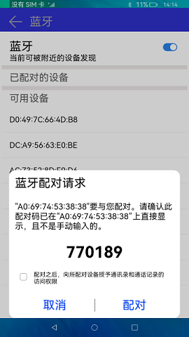
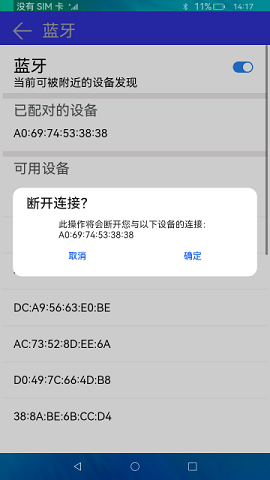

# 如何进行蓝牙连接

## 场景说明
蓝牙技术是一种无线数据和语音通信开放的全球规范，它是基于低成本的近距离无线连接，为固定和移动设备建立通信环境的一种特殊的连接。本示例通过[@ohos.bluetoothManager](../application-dev/reference/apis/js-apis-bluetoothManager.md)接口实现蓝牙设备发现、配对、取消配对功能。

## 效果呈现

本示例最终效果如下：

| 发现设备                        | 连接设备                          | 断开连接                          |
| ------------------------------- | --------------------------------- | --------------------------------- |
|  |  |  |

## 运行环境

本例基于以下环境开发，开发者也可以基于其他适配的版本进行开发。

- IDE：DevEco Studio 3.1.1 Release
- SDK：Ohos_sdk_full 4.0.8.5(API Version 10 Beta1)

## 实现思路
本文涉及到蓝牙的设备发现、配对、取消配对三个功能特性，实现思路如下：

- 启动和关闭蓝牙：在Index页面中通过Toggle组件的onChange函数控制蓝牙的开关，开关打开的情况下执行initBluetooth函数，关闭的情况下执行bluetooth.disableBluetooth()方法来断开蓝牙；
- 验证蓝牙是否处于连接状态：蓝牙打开的时候通过bluetooth.on('stateChange')方法监听蓝牙连接状态改变事件，如确认已打开，执行foundDevices()函数来查找设备接口，确认已关闭则执行bluetooth.stopBluetoothDiscovery()方法停止查询接口。
- 发现设备：在foundDevices()函数中通过bluetooth.on('bluetoothDeviceFind')方法监听设备发现事件，通过bluetooth.getPairedDevices()方法更新已配对蓝牙地址，然后通过bluetooth.startBluetoothDiscovery()方法开启蓝牙扫描发现远端设备，并且通过bluetooth.setBluetoothScanMode()方法来被远端设备发现。
- 蓝牙配对：通过bluetooth.on('pinRequired')方法监听远端蓝牙设备的配对请求事件，点击配对执行bluetooth.setDevicePairingConfirmation(this.data.deviceId, true)方法，点击取消执行bluetooth.setDevicePairingConfirmation(this.data.deviceId, false)方法。
- 取消配对：使用bluetooth.cancelPairedDevice()断开指定的远端设备连接。

## 开发步骤
1. 申请蓝牙权限。
   使用蓝牙需要先申请对应的权限，在module.json5文件中添加以下配置：
   
    ```json
    "requestPermissions": [
          {
            //允许应用查看蓝牙的配置
            "name": "ohos.permission.USE_BLUETOOTH",
            "reason": "$string:grant_use_bluetooth",
            "usedScene": {
              "abilities": [
                "MainAbility"
              ],
              "when": "inuse"
            }
          },
          {
            //允许应用配置本地蓝牙，查找远端设备且与之配对连接
            "name": "ohos.permission.DISCOVER_BLUETOOTH",
            "reason": "$string:grant_discovery_bluetooth",
            "usedScene": {
              "abilities": [
                "MainAbility"
              ],
              "when": "inuse"
            }
          },
          {
            //允许应用获取设备位置信息
            "name": "ohos.permission.LOCATION",
            "reason": "$string:grant_location",
            "usedScene": {
              "abilities": [
                "MainAbility"
              ],
              "when": "inuse"
            }
          },
          {
            //允许应用获取设备模糊位置信息
            "name": "ohos.permission.APPROXIMATELY_LOCATION",
            "reason": "$string:grant_location",
            "usedScene": {
              "abilities": [
                "MainAbility"
              ],
              "when": "inuse"
            }
          },
          {
            //允许应用配对蓝牙设备，并对设备的电话簿或消息进行访问
            "name": "ohos.permission.MANAGE_BLUETOOTH",
            "reason": "$string:grant_manage_bluetooth",
            "usedScene": {
              "abilities": [
                "MainAbility"
              ],
              "when": "inuse"
            }
          }
        ]
    ```
   
2. 构建UI框架，整体的UI框架分为TitleBar（页面名称），PinDialog（配对蓝牙弹框），index（主页面）三个部分。

    ```ts
    //Common/TitleBar.ets
    @Component
    export struct TitleBar {
      private handlerClickButton: () => void
    
      build() {
        Row() {
          Image($r('app.media.ic_back'))
            .width(40)
            .height(30)
            .onClick(() => {
              this.handlerClickButton()
            })
          Text($r('app.string.bluetooth'))
            .fontSize(30)
            .width(150)
            .height(50)
            .margin({ left: 15 })
            .fontColor('#ffa2a3a4')
        }
        .width('100%')
        .height(60)
        .padding({ left: 20, top: 10 })
        .backgroundColor('#ff2d30cb')
        .constraintSize({ minHeight: 50 })
      }
    }
    
    //Common/PinDalog.ets
     ...
     aboutToAppear() {
        this.titleText = `"${this.data.deviceId}"要与您配对。请确认此配对码已在"${this.data.deviceId}"上直接显示，且不是手动输入的。`
        this.pinCode = JSON.stringify(this.data.pinCode)
      }
      build() {
        //配对弹框描述文字
        Column({ space: 10 }) {
          Text($r('app.string.match_request'))
            .fontSize(30)
            .alignSelf(ItemAlign.Start)
          Text(this.titleText)
            .alignSelf(ItemAlign.Start)
            .margin({ top: 20 })
            .fontSize(21)
          Text(this.pinCode)
            .fontSize(40)
            .fontWeight(FontWeight.Bold)
            .margin({ top: 20 })
          Flex({ direction: FlexDirection.Row, alignItems: ItemAlign.Center }) {
            Checkbox({ name: 'checkbox' })
              .select(false)
              .selectedColor('#ff3d6fb8')
              .key('checkBox')
            Text($r('app.string.grant_permission'))
              .fontSize(15)
              .margin({ left: 3, top: 6 })
          }
          .alignSelf(ItemAlign.Start)
          .width('95%')
          .margin({ top: 5 })
    
          Row() {
            //配对选择UI，取消or配对
            this.choiceText($r('app.string.cancel'), () => {
              bluetooth.setDevicePairingConfirmation(this.data.deviceId, false)
              logger.info(TAG, `setDevicePairingConfirmation = ${bluetooth.setDevicePairingConfirmation(this.data.deviceId, false)}`)
              this.controller.close()
            })
    
            Divider()
              .vertical(true)
              .height(32)
    
            this.choiceText($r('app.string.match'), () => {
              bluetooth.setDevicePairingConfirmation(this.data.deviceId, true)
              logger.info(TAG, `setDevicePairingConfirmation = ${bluetooth.setDevicePairingConfirmation(this.data.deviceId, true)}`)
              this.controller.close()
            })
          }
          .margin({ top: 20 })
        }
        .width('100%')
        .padding(15)
      }
    ...
    
    //pages/index.ets
    @Entry
    @Component
    struct Index {
     build() {
        Column() {
          TitleBar({ handlerClickButton: this.handlerClickButton })
          Scroll() {
            Column() {
              Row() {
                //蓝牙开关
                Column() {
                  Text($r('app.string.bluetooth'))
                    .fontSize(30)
                    .margin({ top: 20 })
                    .alignSelf(ItemAlign.Start)
                  if (true === this.isOn) {
                    Text($r('app.string.discovery'))
                      .fontSize(20)
                      .alignSelf(ItemAlign.Start)
                  }
                }
    
                Blank()
    
                Column() {
                  Toggle({ type: ToggleType.Switch, isOn: this.isOn })
                    .selectedColor('#ff2982ea')
                    .onChange((isOn: boolean) => {
                      if (isOn) {
                        this.isOn = true
                        this.initBluetooth()
                      } else {
                        this.isOn = false
                        bluetooth.disableBluetooth()
                        this.deviceList = []
                        this.discoveryList = []
                      }
                    })
                }
                .id('toggleBtn')
              }
              .width('90%')
    
              if (this.isOn) {
                Divider()
                  .vertical(false)
                  .strokeWidth(10)
                  .color('#ffece7e7')
                  .lineCap(LineCapStyle.Butt)
                  .margin('1%')
                //已配对的设备
                Text($r('app.string.paired_device'))
                  .fontSize(25)
                  .fontColor('#ff565555')
                  .margin({ left: '5%' })
                  .alignSelf(ItemAlign.Start)
    
                ForEach(this.deviceList, (item, index) => {
                  Row() {
                    Text(item)
                      .fontSize(20)
                  }
                  .alignSelf(ItemAlign.Start)
                  .width('100%')
                  .height(50)
                  .margin({ left: '5%', top: '1%' })
                  .id(`pairedDevice${index}`)
                  .onClick(() => {
                    AlertDialog.show({
                      //取消配对
                      title: $r('app.string.disconnect'),
                      message: '此操作将会断开您与以下设备的连接：' + item,
                      primaryButton: {
                        value: $r('app.string.cancel'),
                        action: () => {
                        }
                      },
                      //确认取消
                      secondaryButton: {
                        value: $r('app.string.confirm'),
                        action: () => {
                          try {
                            bluetooth.cancelPairedDevice(item);
                            this.deviceList = bluetooth.getPairedDevices()
                            this.discoveryList = []
                            bluetooth.startBluetoothDiscovery()
                          } catch (err) {
                            console.error("errCode:" + err.code + ",errMessage:" + err.message);
                          }
                        }
                      }
                    })
                  })
                })
    
                Divider()
                  .vertical(false)
                  .strokeWidth(10)
                  .color('#ffece7e7')
                  .lineCap(LineCapStyle.Butt)
                  .margin('1%')
    
                Text($r('app.string.available_device'))
                  .fontSize(25)
                  .fontColor('#ff565555')
                  .margin({ left: '5%', bottom: '2%' })
                  .alignSelf(ItemAlign.Start)
                //可用设备列表
                ForEach(this.discoveryList, (item) => {
                  Row() {
                    Text(item)
                      .fontSize(20)
                  }
                  .alignSelf(ItemAlign.Start)
                  .width('100%')
                  .height(50)
                  .margin({ left: '5%', top: '1%' })
                  //进行配对操作点击
                  .onClick(() => {
                    logger.info(TAG, `start bluetooth.pairDevice,item = ${item}`)
                    let pairStatus = bluetooth.pairDevice(item)
                    logger.info(TAG, `pairStatus = ${pairStatus}`)
                  })
    
                  Divider()
                    .vertical(false)
                    .color('#ffece7e7')
                    .lineCap(LineCapStyle.Butt)
                    .margin('1%')
                })
              }
            }
          }
          .constraintSize({ maxHeight: '85%' })
        }
      }
    }
    ```
    
3. 蓝牙开关打开关闭操作，需要打开蓝牙开关才能进行后续操作：
    ```ts
    initBluetooth() {
        bluetooth.on('stateChange', (data) => {
          logger.info(TAG, `enter on stateChange`)
          //判断蓝牙开关状态
          if (data === bluetooth.BluetoothState.STATE_ON) {
            logger.info(TAG, `enter BluetoothState.STATE_ON`)
            //蓝牙打开后的相关操作
            this.foundDevices()
          }
          if (data === bluetooth.BluetoothState.STATE_OFF) {
            logger.info(TAG, `enter BluetoothState.STATE_OFF`)
            bluetooth.off('bluetoothDeviceFind', (data) => {
              logger.info(TAG, `offBluetoothDeviceFindData = ${JSON.stringify(data)}`)
            })
            //关闭
            bluetooth.stopBluetoothDiscovery()
            this.discoveryList = []
          }
          logger.info(TAG, `BluetoothState = ${JSON.stringify(data)}`)
        })
        //开启蓝牙
        bluetooth.enableBluetooth()
      }
    ```

4. 设置蓝牙扫描模式并开启扫描去发现设备，并订阅蓝牙设备发现上报时间获取设备列表
    ```ts
     foundDevices() {
        //订阅蓝牙设备发现上报事件
        bluetooth.on('bluetoothDeviceFind', (data) => {
          logger.info(TAG, `enter on bluetoothDeviceFind`)
          if (data !== null && data.length > 0) {
            if (this.discoveryList.indexOf(data[0]) === -1 && this.deviceList.indexOf(data[0]) === -1) {
              this.discoveryList.push(data[0])
            }
            logger.info(TAG, `discoveryList = ${JSON.stringify(this.discoveryList)}`)
          }
          let list = bluetooth.getPairedDevices()
          if (list !== null && list.length > 0) {
            this.deviceList = list
            logger.info(TAG, `deviceList =  ${JSON.stringify(this.deviceList)}`)
          }
        })
        //开启蓝牙扫描，可以发现远端设备
        bluetooth.startBluetoothDiscovery()
        //设置蓝牙扫描模式，可以被远端设备发现
        bluetooth.setBluetoothScanMode(bluetooth.ScanMode.SCAN_MODE_CONNECTABLE_GENERAL_DISCOVERABLE, TIME)
      }
    ```

5. 设置蓝牙扫描模式并开启扫描去发现设备，并订阅蓝牙设备发现上报时间获取设备列表

   ```ts
   //配对确定和取消代码在PinDialog.ets文件中
   //setDevicePairingConfirmation(device: string, accept: boolean): void
   //device	string	表示远端设备地址，例如："XX:XX:XX:XX:XX:XX
   //accept	boolean	接受配对请求设置为true，否则设置为false
   
   //订阅蓝牙配对状态改变事件，根据蓝牙状态更新设备列表
   bluetooth.on('bondStateChange', (data) => {
       logger.info(TAG, `enter bondStateChange`)
       logger.info(TAG, `data = ${JSON.stringify(data)}`)
       if (data.state === bluetooth.BondState.BOND_STATE_BONDED) {
           logger.info(TAG, `BOND_STATE_BONDED`)
           let index = this.discoveryList.indexOf(data.deviceId)
           this.discoveryList.splice(index, 1)
           this.deviceList = bluetooth.getPairedDevices()
       }
       if (data.state === bluetooth.BondState.BOND_STATE_INVALID) {
           logger.info(TAG, `BOND_STATE_INVALID`)
           this.deviceList = bluetooth.getPairedDevices()
       }
       logger.info(TAG, `bondStateChange,data = ${JSON.stringify(data)}`)
   })
   ```

​		

## 完整代码

本例完整代码sample示例链接：[蓝牙Sample](https://gitee.com/openharmony/applications_app_samples/tree/OpenHarmony-4.0-Release/code/SystemFeature/Connectivity/Bluetooth)


## 参考
- [权限申请指导](../application-dev/security/accesstoken-guidelines.md)
- [@ohos.bluetooth](../application-dev/reference/apis/js-apis-bluetooth.md)

​	