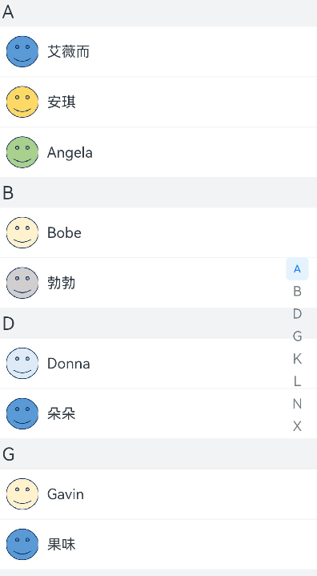
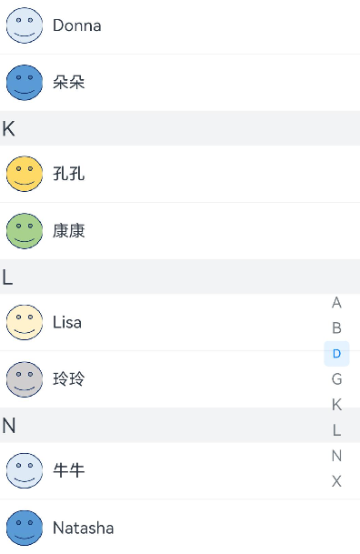
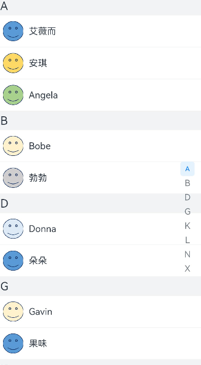

# 如何按字母分组展示联系人（仅UI）

## 场景说明
在通讯录中，需要将联系人按照姓氏的首字母进行分组排列，从而更方便联系人的查找；联系人列表右侧的字母导航可以随列表的滑动而定位到对应字母处；同时，也可以通过字母导航控制列表跳到指定联系人分组。
本例即为大家介绍如何通过实现上述场景。

## 效果呈现
本示例最终效果如下：



## 环境要求
- IDE：DevEco Studio 3.1 Beta1
- SDK：Ohos_sdk_public 3.2.11.9 (API Version 9 Release)

## 实现思路
本例涉及的四个关键特性及其实现方案如下：
- 联系人按字母分组展示：通过List组件显示联系人列表，通过ListItemGroup组件实现联系人分组。
- 联系人右侧呈现字母导航：使用AlphabetIndexer组件实现字母导航，同时通过Stack组件使字母导航浮在联系人列表右侧。
- 滑动联系人列表，右侧字母导航随之变动：通过List组件的onScrollIndex事件获取到联系人列表的滑动位置，并将该位置索引传递给字母导航的selected属性，作为字母导航的被选中项。
- 通过右侧字母导航控制联系人列表滑动到指定分组：通过字母导航的onSelected事件获取选中字母的索引，并将该索引传递给联系人列表的控制器，控制列表滑动到指定分组。

## 开发步骤
针对上述关键特性，具体实现步骤如下：

1、先通过Stack、List、ListItemGroup、AlphabetIndexer等关键组件将UI框架搭建起来。
先构建列表数据，其中Contact为联系人数据类。
```ts
contactGroups: object[] = [
   ...
    {
      title: 'D',
      contacts: [
        new Contact('Donna', $r('app.media.contact6')),
        new Contact('朵朵', $r('app.media.contact1')),
      ],
    },
    ...
    {
      title: 'K',
      contacts: [
        new Contact('孔孔', $r('app.media.contact2')),
        new Contact('康康', $r('app.media.contact3')),
      ],
    },
    {
      title: 'L',
      contacts: [
        new Contact('Lisa', $r('app.media.contact4')),
        new Contact('玲玲', $r('app.media.contact5')),
      ],
    },
    {
      title: 'N',
      contacts: [
        new Contact('牛牛', $r('app.media.contact6')),
        new Contact('Natasha', $r('app.media.contact1')),
      ],
    },
    ...
  ]
```
有了列表数据后，我们来构建UI框架，关键代码如下：
```ts
@Entry
@Component
struct ContactList{
  ...
  // 自定义组件groupHeader，作为ListItemGroup的头部组件，即A、B、C等字母列表项
  @Builder groupHeader(titleLetter:string){
    Text(titleLetter)
      .fontSize(20)
      .backgroundColor('#fff1f3f5')
      .width('100%')
      .padding(5)
  }
  // 创建字母列表作为字母导航的内容
  private alphabets:string[] = [ 'A', 'B', 'D', 'G', 'K', 'L', 'N', 'X'];

  build() {
    Stack({alignContent:Alignment.End}){
      List(){
        // 循环渲染列表内容
        ForEach(this.contactGroups,contactGroup=>{
          // 采用ListItemGroup对联系人进行分组，将groupHeader作为ListItemGroup的头部组件
          ListItemGroup({header:this.groupHeader(contactGroup.title)}){
            ForEach(contactGroup.contacts,contact=>{
              ListItem(){
                Column(){
                  Row(){
                    Image(contact.icon)
                      ...
                    Text(contact.name)
                  }
                  ...
                  Divider().color('#fff1f3f5')
                }
                ...
              }
            })
          }
        })
      }
      ...
      // 使用AlphabetIndexer组件实现右侧字母导航
      AlphabetIndexer({arrayValue:this.alphabets,selected:0})
        ...
    }
  }
}
```
完成上述代码，我们的框架就搭建起来了，如图：



2、接下来我们为UI框架添加逻辑控制。首先，通过List的onScrollIndex事件获取到列表滑动位置的索引，并将索引同步给右侧字母表的selected属性，从而在滑动联系人时，使右侧字母导航随之变动，关键代码如下：
```ts
  ...
  // 创建动态变量，用于指定字母导航的选择项
  @State selectedIndex:number = 0;
  ...
  build() {
    Stack({alignContent:Alignment.End}){
      List({scroller:this.listScroller}){
        ForEach(this.contactGroups,contactGroup=>{
          ListItemGroup({header:this.groupHeader(contactGroup.title)}){
            ForEach(contactGroup.contacts,contact=>{
              ListItem(){
                ...
              }
            })
          }
        })
      }
      ...
      // 获取联系人列表滑动位置的索引，并将索引通过selectedIndex同步给右侧字母导航
      .onScrollIndex((firstIndex:number)=>{
        this.selectedIndex = firstIndex
      })
      AlphabetIndexer({arrayValue:this.alphabets,selected:0})
        ...
        // 指定字母导航的选择项为selectedIndex，完成跟联系人列表的同步
        .selected(this.selectedIndex)
        ...
    }
  }
```
至此，当我们滑动联系人列表时，就可以让右侧字母导航随之变动了。效果如下：



3、最后，我们通过AlphabetIndexer组件的onSelect事件获取到字母导航选择项的索引，然后通过List组件的scroller控制器控制联系人列表滑动到相同的索引处，从而实现通过右侧字母导航控制联系人列表滑动到指定分组。关键代码如下：
```ts
...
  @State selectedIndex:number = 0;
  // 创建List组件的scroller控制器：listScroller，用于控制联系人列表的滑动位置
  private listScroller:Scroller = new Scroller()
  ...
  build() {
    Stack({alignContent:Alignment.End}){
      // 将scroller控制器绑定到List组件
      List({scroller:this.listScroller}){
        ForEach(this.contactGroups,contactGroup=>{
          ListItemGroup({header:this.groupHeader(contactGroup.title)}){
            ForEach(contactGroup.contacts,contact=>{
              ListItem(){
                ...
              }
            })
          }
        })
      }
      ...
      AlphabetIndexer({arrayValue:this.alphabets,selected:0})
        ...
        // 获取字母导航中选中字母的索引值，并通过listScroller控制列表滑动到对应索引位置
        .onSelect((index:number)=>{
          this.listScroller.scrollToIndex(index)
        })
        ...
    }
  }
```
至此，当我们在右侧字母导航选择某个字母时就可以控制联系人列表跳转到指定分组了，效果如下：


## 完整代码
通过上述步骤我们已经完成了整个示例的开发，现提供本示例的完整代码供大家参考：

联系人数据类代码：
```ts
// ListModel.ets
export default class Contact{
  name:string;
  icon:Resource;

  constructor(name:string,icon:Resource) {
    this.name = name
    this.icon = icon
  }
}
```
案例主代码：
```ts
// Contact.ets
import Contact from '../model/ListModel'

@Entry
@Component
struct ContactList{
  // 联系人列表数据
  contactGroups: object[] = [
    {
      title: 'A',
      contacts: [
        new Contact('艾薇而', $r('app.media.contact1')),
        new Contact('安琪', $r('app.media.contact2')),
        new Contact('Angela', $r('app.media.contact3')),
      ],
    },
    {
      title: 'B',
      contacts: [
        new Contact('Bobe', $r('app.media.contact4')),
        new Contact('勃勃', $r('app.media.contact5')),
      ],
    },
    {
      title: 'D',
      contacts: [
        new Contact('Donna', $r('app.media.contact6')),
        new Contact('朵朵', $r('app.media.contact1')),
      ],
    },
    {
      title: 'G',
      contacts: [
        new Contact('Gavin', $r('app.media.contact4')),
        new Contact('果味', $r('app.media.contact1')),
      ],
    },
    {
      title: 'K',
      contacts: [
        new Contact('孔孔', $r('app.media.contact2')),
        new Contact('康康', $r('app.media.contact3')),
      ],
    },
    {
      title: 'L',
      contacts: [
        new Contact('Lisa', $r('app.media.contact4')),
        new Contact('玲玲', $r('app.media.contact5')),
      ],
    },
    {
      title: 'N',
      contacts: [
        new Contact('牛牛', $r('app.media.contact6')),
        new Contact('Natasha', $r('app.media.contact1')),
      ],
    },
    {
      title: 'X',
      contacts: [
        new Contact('小可爱', $r('app.media.contact2')),
        new Contact('徐总是', $r('app.media.contact3')),
        new Contact('璇璇', $r('app.media.contact3')),
        new Contact('欣欣', $r('app.media.contact3')),
      ],
    },
  ]
  // 自定义组件groupHeader，作为ListItemGroup的头部组件，即A、B、C等字母列表项
  @Builder groupHeader(titleLetter:string){
    Text(titleLetter)
      .fontSize(20)
      .backgroundColor('#fff1f3f5')
      .width('100%')
      .padding(5)
  }
  // 创建字母列表作为字母导航的内容
  private alphabets:string[] = [ 'A', 'B', 'D', 'G', 'K', 'L', 'N', 'X'];
  // 创建动态变量，用于指定字母导航的选择项
  @State selectedIndex:number = 0;
  // 创建List组件的scroller控制器：listScroller，用于控制联系人列表的滑动位置
  private listScroller:Scroller = new Scroller()

  build() {
    Stack({alignContent:Alignment.End}){
      // 将scroller控制器绑定到List组件
      List({scroller:this.listScroller}){
        // 循环渲染列表内容
        ForEach(this.contactGroups,contactGroup=>{
          // 采用ListItemGroup对联系人进行分组，将groupHeader作为ListItemGroup的头部组件
          ListItemGroup({header:this.groupHeader(contactGroup.title)}){
            ForEach(contactGroup.contacts,contact=>{
              ListItem(){
                Column(){
                  Row(){
                    Image(contact.icon)
                      .width(35)
                      .height(35)
                      .margin(10)
                    Text(contact.name)
                  }
                  .width('100%')
                  Divider().color('#fff1f3f5')
                }
                .justifyContent(FlexAlign.Start)
              }
            })
          }
        })
      }
      .width('100%')
      .height('100%')
      .scrollBar(BarState.Auto)
      // 获取联系人列表滑动位置的索引，并将索引通过selectedIndex同步给右侧字母导航
      .onScrollIndex((firstIndex:number)=>{
        this.selectedIndex = firstIndex
      })
      // 使用AlphabetIndexer组件实现右侧字母导航
      AlphabetIndexer({arrayValue:this.alphabets,selected:0})
        .margin({right:10})
        .itemSize(25)
        .font({size:15})
        // 指定字母导航的选择项为selectedIndex，完成跟联系人列表的同步
        .selected(this.selectedIndex)
        // 获取选中字母的索引值，通过listScroller控制列表滑动到对应索引位置
        .onSelect((index:number)=>{
          this.listScroller.scrollToIndex(index)
        })
    }
  }
}
```
## 参考
[创建列表](../application-dev/ui/arkts-layout-development-create-list.md/)