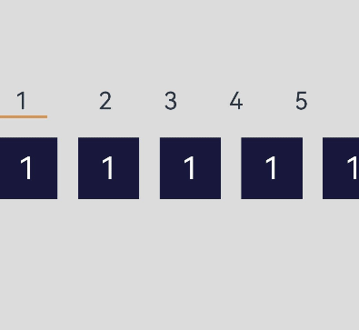

# 二级联动
## 场景介绍
列表的二级联动（Cascading List）是指根据一个列表（一级列表）的选择结果，来更新另一个列表（二级列表）的选项。这种联动可以使用户根据实际需求，快速定位到想要的选项，提高交互体验。例如，短视频中拍摄风格的选择、照片编辑时的场景的选择，本文即为大家介绍这种联动。
## 效果呈现
本例最终效果如下：



## 运行环境
本例基于以下环境开发，开发者也可以基于其他适配的版本进行开发：
- IDE: DevEco Studio 3.1 Beta2
- SDK: Ohos_sdk_public 3.2.11.9 (API Version 9 Release)
## 实现思路
- 类型标题(titles)以及下方的图片列表(contents)分组展示：通过List组件显示类型标题
- 滑动点击类型标题列表，下方图片列表也会随之变动：通过List组件的onScrollIndex事件获取到不同类型标题的在图片列表中的与之对应的索引已达到图片列表的变动，且通过Line组件为选中的标题添加下划线
- 滑动或点击下方列表中的图片，上方的被选中的类型标题也发生变化：首先判断点击或者滑动到最左边图片的索引，判断该图片所属类型，根据各个类型图片中首张图片的索引进行比较，确定其索引值，最后与标题(titles)相匹配已达到标题列表的变动

## 开发步骤
根据上述特性，具体实现步骤如下：
1. 首先ts构建列表数据，并且各个类型标题中首张图片的索引提前整理，具体代码块如下：
    ```ts
    ...
    @State typeIndex: number = 0
    private tmp: number = 0
    private titles: Array<string> = ["中国风", "旅游", "春日限定", "复古滤镜", "精选", "油画", "电影", "胶片自由", "运动生活"]
    private contents: Array<string> = ["1", "1", "1", "1", "1", "1", "1", "1", "1", "2", "2", "2", "2", "2", "2", "2", "2", "2", "2", "2", "2", "3"
        , "3", "3", "3", "3", "4", "4", "4", "5", "5", "5", "5", "5", "6", "7", "7", "7", "7", "7", "7", "7", "7", "7", "7", "7", "7",
        "8", "8", "8", "8", "8", "9", "9", "9", "9", "9", "9", "9", "9", "9", "9", "9"]
    private records: Array<number> = [0, 9, 21, 26, 29, 34, 35, 47, 52, 63]
    private classifyScroller: Scroller = new Scroller();
    private scroller: Scroller = new Scroller();
    ...
    ```
    类型标题列表：具体代码块如下：
    ```ts
    ...
    build() {
      Column({ space: 0 }) {
        List  ({ space: 50, scroller: this.classifyScroller, initialIndex: 0 }) {
          ForEach(this.titles, (item, index) => {
            ListItem() {
              Column() {
                Text(item)
                  .fontSize(14)
                ...  
              }
            }
          }
          ...
        }
        .listDirection(Axis.Horizontal)
        .height(50)
      }
    }
    ```
    图片列表，具体代码块如下：
    ```ts
    List({ space: 20, scroller: this.scroller }) {
      ForEach(this.contents, (item, index) => {
        ListItem() {
          Column({ space: 5 }) {
            Image($r("app.media.app_icon"))
              .width(40)
              .height(40)
            Text(item)
              .fontSize(12)
          }
          ...
        }
      }
    }
    .listDirection(Axis.Horizontal) //列表排列方向水平
    .edgeEffect(EdgeEffect.None) //不支持滑动效果
    ```
2. 图片的索引值判断，并通过返回值返回到各类型标题的首张图片的索引，具体代码块如下：
    ```ts
    ...
    findClassIndex(ind: number) { // 当前界面最左边图的索引值ind
      let ans = 0
      // 定义一个i 并进行遍历 this.records.length = 10
      for (let i = 0; i < this.records.length; i++) { 
        // 判断ind在this.records中那两个临近索引值之间
        if (ind >= this.records[i] && ind < this.records[i + 1]) {
          ans = i
          break
        }
      }
      return ans
    }
    findItemIndex(ind: number) { 
      // 将ind重新赋值给类型标题列表的索引值
      return this.records[ind]
    }
    ...
    ```
    通过Line组件构成标题下滑线，具体代码块如下：
    ```ts
    ...
    if (this.typeIndex == index) {
      Line()
        //根据长短判断下划线
        .width(item.length === 2 ? 25 : item.length === 3 ? 35 : 50)
        .height(3)
        .strokeWidth(20)
        .strokeLineCap(LineCapStyle.Round)
        .backgroundColor('#ffcf9861')
    }
    ...
    ```
3. 类型标题的滑动导致图片列表的变动：通过onClick事件获取的与类型标题相对应首张图片的索引值，使图片列表进行变动，具体代码块如下：
    ```ts
    ...
    .onClick(() => {
      this.typeIndex = index
      this.classifyScroller.scrollToIndex(index)
      let itemIndex = this.findItemIndex(index)
      console.log("移动元素：" + itemIndex)
      this.scroller.scrollToIndex(itemIndex)
    })
    ...
    ```
4. 图片列表的滑动或点击导致类型标题列表的变动：通过List组件中onScrollIndex事件获取的到屏幕中最左边图片的索引值，然后通过索引值的判断进行类型标题的确认，以达到类型标题列表的变动，具体代码块如下：
    ```ts
    ...
    .onScrollIndex((start) => {
      let currentClassIndex = this.findClassIndex(start)
      console.log("找到的类索引为： " + currentClassIndex)
      if (currentClassIndex != this.tmp) {
        this.tmp = currentClassIndex
        console.log("类别移动到索引： " + currentClassIndex)
        this.typeIndex = currentClassIndex
        this.classifyScroller.scrollToIndex(currentClassIndex)
      }
    })
    ...
    ```
## 完整代码
完整示例代码如下：
```ts
@Entry
@Component
struct TwoLevelLink {
  @State typeIndex: number = 0
  private tmp: number = 0
  private titles: Array<string> = ["1", "2", "3", "4", "5", "6", "7", "8", "9"]
  private contents: Array<string> = ["1", "1", "1", "1", "1", "1", "1", "1", "1", "2", "2", "2", "2", "2", "2", "2", "2", "2", "2", "2", "2", "3"
    , "3", "3", "3", "3", "4", "4", "4", "5", "5", "5", "5", "5", "6", "7", "7", "7", "7", "7", "7", "7", "7", "7", "7", "7", "7",
    "8", "8", "8", "8", "8", "9", "9", "9", "9", "9", "9", "9", "9", "9", "9", "9"]
  private colors: Array<string> = ["#18183C", "#E8A027", "#D4C3B3", "#A4AE77", "#A55D51", "#1F3B54", "#002EA6", "#FFE78F", "#FF770F"]
  private records: Array<number> = [0, 9, 21, 26, 29, 34, 35, 47, 52, 63]
  private classifyScroller: Scroller = new Scroller();
  private scroller: Scroller = new Scroller();
  // 同类型首张图片的索引
  findClassIndex(ind: number) {
    let ans = 0
    for (let i = 0; i < this.records.length; i++) {
      if (ind >= this.records[i] && ind < this.records[i + 1]) {
        ans = i
        break
      }
    }
    return ans
  }
  findItemIndex(ind: number) {
    return this.records[ind]
  }
  build() {
    Column({ space: 0 }) {
      List  ({ space: 50, scroller: this.classifyScroller, initialIndex: 0 }) {
        ForEach(this.titles, (item, index) => {
          ListItem() {
            Column() {
              Text(item)
                .fontSize(24)
              if (this.typeIndex == index) {
                Line()
                  .width(item.length === 2 ? 25 : item.length === 3 ? 35 : 50)
                  .height(3)
                  .strokeWidth(20)
                  .strokeLineCap(LineCapStyle.Round)
                  .backgroundColor('#ffcf9861')
              }
            }
            .onClick(() => {
              this.typeIndex = index
              this.classifyScroller.scrollToIndex(index)
              let itemIndex = this.findItemIndex(index)
              console.log("移动元素：" + itemIndex)
              this.scroller.scrollToIndex(itemIndex)
            })
          }
        })
      }
      .listDirection(Axis.Horizontal)
      .height(50)
      List({ space: 20, scroller: this.scroller }) {
        ForEach(this.contents, (item, index) => {
          ListItem() {
            Column({ space: 5 }) {
              Text(item)
                .fontSize(30)
                .fontColor(Color.White)
            }
            .width(60)
            .height(60)
            .backgroundColor(this.colors[item-1])
            .justifyContent(FlexAlign.Center)
            .onClick(() => {
              this.scroller.scrollToIndex(index)
            })
          }
        })
      }
      .listDirection(Axis.Horizontal) //列表排列方向水平
      .edgeEffect(EdgeEffect.None) //不支持滑动效果
      .onScrollIndex((start) => {
        let currentClassIndex = this.findClassIndex(start)
        console.log("找到的类索引为： " + currentClassIndex)
        if (currentClassIndex != this.tmp) {
          this.tmp = currentClassIndex
          console.log("类别移动到索引： " + currentClassIndex)
          this.typeIndex = currentClassIndex
          this.classifyScroller.scrollToIndex(currentClassIndex)
        }
      })
    }.width('100%').height('100%').backgroundColor(0xDCDCDC).padding({ top: 5 })
  }
}
```
## 参考
[List](../application-dev/reference/arkui-ts/ts-container-list.md)

[Line](../application-dev/reference/arkui-ts/ts-drawing-components-line.md)

[Scroll](../application-dev/reference/arkui-ts/ts-container-scroll.md)