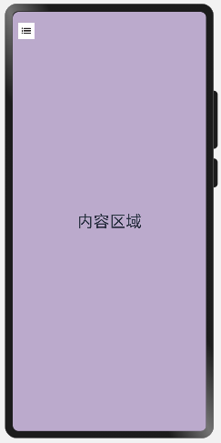
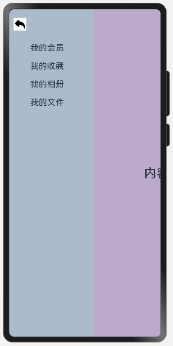

# 如何实现抽屉式导航

## 场景介绍
由于用户所需功能逐渐增多，传统的标签式导航在个别场景已经无法满足用户需求。当导航栏的空间放不下过多页签时，可以采用抽屉式导航，本例将为大家介绍如何通过OpenHarmony的SideBarContainer组件实现抽屉式导航。

## 效果呈现
本例最终实现效果如下：


## 运行环境
- IDE：DevEco Studio 3.1 Beta1
- SDK：Ohos_sdk_public 3.2.11.9 (API Version 9 Release)

## 实现思路
- 通过SideBarContainer组件提供容器，通过子组件定义侧边栏和内容区，第一个子组件表示侧边栏，第二个子组件表示内容区。
- 调用showSideBar属性来设置不显示侧边栏，controlButton属性来控制完成侧栏的展示/收起。



## 开发步骤
1. 创建内容区域文本组件。
首先创建内容区，具体代码块如下：
    ```ts
    ...
    //  内容区
    Column() {
      Text("内容区域")
        .width("100%")
        .height("100%")
        .fontSize(30)
        .textAlign(TextAlign.Center)
    }
    .width("100%")
    .height("100%")
    .backgroundColor("#bbaacc")
    ...
    ```
2. 通过SideBarContainer所支持的showSideBar属性来设置不显示侧边栏，controlButton属性来控制完成侧栏的展示/收起。
具体代码块如下：
    ```ts
    ...
    .showSideBar(false) //默认不展示侧边栏，展示icon，用户点击调出
    .controlButton({
      left: 10, // 图标距离左侧宽度
      top: 20, // 图标距离顶部高度
      height: 30, // 图标高度
      width: 30, //  图标宽度
      icons: {
        shown: $r('app.media.back'), // 侧边栏展示时图标
        hidden: $r('app.media.sidebar_shown'), // 侧边栏收起时图标
        switching: $r('app.media.sidebar_shown') // 侧边栏切换过程图标
      }
    })
    ...
    ```
3. 创建侧边栏文本组件。
具体代码如下：

    ```ts
    ...
    struct SideBarContainerExample {
    @ State navList: Array<string> = ["我的会员", "我的收藏", "我的相册", "我的文件",]
      build() {
        SideBarContainer(SideBarContainerType.Embed) {
        //  侧边栏内容
          Column() {
            ForEach(this.navList, (item) => {
              Text(item)
                .width("100%")
                .fontSize(20)
                .textAlign(TextAlign.Start)
                .padding({ top: 20 })
            })
          }
        .height("100%")
        .padding({ top: 60, left: 50 })
        .backgroundColor("#aabbcc")
        }
    ...
      }
    }
    ```
## 完整代码
示例完整代码如下：

```ts
@Entry
@Component
struct SideBarContainerExample {
  @State navList: Array<string> = ["我的会员", "我的收藏", "我的相册", "我的文件",]

  build() {
    // Embed:侧边栏占据内容空间 Overlay：侧边栏悬浮于内容之上
    SideBarContainer(SideBarContainerType.Embed) { 
      // 侧边栏内容
      Column() {
        ForEach(this.navList, (item) => {
          Text(item)
            .width("100%")
            .fontSize(20)
            .textAlign(TextAlign.Start)
            .padding({ top: 20 })
        })
      }
      .height("100%")
      .padding({ top: 60, left: 50 })
      .backgroundColor("#aabbcc")
      // 内容区
      Column() {
        Text("内容区域")
          .width("100%")
          .height("100%")
          .fontSize(30)
          .textAlign(TextAlign.Center)
      }
      .width("100%")
      .height("100%")
      .backgroundColor("#bbaacc")
    }
    // 默认不展示侧边栏，展示icon，用户点击调出
    .showSideBar(false) 
    .controlButton({
      // 图标距离左侧宽度
      left: 10, 
      // 图标距离顶部高度
      top: 20, 
      // 图标高度
      height: 30, 
      // 图标宽度
      width: 30, 
      icons: {
        // 侧边栏展示时图标
        shown: $r('app.media.back'), 
        // 侧边栏收起时图标
        hidden: $r('app.media.sidebar_shown'), 
        // 侧边栏切换过程图标
        switching: $r('app.media.sidebar_shown') 
      }
    })
    // 侧边栏宽度
    .sideBarWidth(200) 
    .width('100%')
    .height('100%')
  }
}

```
**注意**：模拟机与真机的预览有区别，在SideBarContainerType.Embed情况下，真机中内容区域是压缩，模拟器中内容区域是缺失。

## 总结

[Tabs组件](../application-dev/reference/arkui-ts/ts-container-tabs.md)： 适用于导航栏固定在页面上下左右侧，入口分类数目不多，可以控制在5个以内，且用户需要频繁切换每一个页签的应用，比如微信、QQ等。

[Navigation组件](../application-dev/reference/arkui-ts/ts-basic-components-navigation.md)： 同样可以实现Tabs组件中导航栏位于底部的场景，根据需要显示隐藏导航栏，提供标题，菜单，返回等选项，使用户是使用时更加灵活。

[sideBarContainer组件](../application-dev/reference/arkui-ts/ts-container-sidebarcontainer.md)：主要的功能和内容都在一个页面里面，只是一些低频操作内容需要显示在其他页面里，可以把这些辅助功能放在抽屉栏里。屏幕较小时导航栏不占用空间。比如QQ，开发指导文档等。


