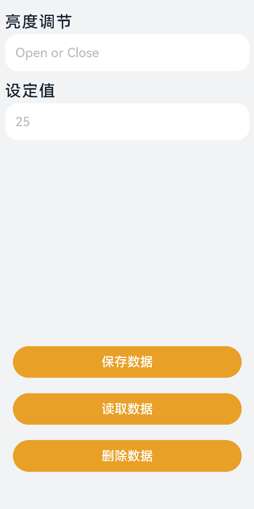

# 首选项的使用

## 场景说明
用户首选项为应用提供Key-Value键值型的数据处理能力，支持应用持久化轻量级数据，并对其修改和查询。当用户希望有一个全局唯一存储的地方，可以采用用户首选项来进行存储。Preferences会将该数据缓存在内存中，当用户读取的时候，能够快速从内存中获取数据。Preferences会随着存放的数据量越多而导致应用占用的内存越大，因此，Preferences不适合存放过多的数据，适用的场景一般为应用保存用户的个性化设置（屏幕亮度，是否开启夜间模式）等。
本例以一个小示例为大家介绍如何使用用户首选项对数据进行存储、获取、删除。

## 效果呈现
本例最终效果如下：



## 运行环境
本例基于以下环境开发，开发者也可以基于其他适配的版本进行开发：

- IDE: DevEco Studio 4.0 Beta1
- SDK: Ohos_sdk_public 4.0.7.5 (API Version 10 Beta1)

## 实现思路
本例以设置屏幕亮度为例演示如何使用用户首选项管理数据，主要特性及实现方式如下：
- 当用户在文本框输入数据后，点击保存数据，用户首选项将数据缓存在内存中：通过dataPreferences类的getPreferences方法获取用户首选项实例，然后通过该实例调用put方法将数据写入内存。
- 当用户点击读取数据时，用户首选项将数据从内存中读取出来并显示在输入框中：通过用户首选项实例调用get方法获取到保存的数据，显示在输入框中。
- 当用户点击删除数据时，用户首选项将数据从内存中删除，用户无法继续读取数据：通过用户首选项实例调用delete方法删除保存的数据。

>  **说明：**
> 用户首选项的使用需要注意以下几点：
> - Key键为string类型，要求非空且长度不超过80个字节。
> - 如果Value值为string类型，请使用UTF-8编码格式，可以为空，不为空时长度不超过8192个字节。
> - 内存会随着存储数据量的增大而增大，所以存储的数据量应该是轻量级的，建议存储的数据不超过一万条，否则会在内存方面产生较大的开销。

## 开发步骤
由于本例重点讲解用户首选项的数据管理操作，所以开发步骤会着重讲解如何通过用户首选项完成数据的存储、读取和删除，全量代码可参考完整代码章节。
1. 首先自定义一个用户首选项类，根据业务封装相关方法方便后续调用。
    其中包含数据处理的方法，用于完成数据的存储、读取和删除操作。用户首选项接口的使用方式主要在这部分呈现，需要重点关注。
    具体代码如下：
    ```ts
    import dataPreferences from '@ohos.data.preferences';
    import promptAction from '@ohos.promptAction';
    import ScreenBrightness from '../common/bean/Brightness';

    let context = getContext(this);
    let preference: dataPreferences.Preferences = null;

    // 自定义用户首选项类
    class PreferenceModel {
      private brightness:ScreenBrightness

      // 创建用户首选项实例preference
      async getPreferencesFromStorage() {
        try {
          preference = await dataPreferences.getPreferences(context, 'setting.db');
        } catch (err) {
          Logger.error('[PreferenceModel]', `Failed to get preferences, Cause: ${err}`);
        }
      }

      // 删除数据，调用dataPreferences的deletePreferences接口
      async deletePreferences() {
        try {
          await dataPreferences.deletePreferences(context, 'setting.db');
        } catch(err) {
          Logger.error('[PreferenceModel]', `Failed to delete preferences, Cause: ${err}`);
        };
        preference = null;
        this.showToastMessage($r('app.string.delete_success_msg'));
      }

      // 保存数据
      async putPreference(screenBrightness:ScreenBrightness) {
        if (preference === null) {
          await this.getPreferencesFromStorage();
        }
        // 将用户输入的亮度数据保存到preference，调用用户首选项实例的put接口
        try {
          await preference.put('screenBrightness', JSON.stringify(screenBrightness));
        } catch (err) {
          Logger.error('[PreferenceModel]', `Failed to put value, Cause: ${err}`);
        }
        // 使用flush方法将preferences实例的数据存储到持久化文件，调用用户首选项实例的flush接口
        await preference.flush();
      }

      // 获取数据，调用用户首选项实例的get接口
      async getPreference() {
        let screenBrightness = '';
        if (preference === null) {
          await this.getPreferencesFromStorage();
        }
        try {
          screenBrightness = <string> await preference.get('screenBrightness', '');
        } catch (err) {
          Logger.error('[PreferenceModel]', `Failed to get value, Cause: ${err}`);
        }
        // 如果判断数据为空则提示用户先输入数据
        if (screenBrightness === '') {
          this.showToastMessage($r('app.string.data_is_null_msg'));
          return;
        }
        this.showToastMessage($r('app.string.read_success_msg'));
        return JSON.parse(screenBrightness);
      }

      // 校验用户输入是否为空
      checkData(screenBrightness:ScreenBrightness) {
        if (screenBrightness.brightSwitch === '' || screenBrightness.defaultValue === '') {
          this.showToastMessage($r('app.string.fruit_input_null_msg'));
          return true;
        }
        return false;
      }

      // 点击保存按钮保存数据
      writeData(screenBrightness:ScreenBrightness) {
        // Check whether the data is null.
        let isDataNull = this.checkData(screenBrightness);
        if (isDataNull) {
          return;
        }
        // The data is inserted into the preferences database if it is not empty.
        this.putPreference(screenBrightness);
        this.showToastMessage($r('app.string.write_success_msg'));
      }

      // 消息弹框
      showToastMessage(message: Resource) {
        promptAction.showToast({
          message: message,
          duration: 3000
        });
      };
    }
    ```
2. UI中主要包含两大部分：文本和输入框，按钮。将这两部分分别抽取为子组件，在主页中进行调用。具体代码如下：
    文本和输入框子组件：
    ```ts
    import ScreenBrightness from '../common/bean/Brightness';

    @Component
    export default struct TextItemComponent {
      private textResource: Resource;
      private placeholderResource: Resource;
      private marginBottom: string;
      private marginTop: string;
      private textInputType: InputType;
      private textFlag: number;
      @Link screenBrightness: ScreenBrightness;
      private textInputCallBack: (value: string) => void;

      aboutToAppear() {
        if (this.textFlag === 0) {
          this.marginTop = '8%';
          this.marginBottom = '4%';
          this.textInputType = InputType.Normal;
        } else {
          this.marginBottom = '321vp';
          this.textInputType = InputType.Number;
        }
      }

      build() {
        Column() {
          // 文本
          Text(this.textResource)
            .fontSize(25)
            .height('3.2%')
            .width('100%')
            .fontColor("#182431")
            .letterSpacing('1.58')
            .fontWeight(500)
            .margin({
              bottom: '2%',
              left: '7%',
              top: this.marginTop
            })
          // 输入框
          TextInput({
            placeholder: this.placeholderResource,
            text: this.textFlag === 0 ? (this.screenBrightness.brightSwitch) : (this.screenBrightness.defaultValue)
          })
            .placeholderFont({ size: 20, weight: 500 })
            .placeholderColor("#BDC1C4")
            .caretColor(Color.Blue)
            .type(this.textInputType)
            .height('7%')
            .width('93%')
            .margin({ bottom: this.marginBottom })
            .fontSize(20)
            .fontColor("#182431")
            .fontWeight(500)
            .backgroundColor("#FFFFFF")
            .onChange((value: string) => {
              this.textInputCallBack(value);
            })
        }
      }
    }
    ```
    按钮子组件：
    ```ts
    import PreferenceModel from '../model/PreferenceModel';
    import ButtonItemData from '../common/bean/ButtonItemData';
    import ScreenBrightness from '../common/bean/Brightness';

    @Component
    export default struct ButtonComponent {
      private buttonItemValues: Array<ButtonItemData> = this.getButtonItemValues();
      @Link screenBrightness: ScreenBrightness;

      build() {
        Column() {
          ForEach(this.buttonItemValues, (item) => {
            Button(item.text, { type: ButtonType.Capsule, stateEffect: true })
              .backgroundColor("#E8A027")
              .width('87%')
              .height('6%')
              .fontWeight(500)
              .fontSize(20)
              .margin({ bottom: '24vp' })
              .onClick(() => {
                item.clickMethod();
              })
          }, item => JSON.stringify(item))
        }
      }

      // 在foreach中渲染Button组件时传入不同按钮的参数
      getButtonItemValues() {
        let values: Array<ButtonItemData> = [
          new ButtonItemData(
            '保存数据',
            () => {
              // 调用保存方法
              PreferenceModel.writeData(this.screenBrightness);
            }
          ),
          new ButtonItemData(
            '读取数据',
            () => {
              // 调用读取方法
              PreferenceModel.getPreference().then(resultData => {
                this.screenBrightness = resultData;
                console.info('dbdata is '+JSON.stringify(resultData))
              });
            }
          ),
          new ButtonItemData(
            '删除数据',
            () => {
              // 调用删除方法
              PreferenceModel.deletePreferences();
              // 数据删除后将相关内容置为空
              this.screenBrightness.brightSwitch = '';
              this.screenBrightness.defaultValue = ''
            }
          )
        ];
        return values;
      }
    }
    ```
3. 构建首页UI。
    在页面生命周期的aboutToAppear中调用自定义首选项类的getPreference方法获取到保存的数据，这样如果用户之前有保存数据的话，进入应用中就可以显示之前保存的数据。
    具体代码如下：
    ```ts
    import PreferenceModel from '../model/PreferenceModel';
    import ButtonComponent from '../view/ButtonComponent';
    import TextItemComponent from '../view/TextItemComponent';
    import ScreenBrightness from '../common/bean/Brightness';

    @Entry
    @Component
    struct Setting {
      @State screenBrightness: ScreenBrightness = new ScreenBrightness('', '');

      build() {
        Column() {
          // 亮度调节文本及文本框
          TextItemComponent({
            textResource: $r('app.string.brightness_text'),
            placeholderResource: $r('app.string.brightness_placeholder'),
            textFlag: 0,
            screenBrightness: $screenBrightness,
            textInputCallBack: (value) => {
              this.screenBrightness.brightSwitch = value;
            }
          })

          // 设定值文本及文本框
          TextItemComponent({
            textResource: $r('app.string.defaultValue_text'),
            placeholderResource: $r('app.string.defaultValue_placeholder'),
            textFlag: 1,
            screenBrightness: $screenBrightness,
            textInputCallBack: (value) => {
              this.screenBrightness.defaultValue = value;
            }
          })

          // 按钮
          ButtonComponent({ screenBrightness: $screenBrightness })
        }
        .width('100%')
        .height('100%')
        .backgroundColor("#F1F3F5")
      }

      async aboutToAppear() {
        await PreferenceModel.getPreferencesFromStorage();
        // 获取到之前保存的数据，显示在输入框中
        PreferenceModel.getPreference().then(resultData => {
          this.screenBrightness = resultData;
        });
      }
    }
    ```

## 完整代码
由于开发步骤中已经展示了大部分完整代码，此处补充前文中未呈现的两个数据类：
亮度数据类：
```ts
export default class ScreenBrightness {
  // 亮度调节
  brightSwitch: string;
  // 设定值
  defaultValue: string;

  constructor(brightSwitch: string, defaultValue: string) {
    this.brightSwitch = brightSwitch;
    this.defaultValue = defaultValue;
  }
}
```
按钮数据类：
```ts
export default class ButtonItemData {

  // 按钮文本
  text: string;

  // 按钮点击事件触发的方法
  clickMethod: () => void;

  constructor(text: string, clickMethod: () => void) {
    this.text = text;
    this.clickMethod = clickMethod;
  }
}
```

## 参考
- [@ohos.data.preferences (用户首选项)](../application-dev/reference/apis/js-apis-data-preferences.md)
- [通过用户首选项实现数据持久化](../application-dev/database/data-persistence-by-preferences.md)