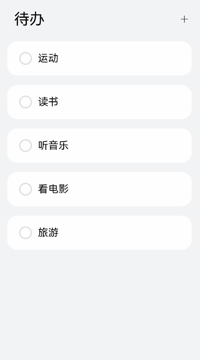

## 如何实现列表项的新增和删除

列表的编辑模式用途十分广泛，常见于待办事项管理、文件管理、备忘录的记录管理等应用场景。在列表的编辑模式下，新增和删除列表项是最基础的功能，其核心是对列表项对应的数据集合进行数据添加和删除。

下面以待办事项管理为例，介绍如何快速实现新增和删除列表项功能。

### 环境要求
- IDE：DevEco Studio 3.1 Beta1
- SDK：Ohos_sdk_public 3.2.11.9 (API Version 9 Release)

### 新增列表项

如下图所示，当用户点击添加按钮时，将弹出列表项选择界面，用户点击确定后，列表中新增对应项目。

  **图17** 新增待办  


#### 开发步骤

1. 定义列表项数据结构和初始化列表数据，构建列表整体布局和列表项。
   以待办事项管理为例，首先定义待办事项的数据结构：

   ```ts
   import util from '@ohos.util';

   export class ToDo {
     key: string = util.generateRandomUUID(true);
     name: string;

     constructor(name: string) {
       this.name = name;
     }
   }
   ```

2. 然后，初始化待办事项列表和可选事项列表：

   ```ts
   @State toDoData: ToDo[] = [];
   private availableThings: string[] = ['读书', '运动', '旅游', '听音乐', '看电影', '唱歌'];
   ```

3. 构建UI界面。
   初始界面包含“待办”和新增按钮“+”：
   ```ts
   Text('待办')
     .fontSize(36)
     .margin({ left: 40})
   Blank()
   Text('+')
     .fontWeight(FontWeight.Lighter)
     .fontSize(40)
     .margin({ right: 30 })
   ```
   构建列表布局并通过ForEach循环渲染列表项：

   ```ts
   List({ space: 10 }) {
     ForEach(this.toDoData, (toDoItem) => {
       ListItem() {
         ...
       }
     }, toDoItem => toDoItem.key)
   }
   ```

4. 为新增按钮绑定点击事件，并在事件中通过TextPickerDialog.show添加新增列表项的逻辑：

   ```ts
   Text('+')
     .onClick(() => {
       TextPickerDialog.show({
         range: this.availableThings, // 将可选事项列表配置到选择对话框中
         onAccept: (value: TextPickerResult) => {
            this.toDoData.push(new ToDo(this.availableThings[value.index])); // 用户点击确认，将选择的数据添加到待办列表toDoData中
         },
       })
     })
   ```


### 删除列表项

如下图所示，当用户长按列表项进入删除模式时，提供用户删除列表项选择的交互界面，用户勾选完成后点击删除按钮，列表中删除对应的项目。

  **图18** 长按删除待办事项  



#### 开发步骤

1. 列表的删除功能一般进入编辑模式后才可使用，所以需要提供编辑模式的入口。
   以待办列表为例，通过LongPressGesture()监听列表项的长按事件，当用户长按列表项时，进入编辑模式。
   

   ```ts
   // ToDoListItem.ets

   Flex({ justifyContent: FlexAlign.SpaceBetween, alignItems: ItemAlign.Center }) {
     ...
   }
   .gesture(
   GestureGroup(GestureMode.Exclusive,
     LongPressGesture() // 监听长按事件
       .onAction(() => {
         if (!this.isEditMode) {
           this.isEditMode = true; //进入编辑模式
           this.selectedItems.push(this.toDoItem); // 记录长按时选中的列表项
         }
       })
     )
   )
   ```

2. 需要响应用户的选择交互，记录要删除的列表项数据。
   在待办列表中，通过勾选框的勾选或取消勾选，响应用户勾选列表项变化，记录所有选择的列表项。

   ```ts
   // ToDoListItem.ets

   if (this.isEditMode) {
     Checkbox()
       .onChange((isSelected) => {
         if (isSelected) {
           this.selectedItems.push(this.toDoItem) // 勾选时，记录选中的列表项
         } else {
           let index = this.selectedItems.indexOf(this.toDoItem)
           if (index !== -1) {
             this.selectedItems.splice(index, 1) // 取消勾选时，则将此项从selectedItems中删除
           }
         }
       })
       ...
   }
   ```

3. 需要响应用户点击删除按钮事件，删除列表中对应的选项。

   ```ts
   // ToDoList.ets

   Button('删除')
     .onClick(() => {
       // 删除选中的列表项对应的toDoData数据
       let leftData = this.toDoData.filter((item) => {
         return this.selectedItems.find((selectedItem) => selectedItem !== item);
       })

       this.toDoData = leftData;
       this.isEditMode = false;
     })
     ...
   ```
### 完整示例代码
新增和删除列表项的实现共涉及三个文件，各文件完整代码如下：
1. 待办事项数据结构代码（ToDo.ets）：
    ```ts
    // ToDo.ets
    import util from '@ohos.util';

    export class ToDo {
      key: string = util.generateRandomUUID(true)
      name: string;

      constructor(name: string) {
        this.name = name;
      }
    }
    ```
2. 待办事项列表代码（ToDoList.ets）：
    ```ts
    // ToDoList.ets
    import { ToDo } from '../model/ToDo';
    import { ToDoListItem } from './ToDoListItem';

    @Entry
    @Component
    struct ToDoList {
      @State toDoData: ToDo[] = []
      @Watch('onEditModeChange') @State isEditMode: boolean = false
      @State selectedItems: ToDo[] = []

      private availableThings: string[] = ["读书", "运动", "旅游", '听音乐', '看电影', '唱歌']

      saveData(value: string) {
        this.toDoData.push(new ToDo(value))
      }

      onEditModeChange() {
        if (!this.isEditMode) {
          this.selectedItems = []
        }
      }

      build() {
        Column() {
            Row() {
              if (this.isEditMode) {
                Text('X')
                  .fontSize(20)
                  .onClick(() => {
                    this.isEditMode = false;
                  })
                  .margin({ left: 20, right: 20 })

                Text('已选择' + this.selectedItems.length + '项')
                  .fontSize(24)
              } else {
                Text('待办')
                  .fontSize(36)
                  .margin({ left: 40})
                Blank()
                Text('+')
                  .fontWeight(FontWeight.Lighter)
                  .fontSize(40)
                  .margin({ right: 30 })
                  .onClick(() => {
                    TextPickerDialog.show({
                      range: this.availableThings,
                      onAccept: (value: TextPickerResult) => {
                        this.toDoData.push(new ToDo(this.availableThings[value.index]))
                        console.info('to do data: ' + JSON.stringify(this.toDoData))
                      },
                    })
                  })
              }
            }
            .height('12%')
            .width('100%')

            List({ initialIndex: 0, space: 10 }) {
              ForEach(this.toDoData, toDoItem => {
                ListItem() {
                    ToDoListItem({
                      isEditMode: $isEditMode,
                      toDoItem: toDoItem,
                      selectedItems: $selectedItems
                    })
                }.padding({ left: 24, right: 24, bottom: 12 })
              }, toDoItem => toDoItem.key)
            }
            .height('73%')
            .listDirection(Axis.Vertical)
            .edgeEffect(EdgeEffect.Spring)

          if (this.isEditMode) {
            Row() {
              Button('删除')
                .width('80%')
                .onClick(() => {
                  let leftData = this.toDoData.filter((item) => {
                    return this.selectedItems.find((selectedItem) => selectedItem != item)
                  })
                  console.log('leftData: ' + leftData);
                  this.isEditMode = false;
                  this.toDoData = leftData;
                })
                .backgroundColor('#ffd75d5d')
            }
            .height('15%')
          }
        }
        .backgroundColor('#fff1f3f5')
        .width('100%')
        .height('100%')
      }
    }
    ```
3. 待办事项代码（ToDoListItem.ets）：
    ```ts
    // ToDoListItem.ets
    import { ToDo } from '../model/ToDo';

    @Component
    export struct ToDoListItem {
      @Link isEditMode: boolean
      @Link selectedItems: ToDo[]
      private toDoItem: ToDo;

      hasBeenSelected(): boolean {
        return this.selectedItems.indexOf(this.toDoItem) != -1
      }

      build() {
        Flex({ justifyContent: FlexAlign.SpaceBetween, alignItems: ItemAlign.Center }) {
          Row({ space: 4 }) {
            Circle()
              .width(24)
              .height(24)
              .fill(Color.White)
              .borderWidth(3)
              .borderRadius(30)
              .borderColor('#ffdcdfdf')
              .margin({ right: 10 })

            Text(`${this.toDoItem.name}`)
              .maxLines(1)
              .fontSize(24)
              .textOverflow({ overflow: TextOverflow.Ellipsis })
          }
          .padding({ left: 12 })

          if (this.isEditMode) {
            Checkbox()
              .select(this.hasBeenSelected() ? true : false)
              .onChange((isSelected) => {
                if (isSelected) {
                  this.selectedItems.push(this.toDoItem)
                } else {
                  let index = this.selectedItems.indexOf(this.toDoItem)
                  if (index != -1) {
                    this.selectedItems.splice(index, 1)
                  }
                }
              })
              .width(24)
              .height(24)
          }
        }
        .width('100%')
        .height(80)
        .padding({
          left: 16,
          right: 12,
          top: 4,
          bottom: 4
        })
        .borderRadius(24)
        .linearGradient({
          direction: GradientDirection.Right,
          colors: this.hasBeenSelected() ? [[0xffcdae, 0.0], [0xFfece2, 1.0]] : [[0xffffff, 0.0], [0xffffff, 1.0]]
        })
        .gesture(
        GestureGroup(GestureMode.Exclusive,
        LongPressGesture()
          .onAction(() => {
            if (!this.isEditMode) {
              this.isEditMode = true
              this.selectedItems.push(this.toDoItem)
            }
          })
        )
        )
      }
    }
    ```